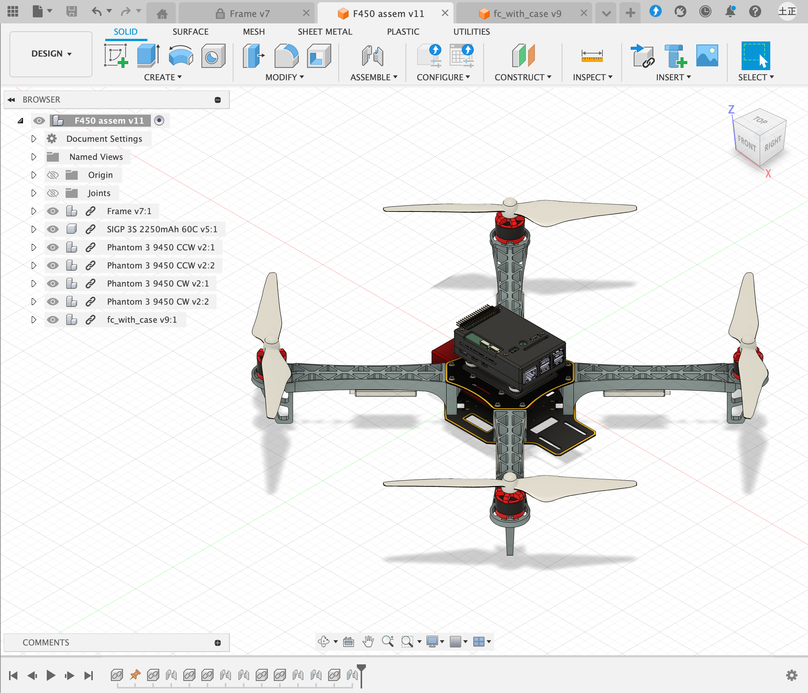
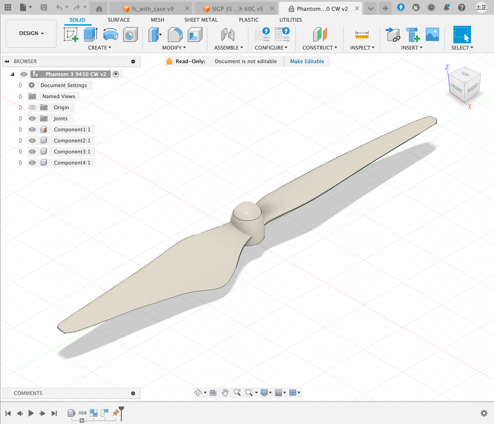
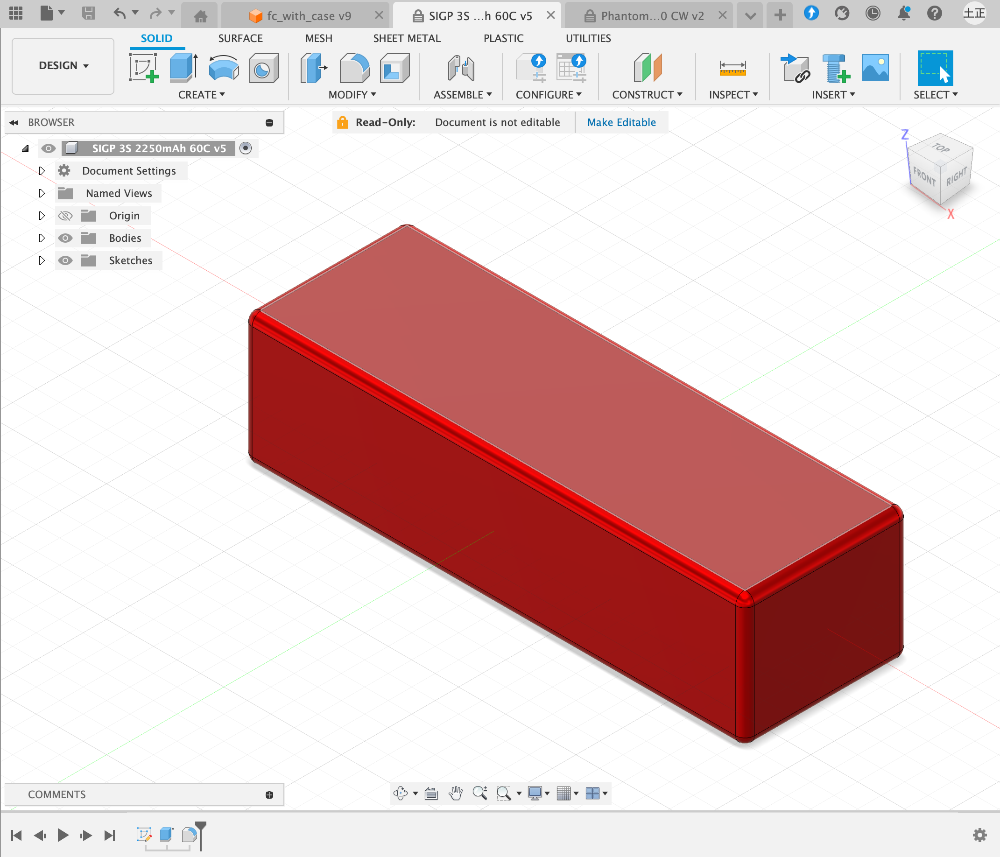
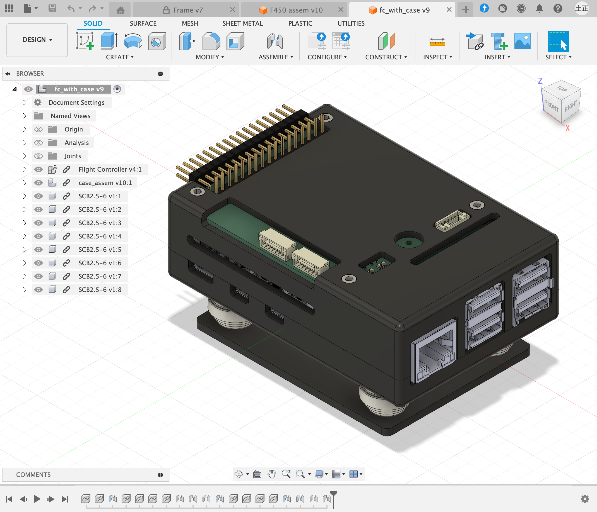
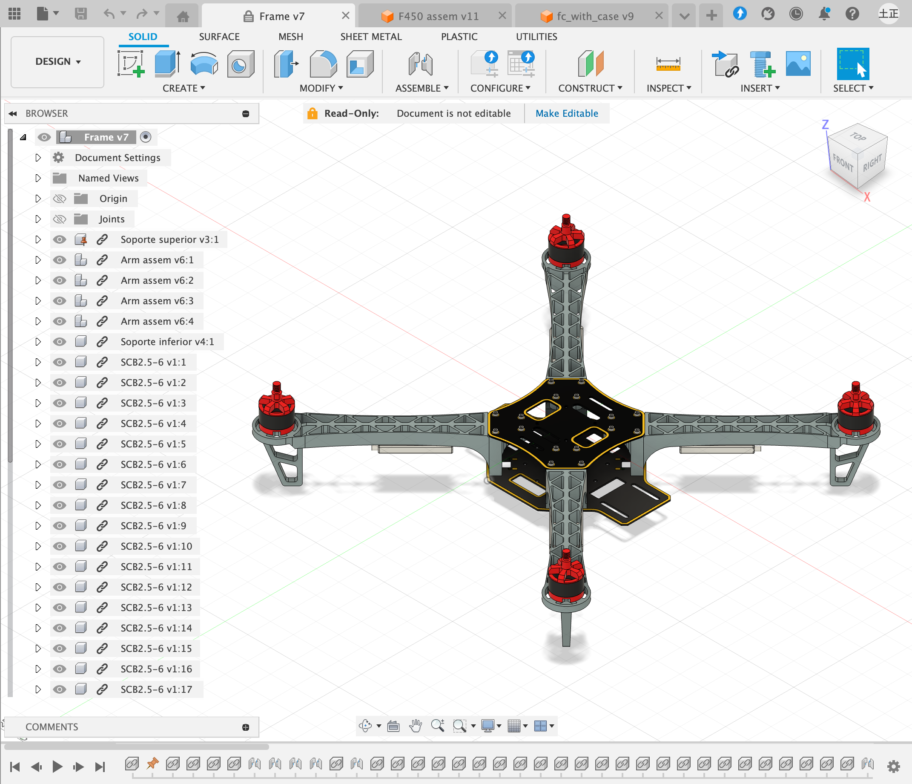

# ドローンの 3D モデリング

3D CAD を用いてドローンのモデルを作成します．
使用する 3D CAD に指定はありませんが，URDF を作成するためにメッシュファイル (\*.stl 又は \*.dae) での出力と質量解析ができるものが望ましいです．
このチュートリアルでは Autodesk の Fusion 360 を使用します．

## 構成要素の選定に関する注意点

---

ドローンの構成要素を選定する際には，以下の点に注意してください．

### ESC

Tobas は Bidirectional DShot 600 で ESC と通信するため，それに対応したものを選定してください．
少なくとも以下のファームウェアは対応しています．

- <a href=https://github.com/bitdump/BLHeli/tree/master/BLHeli_32%20ARM target="_blank">BLHeli_32</a> (2024 年 6 月にサポート終了)
- <a href=https://github.com/AlkaMotors/AM32-MultiRotor-ESC-firmware target="_blank">AM32</a>
- <a href=https://github.com/bird-sanctuary/bluejay target="_blank">bluejay</a>

今回は BLHeli32 の<a href=https://ja.aliexpress.com/item/1005004919687788.html target="_blank">Flycolor Raptor5 35A</a>を使用します．

### プロペラ

制御性能を高めるため，空力特性が分かるものが望ましいです．
<a href=https://www.tytorobotics.com/pages/series-1580-1585 target="_blank">Series 1585 Thrust Stand</a>
のような推力測定機で測定するか，そうでなければなるべく
<a href=https://m-selig.ae.illinois.edu/props/propDB.html target="_blank">UIUC Propeller Data Site</a>
でデータが得られるプロペラを使用してください．

### GNSS アンテナ

GNSS 受信機の周波数帯域とコネクタに対応したアンテナを選択してください．
Tobas Aso の場合は L1/L5 帯域で SMA コネクタのため，例えば
<a href=https://www.topgnss.store/products/2pcs-l1-l5-helical-antenna-uav-flight-control-antenna-gps-glonass-galileo-bds-rtk-handheld-receiver-an-103-topgnss-helical target="_blank">TOPGNSS AN-103</a>
が使用可能です．

### RC 受信機

8 チャンネル以上の S.BUS に対応しているものを使用してください．
今回は<a href=https://www.rc.futaba.co.jp/products/detail/I00000021 target="_blank">Futaba R2000SBM</a>
を使用します．

### RC 送信機

RC 受信機が対応しているプロトコルに対応しているものを使用してください．
今回は<a href=https://www.rc.futaba.co.jp/products/detail/I00000006 target="_blank">Futaba T10J</a>を使用します．

### 電源モジュール

<a href=https://www.digikey.jp/ja/products/detail/texas-instruments/INA228AIDGSR/13691042 target="_blank">INA228</a>
が搭載されたデジタル電力モジュールを使用してください．
今回は<a href=https://holybro.com/products/pm02d-power-module target="_blank">Holybro PM02D</a>を使用します．

## モデリングに関する注意点

---

モデリングの際は，以下の点に注意してください．

### 1. 剛体ごとにモデルを作成する

URDF ではドローンを含むロボットを剛体多リンク系として表現します．
そのため，CAD モデルにおいても，最低でも剛体ごとにモデルを作成する必要があります．
逆に 1 つの剛体を複数に分割することは可能です．

### 2. 各モデルの座標軸をなるべく機体のベース座標系に合わせる

アセンブリと各パーツの座標軸が一致していた方が URDF が作成しやすいです．
Gazebo (物理シミュレータ) と同じく，NWU 座標系 (X 軸を前，Y 軸を左，Z 軸を上) に一致させることをおすすめします．

### 3. 質量特性を得るために各モデルに材質を設定する

姿勢制御の安定化のため，各モデルの材質からその質量特性をなるべく正確に推定することが重要です．
しかし，材質が不明な場合やモータなど材質が均一でない場合は，以下のような代替手段をとることができます．

1. モデルの実際の質量から平均密度を計算し，その密度をもつ仮想的な材質を設定します．これは CAD 上で行います．
1. 材質が不明な部分をリンクとして分離し，URDF を作成する際に質量とプリミティブ形状 (直方体，球，円柱) で近似的に質量特性を求めます．
   これは後の URDF 作成時に行うため，この場合 CAD 上で質量特性を設定する必要はありません．

### 4. 多少のモデル化誤差は許容される

制御器にはモデル化誤差に対するロバスト性があるため，モデルの質量特性は必ずしも正確である必要はありません．
モデルと実機をなるべく一致させるよう努力すべきですが，理論上は誤差 50%以内なら安定性を損なわないと言えます．
例えば RC 受信機やケーブルは軽量なので，今回はモデルから省略することにします．

## クアッドコプターのモデリング

---

以下がアセンブリ全体の画像です．
<a href=https://www-v1.dji.com/jp/flame-wheel-arf/spec.html target="_blank">DJI F450 Frame Kit</a>を用いています．

注意点 1 にあるように，最も粗くても剛体単位でモデルを分ける必要があります．
今回は，プロペラ (CCW, CW)，バッテリー，FMU，フレームのモデルをそれぞれ作成します．

### プロペラのモデリング

<a href=https://www.amazon.co.jp/DJI-%E3%83%89%E3%83%AD%E3%83%BC%E3%83%B3%E7%94%A8%E3%83%97%E3%83%AD%E3%83%9A%E3%83%A9-2%E6%9E%9A%E7%B5%84-PHANTOM-Part9/dp/B00YOB2AXQ target="_blank"> Phantom3 9450</a>を使用します．
<a href=https://grabcad.com/library target="_blank">GrabCAD Library</a>から良さげなモデルをダウンロードし，Fusion360 にインポートします．
最終的なアセンブリを見越して回転軸が Z 軸に一致するように配置し，材質を ABS に設定します．
プロパティを見ると質量が約 10g になっており，実物と概ね一致することが確認できました．
画像は時計回りですが，反時計回りのプロペラについても同様の操作を行います．

### バッテリーのモデリング

<a href=https://www.amazon.co.jp/gp/product/B08ZD17NZC target="_blank">SIGP 3S 2250mAh 60C</a>を使用します．
バッテリーはフレームに固定されているためフレームに含めても良かったのですが，
後でバッテリーだけ交換する可能性を考えて今回は独立したモデルとして作成します．
GrabCAD にモデルが無かったため，直方体にフィレットをつけただけの簡単なモデルを作成しました．
注意点 2 にあるように， NWU 座標系に一致するように配置します．
注意点 3 にあるように材質を設定したいのですが，バッテリーの材質はわからないしそもそも均一ではありません．
そこで，バッテリーについては代替手段 2 をとることにし，CAD では材質を設定せず形を作るのみとします．

### FMU のモデリング

今回は Tobas Aso を使用します．
3D モデル (STEP) は<a href=https://drive.google.com/file/d/124LzAW3CvhgYobC6YJGh0XPJ6KVfslS3 target="_blank">こちら</a>からダウンロードできます．
STEP ファイルには質量特性が含まれないため，FMU についても URDF を作成する際にプリミティブ形状で近似することにします．

### フレームのモデリング

プロペラ，バッテリー，FMU を除く部分をフレームとして 1 つのモデルにします．
プロペラと同じく GrabCAD から STEP ファイルをダウンロードし，Fusion360 にインポートします．
注意点 2 にあるように，機体座標系を NWU 座標系に一致するように配置します．
注意点 3 にあるように各パーツの材質を設定します．
アームやボルトは 材質が均一ですが，モータや ESC は材質がわからないため，代替手段 1 で仮想的な材質を設定します．

### メッシュファイルとプロパティの出力

作成したモデルのメッシュファイルをそれぞれ出力し，原点周りの質量特性やプロペラの原点位置をメモしておきます．
Fusion360 は Windows または Mac で動作しますが，これ以降は Ubuntu での作業になるため，
それらのファイルを Google Drive にアップロードするなどして Ubuntu からも参照できるようにします．
