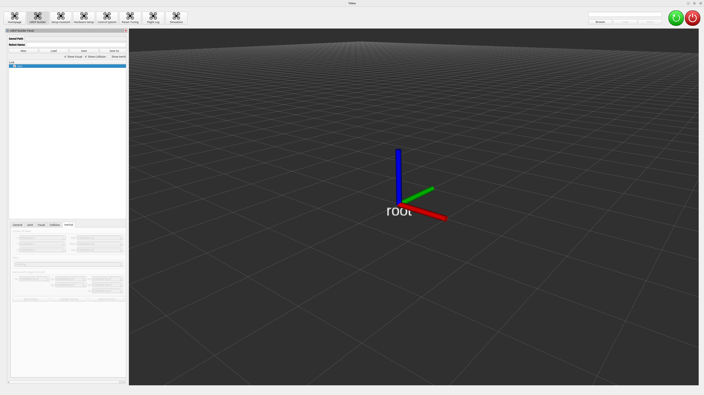
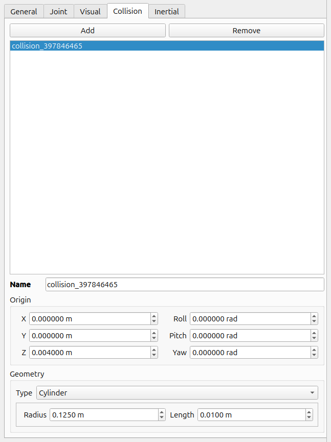

# URDF 作成

前ページで作成した CAD モデルを元に URDF (Unified Robot Description Format, ロボット記述言語) を作成します．
URDF は剛体多リンク系のリンク構造や質量特性等を XML 形式で記述したものです．
今回は以下のような URDF を作成します:

```xml
<robot name="f450">
  <material name="material_-492512390">
    <color rgba="1 1 1 0.7" />
  </material>
  <material name="material_-496767138">
    <color rgba="0 0 1 0.7" />
  </material>
  <material name="material_-510938680">
    <color rgba="0 0 0 0.7" />
  </material>
  <link name="battery">
    <inertial>
      <mass value="0.186" />
      <origin xyz="0 0 0" rpy="0 -0 0" />
      <inertia ixx="0.000294655" ixy="0" ixz="0" iyy="0.00184636" iyz="0" izz="0.00193145" />
    </inertial>
    <visual>
      <origin xyz="0 0 0" rpy="0 -0 0" />
      <geometry>
        <box size="0.106 0.035 0.026" />
      </geometry>
      <material name="material_-496767138">
        <color rgba="0 0 1 0.7" />
      </material>
    </visual>
    <collision>
      <origin xyz="0 0 0" rpy="0 -0 0" />
      <geometry>
        <box size="0.106 0.035 0.026" />
      </geometry>
    </collision>
  </link>
  <link name="frame">
    <inertial>
      <mass value="0.635" />
      <origin xyz="0.001573 -0.000596 -0.003436" rpy="0 -0 0" />
      <inertia ixx="0.009613" ixy="6e-06" ixz="4.8e-05" iyy="0.009072" iyz="4e-06" izz="0.01867" />
    </inertial>
    <visual>
      <origin xyz="0 0 0" rpy="0 -0 0" />
      <geometry>
        <mesh filename="file:///home/dohi/Downloads/frame.stl" scale="0.001 0.001 0.001" />
      </geometry>
      <material name="material_-510938680">
        <color rgba="0 0 0 0.7" />
      </material>
    </visual>
    <collision>
      <origin xyz="0 0 -0.008" rpy="0 -0 0" />
      <geometry>
        <box size="0.35 0.35 0.1" />
      </geometry>
    </collision>
  </link>
  <link name="propeller1">
    <inertial>
      <mass value="0.012" />
      <origin xyz="0 0 0.004" rpy="0 -0 0" />
      <inertia ixx="0.00046975" ixy="0" ixz="0" iyy="0.00046975" iyz="0" izz="9.375e-05" />
    </inertial>
    <visual>
      <origin xyz="0 0 0" rpy="0 -0 0" />
      <geometry>
        <mesh filename="file:///home/dohi/Downloads/phantom3_0945_ccw.stl" scale="0.001 0.001 0.001" />
      </geometry>
      <material name="material_-492512390">
        <color rgba="1 1 1 0.7" />
      </material>
    </visual>
    <collision>
      <origin xyz="0 0 0.004" rpy="0 -0 0" />
      <geometry>
        <cylinder radius="0.125" length="0.01" />
      </geometry>
    </collision>
  </link>
  <link name="propeller1_1">
    <inertial>
      <mass value="0.012" />
      <origin xyz="0 0 0.004" rpy="0 -0 0" />
      <inertia ixx="0.00046975" ixy="0" ixz="0" iyy="0.00046975" iyz="0" izz="9.375e-05" />
    </inertial>
    <visual>
      <origin xyz="0 0 0" rpy="0 -0 0" />
      <geometry>
        <mesh filename="file:///home/dohi/Downloads/phantom3_0945_ccw.stl" scale="0.001 0.001 0.001" />
      </geometry>
      <material name="material_-492512390">
        <color rgba="1 1 1 0.7" />
      </material>
    </visual>
    <collision>
      <origin xyz="0 0 0.004" rpy="0 -0 0" />
      <geometry>
        <cylinder radius="0.125" length="0.01" />
      </geometry>
    </collision>
  </link>
  <link name="propeller1_2">
    <inertial>
      <mass value="0.012" />
      <origin xyz="0 0 0.004" rpy="0 -0 0" />
      <inertia ixx="0.00046975" ixy="0" ixz="0" iyy="0.00046975" iyz="0" izz="9.375e-05" />
    </inertial>
    <visual>
      <origin xyz="0 0 0" rpy="0 -0 0" />
      <geometry>
        <mesh filename="file:///home/dohi/Downloads/phantom3_0945_cw.stl" scale="0.001 0.001 0.001" />
      </geometry>
      <material name="material_-492512390">
        <color rgba="1 1 1 0.7" />
      </material>
    </visual>
    <collision>
      <origin xyz="0 0 0.004" rpy="0 -0 0" />
      <geometry>
        <cylinder radius="0.125" length="0.01" />
      </geometry>
    </collision>
  </link>
  <link name="propeller1_3">
    <inertial>
      <mass value="0.012" />
      <origin xyz="0 0 0.004" rpy="0 -0 0" />
      <inertia ixx="0.00046975" ixy="0" ixz="0" iyy="0.00046975" iyz="0" izz="9.375e-05" />
    </inertial>
    <visual>
      <origin xyz="0 0 0" rpy="0 -0 0" />
      <geometry>
        <mesh filename="file:///home/dohi/Downloads/phantom3_0945_cw.stl" scale="0.001 0.001 0.001" />
      </geometry>
      <material name="material_-492512390">
        <color rgba="1 1 1 0.7" />
      </material>
    </visual>
    <collision>
      <origin xyz="0 0 0.004" rpy="0 -0 0" />
      <geometry>
        <cylinder radius="0.125" length="0.01" />
      </geometry>
    </collision>
  </link>
  <link name="root" />
  <joint name="battery_joint" type="fixed">
    <origin xyz="-0.035 0 -0.024" rpy="0 -0 0" />
    <axis xyz="0 0 0" />
    <parent link="frame" />
    <child link="battery" />
  </joint>
  <joint name="frame_joint" type="fixed">
    <origin xyz="0 0 0" rpy="0 -0 0" />
    <axis xyz="0 0 0" />
    <parent link="root" />
    <child link="frame" />
    <limit effort="0" velocity="0" lower="0" upper="0" />
  </joint>
  <joint name="propeller1_joint" type="continuous">
    <origin xyz="0.16 -0.16 0.024" rpy="0 0 -0.7854" />
    <axis xyz="0 0 1" />
    <parent link="frame" />
    <child link="propeller1" />
  </joint>
  <joint name="propeller1_joint_1" type="continuous">
    <origin xyz="-0.16 0.16 0.024" rpy="0 0 -0.7854" />
    <axis xyz="0 0 1" />
    <parent link="frame" />
    <child link="propeller1_1" />
  </joint>
  <joint name="propeller1_joint_2" type="continuous">
    <origin xyz="0.16 0.16 0.024" rpy="0 -0 0.7854" />
    <axis xyz="0 0 1" />
    <parent link="frame" />
    <child link="propeller1_2" />
  </joint>
  <joint name="propeller1_joint_3" type="continuous">
    <origin xyz="-0.16 -0.16 0.024" rpy="0 -0 0.7854" />
    <axis xyz="0 0 1" />
    <parent link="frame" />
    <child link="propeller1_3" />
  </joint>
</robot>
```

frame, battery, propeller といったリンクと，それらを繋ぐジョイントが定義されていることがわかります．

URDF の作成方法としては，エディタを用いて直接編集することが一般的ですが，
今回は GUI で URDF が作成できるツールである URDF Builder を使用します．

ターミナルから URDF Builder を起動します:

```bash
$ roslaunch urdf_builder urdf_builder.launch
```


新しく URDF を作成するため，`New`ボタンを押します．
すると，`Link`ツリーに`root`リンクが追加されます．
今回は使いませんが，`Load`ボタンを押すと作成した URDF をロードして編集することができます．



画面左上の`Robot Name`に適当な名前を設定します．
今回はそのまま`f450`とします．


## フレームリンクの設定

---

`Link`ツリーで右クリックし，`Add Link`を選択するとダイアログが現れます．
`Link Name`に`frame`，`Joint Name`に`frame_joint`，`Parent`に`root`を選択して `OK` を押します．
すると，ツリーに`frame`リンクが追加されます．


`frame`リンクの設定を行います．
ツリーの`frame`をクリックすると，左下に設定画面が現れます．

`General`タブを選択すると，先程設定したリンク名が記述されています．


`Joint`タブではジョイントの設定を行います．
`Name`には先程設定したジョイント名が記述されています．
`Parent`には先程設定した`root`が選択されています．
`frame`は`root`に固定された基準のリンクとするため，`Type`には`Fixed`を選択し，`Origin`を原点に設定します．


`Visual`タブではリンクの視覚情報の設定を行います．
`Add`ボタンを押すと，Visual オブジェクトが追加されます．
複数の Visual を組み合わせることもできますが，今回は 1 つで構いません．
CAD でのモデリングの際に座標系を NWU 座標系に合わせているため，`Origin`は原点のままで構いません．
もし CAD の座標系がずれていると，ここで調整が必要になります．
`Geometry`の`Type`に`Mesh`を選択し，`Path`の`Browse`ボタンから前ページで作成したフレームのメッシュファイルを選択すると，
モデルビューに可視化されます．
URDF は SI 単位系より長さの単位は m なのに対し，Fusion360 では mm に設定していたため，実際の 1000 倍のスケールで表示されています．
モデルビューの格子の 1 マスは 10cm なので，非常に大きく表示されていることがわかります．
そこで，`Scale`を 0.001 に設定することでメッシュファイルと URDF のスケールを一致させます．
`Material`では Visual オブジェクトの色やテクスチャを設定できます．
あまり重要ではないのですが，プロペラが白なので適当に黒 ((R, G, B) = (0, 0, 0)) に設定します．


`Collision`タブではリンクの接触判定を行うための領域を設定します．
`Add`ボタンを押すと，Collison オブジェクトが追加されます．
Visual と同じく複数の Collision を組み合わせることもできます．
`Geometry`の`Type`に`Box`を選択します．
Visual と同じく`Mesh`を選択してもよいのですが，
複雑なメッシュだと接触判定の際に計算が不安定になったり処理が重くなったりする可能性があるため，
特別な理由が無い限りは`Mesh`以外のプリミティブ形状で近似することを勧めます．
モデルビューを見ながら，Box の大きさと位置を Visual を丁度覆い隠すくらいに設定します．
今回は以下の画像のように設定しました．


`Inertial`タブではリンクの質量特性を設定します．
`Origin`にはリンクの重心を，`Mass`にはリンクの質量を，`Inertia`にはリンクの重心回りの慣性テンソルの要素を設定します．
CAD でのモデリングの際に座標系を NWU 座標系に合わせているため，CAD のプロパティから取得した値をそのまま転記すればよいです．
もし CAD の座標系がずれていると，ここで調整が必要になります．
Visual と異なり Inertial は可視化されないため，座標系がずれていると確認が困難です．
また，全て SI 単位系 (m, kg, kg\*m^2) であることに注意してください．


## バッテリーリンクの設定

---

`Add Link`からバッテリーリンクを追加します．
`Link Name`を`battery`，`Joint Name`を`battery_joint`，`Parent`を`frame`にします．


`Joint`タブを編集する際に視覚情報があったほうが良いので，まず`Visual`タブを開きます．
`Add`ボタンを押すと，Visual オブジェクトが追加されます．
`Origin`は原点のままにします．
LiPo バッテリーはほぼ直方体なので，メッシュファイルは使わずに`Geometry`の`Type`に`Box`を選択します．
`Length`，`Width`，`Height`に実際のバッテリーの大きさを入力します．
`Material`は実際のバッテリーが青を基調としているため青 ((R, G, B) = (0, 0, 1)) に設定します．


`Joint`タブでジョイントの設定を行います．
`battery`は`frame`に固定されているため，`Type`には`Fixed`を選択します．
モデルビューを見ながら`Origin`を調整します．


`Collision`タブでリンクの接触判定領域を設定します．
`Add`ボタンを押すと，Collison オブジェクトが追加されます．
`Origin`と`Geometry`を`Visual`と全く同じように設定します．


`Inertial`タブでリンクの質量特性を設定します．
バッテリーの質量特性を直方体で近似することにします．
すると重心は`Joint`の原点に一致するため，`Origin`の要素を全て 0 に設定します．
`Mass`にバッテリーの質量を入力します．
`Inertia`の`Box Inertia`をクリックするとダイアログが表示され，
`X`，`Y`，`Z`に先程の`Length`，`Width`，`Height`をそれぞれ入力すると，直方体の慣性テンソルがタブ内に反映されます．
`ixx`に比べて`iyy`と`izz`が大きく，矛盾は無さそうだということがわかります．


このように，プリミティブ形状のみを用いてリンクを定義することもできます．
リンクをパラメトリックに記述でき，修正が容易になるという利点があるため，試作段階では積極的に活用すべきでしょう．

## プロペラリンクの設定

---

`Add Link`からプロペラリンクを追加します．
`Link Name`を`propeller1`，`Joint Name`を`propeller1_joint`，`Parent`を`frame`にします．


`Visual`タブを開き，`Add`ボタンで Visual オブジェクトを追加します．
`Origin`は原点のままにします．
`Geometry`の`Type`に`Mesh`を選択し，`Path`を設定します．
必要に応じて`Scale`を修正します．
`Material`は実物と同じく白 ((R, G, B) = (1, 1, 1)) に設定します．


`Joint`タブでジョイントの設定を行います．
プロペラはフレームに対して無限回転するため，`Type`には`Continuous`を選択します．
モデルビューを見ながら`Origin`を調整します．
プロペラは Z 軸まわりに回転するため，`Axis`を (X, Y, Z) = (0, 0, 1) とします．


`Collision`タブでリンクの接触判定領域を設定します．
`Add`ボタンを押すと，Collison オブジェクトが追加されます．
`Geometry`の`Type`に`Cylinder`を選択し，
`Origin`と`Cylinder`の`Radius`，`Length`を丁度 Visual オブジェクトを覆い隠すくらいに調整します．




`Inertial`タブでリンクの質量特性を設定します．
`Collision`と同じく円柱で近似することにします．
`Origin`を`Collision`のそれと等しい値に設定し，`Mass`にプロペラの質量を入力します．
`Inertia`の`Cylinder Inertia`をクリックするとダイアログが表示され，
`Radius`，`Length`に`Collision`のそれらをそれぞれ入力すると，円柱の慣性テンソルがタブ内に反映されます．
`izz`に比べて`ixx`と`iyy`が大きく，矛盾は無さそうだということがわかります．


プロペラは全部で 4 枚なので他の 3 枚の設定を行うのですが，内容はほとんど同じなので`propeller1`をクローンすると早いです．
`propeller1`が選択された状態で`Link`ツリーを右クリックし，`Clone Link`を選択すると，
オリジナルとリンク・ジョイント名のみが異なる`propeller1_1`が作成されます．
今回，それぞれのプロペラはジョイント原点の符号と`Visual`のメッシュファイルのみが異なります．
`propeller1_1`の`Joint`タブから`Origin`の符号を修正し，`Visual`タブの`Geometry`の`Path`を修正します．
同じ要領でもう 2 枚プロペラを増やし，合計 4 枚のプロペラを設定します．


## URDF の保存

---

`Save`または`Save As`ボタンを押すとダイアログが表示されます．
適当な名前を設定し，`Save`ボタンを押して URDF を保存します．
保存できたら URDF Builder は閉じて構いません．


