# URDF 作成

CAD モデルを元に URDF (Unified Robot Description Format) を作成します．
URDF は剛体多リンク系のリンク構造や質量特性等を XML 形式で記述したものです．
今回は以下のような URDF を作成します:

```xml
<robot name="f450">
    <material name="black">
        <color rgba="0 0 0 1"/>
    </material>
    <material name="blue">
        <color rgba="0 0 1 1"/>
    </material>
    <material name="red">
        <color rgba="1 0 0 1"/>
    </material>
    <material name="white">
        <color rgba="1 1 1 1"/>
    </material>
    <link name="base_link"/>
    <link name="battery">
        <inertial>
            <mass value="0.201"/>
            <origin xyz="0 0 0" rpy="0 -0 0"/>
            <inertia ixx="3.36508e-05" ixy="0" ixz="0" iyy="0.000204903" iyz="0" izz="0.00021229"/>
        </inertial>
        <visual>
            <origin xyz="0 0 0" rpy="0 -0 0"/>
            <geometry>
                <box size="0.107 0.035 0.028"/>
            </geometry>
            <material name="blue">
                <color rgba="0 0 1 1"/>
            </material>
        </visual>
        <collision>
            <origin xyz="0 0 0" rpy="0 -0 0"/>
            <geometry>
                <box size="0.107 0.035 0.028"/>
            </geometry>
        </collision>
    </link>
    <link name="fmu">
        <inertial>
            <mass value="0.2"/>
            <origin xyz="0 0 0.009" rpy="0 -0 0"/>
            <inertia ixx="7.71333e-05" ixy="0" ixz="0" iyy="0.000148067" iyz="0" izz="0.000199067"/>
        </inertial>
        <visual>
            <origin xyz="0 0 0" rpy="0 -0 0"/>
            <geometry>
                <mesh filename="package://tobas_description/meshes/common/fmu/tobas_aso.stl" scale="1 1 1"/>
            </geometry>
            <material name="red">
                <color rgba="1 0 0 1"/>
            </material>
        </visual>
        <collision>
            <origin xyz="0 0 0.009" rpy="0 -0 0"/>
            <geometry>
                <box size="0.09 0.062 0.028"/>
            </geometry>
        </collision>
    </link>
    <link name="frame">
        <inertial>
            <mass value="0.55346"/>
            <origin xyz="0 0 -0.004136" rpy="0 -0 0"/>
            <inertia ixx="0.008128" ixy="0" ixz="0" iyy="0.008193" iyz="0" izz="0.01597"/>
        </inertial>
        <visual>
            <origin xyz="0 0 0" rpy="0 -0 0"/>
            <geometry>
                <mesh filename="package://tobas_description/meshes/f450/frame.stl" scale="1 1 1"/>
            </geometry>
            <material name="black">
                <color rgba="0 0 0 1"/>
            </material>
        </visual>
        <collision>
            <origin xyz="0 0 -0.03" rpy="0 -0 0"/>
            <geometry>
                <box size="0.35 0.35 0.06"/>
            </geometry>
        </collision>
    </link>
    <link name="propeller_0">
        <inertial>
            <mass value="0.011"/>
            <origin xyz="0 0 0" rpy="0 -0 0"/>
            <inertia ixx="3.6019e-05" ixy="0" ixz="0" iyy="3.6019e-05" iyz="0" izz="7.18547e-05"/>
        </inertial>
        <visual>
            <origin xyz="0 0 0" rpy="0 -0 0"/>
            <geometry>
                <mesh filename="package://tobas_description/meshes/common/propeller/phantom3_0945_ccw.stl" scale="0.001 0.001 0.001"/>
            </geometry>
            <material name="white">
                <color rgba="1 1 1 1"/>
            </material>
        </visual>
        <collision>
            <origin xyz="0 0 0" rpy="0 -0 0"/>
            <geometry>
                <cylinder radius="0.1143" length="0.01"/>
            </geometry>
        </collision>
    </link>
    <link name="propeller_1">
        <inertial>
            <mass value="0.011"/>
            <origin xyz="0 0 0" rpy="0 -0 0"/>
            <inertia ixx="3.6019e-05" ixy="0" ixz="0" iyy="3.6019e-05" iyz="0" izz="7.18547e-05"/>
        </inertial>
        <visual>
            <origin xyz="0 0 0" rpy="0 -0 0"/>
            <geometry>
                <mesh filename="package://tobas_description/meshes/common/propeller/phantom3_0945_ccw.stl" scale="0.001 0.001 0.001"/>
            </geometry>
            <material name="white">
                <color rgba="1 1 1 1"/>
            </material>
        </visual>
        <collision>
            <origin xyz="0 0 0" rpy="0 -0 0"/>
            <geometry>
                <cylinder radius="0.1143" length="0.01"/>
            </geometry>
        </collision>
    </link>
    <link name="propeller_2">
        <inertial>
            <mass value="0.011"/>
            <origin xyz="0 0 0" rpy="0 -0 0"/>
            <inertia ixx="3.6019e-05" ixy="0" ixz="0" iyy="3.6019e-05" iyz="0" izz="7.18547e-05"/>
        </inertial>
        <visual>
            <origin xyz="0 0 0" rpy="0 -0 0"/>
            <geometry>
                <mesh filename="package://tobas_description/meshes/common/propeller/phantom3_0945_cw.stl" scale="0.001 0.001 0.001"/>
            </geometry>
            <material name="white">
                <color rgba="1 1 1 1"/>
            </material>
        </visual>
        <collision>
            <origin xyz="0 0 0" rpy="0 -0 0"/>
            <geometry>
                <cylinder radius="0.1143" length="0.01"/>
            </geometry>
        </collision>
    </link>
    <link name="propeller_3">
        <inertial>
            <mass value="0.011"/>
            <origin xyz="0 0 0" rpy="0 -0 0"/>
            <inertia ixx="3.6019e-05" ixy="0" ixz="0" iyy="3.6019e-05" iyz="0" izz="7.18547e-05"/>
        </inertial>
        <visual>
            <origin xyz="0 0 0" rpy="0 -0 0"/>
            <geometry>
                <mesh filename="package://tobas_description/meshes/common/propeller/phantom3_0945_cw.stl" scale="0.001 0.001 0.001"/>
            </geometry>
            <material name="white">
                <color rgba="1 1 1 1"/>
            </material>
        </visual>
        <collision>
            <origin xyz="0 0 0" rpy="0 -0 0"/>
            <geometry>
                <cylinder radius="0.1143" length="0.01"/>
            </geometry>
        </collision>
    </link>
    <joint name="battery_joint" type="fixed">
        <origin xyz="-0.037 0 -0.023" rpy="0 -0 0"/>
        <axis xyz="0 0 0"/>
        <parent link="base_link"/>
        <child link="battery"/>
    </joint>
    <joint name="fmu_joint" type="fixed">
        <origin xyz="0 0.015 0.02" rpy="0 -0 0"/>
        <axis xyz="0 0 0"/>
        <parent link="base_link"/>
        <child link="fmu"/>
    </joint>
    <joint name="frame_joint" type="fixed">
        <origin xyz="0 0 0" rpy="0 -0 0"/>
        <axis xyz="0 0 0"/>
        <parent link="base_link"/>
        <child link="frame"/>
    </joint>
    <joint name="propeller_0_joint" type="continuous">
        <origin xyz="0.159099 -0.159099 0.0247" rpy="0 0 -0.785398"/>
        <axis xyz="0 0 1"/>
        <parent link="base_link"/>
        <child link="propeller_0"/>
    </joint>
    <joint name="propeller_1_joint" type="continuous">
        <origin xyz="-0.159099 0.159099 0.0247" rpy="0 -0 2.35619"/>
        <axis xyz="0 0 1"/>
        <parent link="base_link"/>
        <child link="propeller_1"/>
    </joint>
    <joint name="propeller_2_joint" type="continuous">
        <origin xyz="0.159099 0.159099 0.0247" rpy="0 -0 0.785398"/>
        <axis xyz="0 0 1"/>
        <parent link="base_link"/>
        <child link="propeller_2"/>
    </joint>
    <joint name="propeller_3_joint" type="continuous">
        <origin xyz="-0.159099 -0.159099 0.0247" rpy="0 0 -2.35619"/>
        <axis xyz="0 0 1"/>
        <parent link="base_link"/>
        <child link="propeller_3"/>
    </joint>
</robot>
```

`frame`,`battery`,`propeller`といったリンクと，それらを繋ぐジョイントが定義されていることがわかります．

URDF の作成方法としては，エディタを用いて直接編集することが一般的ですが，
今回は GUI で URDF が作成できるツールである URDF Builder を使用します．

Tobas を起動し，ツールボタンから URDF Builder を選択します．

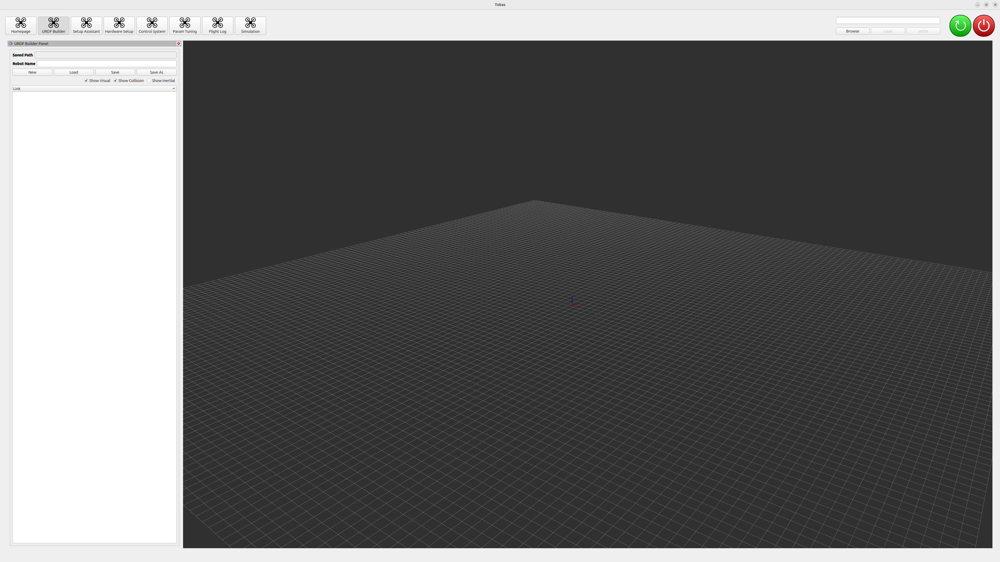

新しく URDF を作成するため，New ボタンを押します．
すると，Link ツリーに`root`リンクが追加されます．
今回は使いませんが，Load ボタンを押すと作成した URDF をロードして編集することができます．


画面左上の Robot Name に適当な名前を設定します．
今回はそのまま`f450`とします．


## フレームリンクの設定

---

Link ツリーで右クリックし，Add Link を選択するとダイアログが現れます．
Link Name に`frame`，Joint Name に`frame_joint`，Parent に`root`を選択して OK を押します．
すると，ツリーに`frame`リンクが追加されます．


`frame`リンクの設定を行います．
ツリーの`frame`をクリックすると，左下に設定画面が現れます．

General タブを選択すると，先程設定したリンク名が記述されています．


Joint タブではジョイントの設定を行います．
Name には先程設定したジョイント名が記述されています．
Parent には先程設定した`root`が選択されています．
`frame`は`root`に固定された基準のリンクとするため，Type には Fixed を選択し，Origin を原点に設定します．

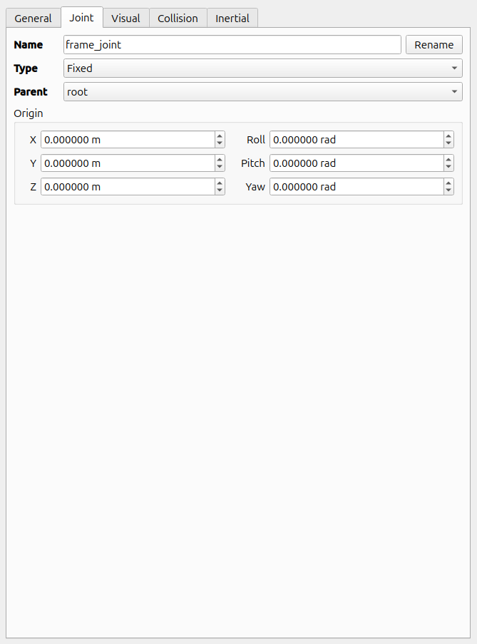

Visual タブではリンクの視覚情報の設定を行います．
Add ボタンを押すと，Visual オブジェクトが追加されます．
複数のオブジェクトを組み合わせることもできますが，今回は 1 つで構いません．
CAD でのモデリングの際に座標系を NWU 座標系に合わせているため，Origin は原点のままで構いません．
もし CAD の座標系がずれていると，ここで調整が必要になります．
Geometry の Type に Mesh を選択し，Path の Browse ボタンから前ページで作成したフレームのメッシュファイルを選択すると，モデルビューに可視化されます．
メッシュファイルの単位系が SI 単位系でない場合は Scale を調整します．
Material では Visual オブジェクトの色やテクスチャを設定できます．


Collision タブではリンクの接触判定を行うための領域を設定します．
Add ボタンを押すと，Collison オブジェクトが追加されます．
Visual と同じく複数のオブジェクトを組み合わせることもできます．
Geometry の Type に Box を選択します．
Visual と同じく Mesh を選択してもよいのですが，
複雑なメッシュだと接触判定の際に計算が不安定になったり処理が重くなったりする可能性があるため，
特別な理由が無い限りは Mesh 以外のプリミティブ形状で近似することを勧めます．
モデルビューを見ながら，Box の大きさと位置を Visual を丁度覆い隠すくらいに設定します．
今回は以下の画像のように設定しました．


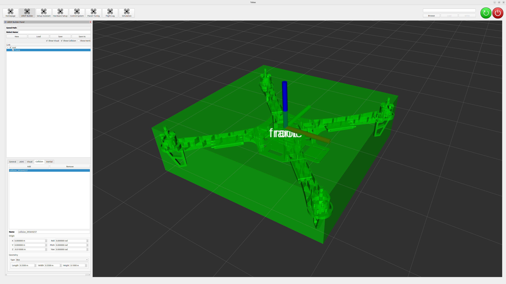

Inertial タブではリンクの質量特性を設定します．
Center of Mass にはリンクの重心を，Mass にはリンクの質量を，Inertia with regard to CoM にはリンクの重心回りの慣性テンソルの要素を設定します．
CAD でのモデリングの際に座標系を NWU 座標系に合わせているため，CAD のプロパティから取得した値をそのまま転記すればよいです．
もし CAD の座標系がずれていると，ここで調整が必要になります．
画面左上の Show Inertial のチェックを入れると，設定した質量特性を実現する材質均一の直方体が表示されます．
機体のフレームの高さに薄い直方体が表示され，概ね矛盾は無さそうだということが分かります．


## バッテリーリンクの設定

---

Add Link からバッテリーリンクを追加します．
Link Name を`battery`，Joint Name を`battery_joint`，Parent を`frame`にします．


Joint タブを編集する際に視覚情報があったほうが良いので，まず Visual タブを開きます．
Add ボタンを押すと，Visual オブジェクトが追加されます．
Origin は原点のままにします．
LiPo バッテリーはほぼ直方体なので，メッシュファイルは使わずに Geometry の Type に Box を選択します．
Length，Width，Height に実際のバッテリーの大きさを入力します．
Material を青色 ((R, G, B) = (0, 0, 1)) に設定します．


Joint タブでジョイントの設定を行います．
`battery`は`frame`に固定されているため，Type には Fixed を選択します．
モデルビューを見ながら Origin を調整します．


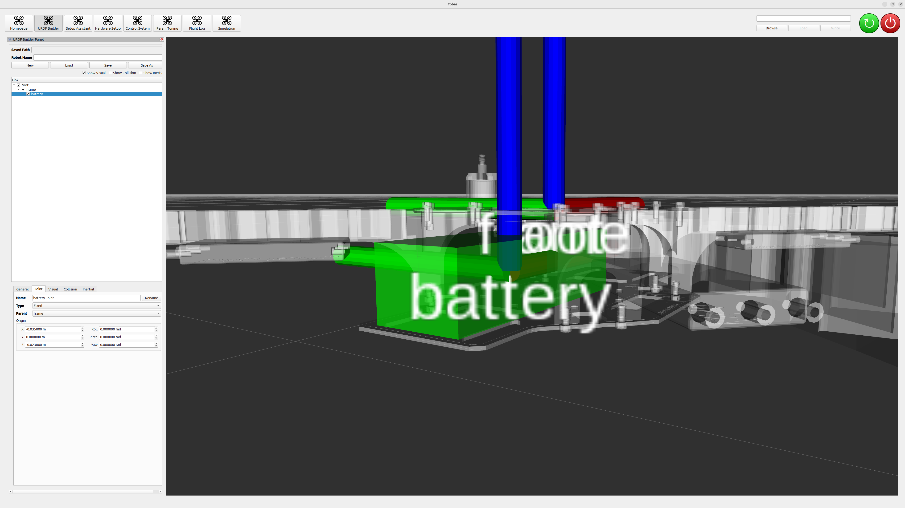

Collision タブでリンクの接触判定領域を設定します．
Add ボタンを押すと，Collison オブジェクトが追加されます．
Origin と Geometry を Visual と全く同じように設定します．


Inertial タブでリンクの質量特性を設定します．
バッテリーの質量特性を直方体で近似することにします．
重心は Joint の原点に一致するため，Center of Mass の要素を全て 0 に設定します．
Mass にバッテリーの質量を入力します．
Inertia の Box Inertia をクリックするとダイアログが表示され，
X，Y，Z に先程の Length，Width，Height をそれぞれ入力すると，直方体の慣性テンソルがタブ内に反映されます．
Show Collision のチェックを外して Show Inertial に入れると，
質量等価の直方体が Visual タブで設定した直方体と正確に一致しており，矛盾は無さそうだということがわかります．

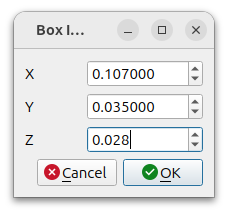


このように，プリミティブ形状のみを用いてリンクを定義することもできます．
リンクをパラメトリックに記述でき，修正が容易になるという利点があるため，試作段階では積極的に活用すべきでしょう．

## プロペラリンクの設定

---

Add Link からプロペラリンクを追加します．
Link Name を`propeller_0`，Joint Name を`propeller_0_joint`，Parent を`frame`にします．

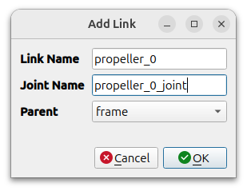

Visual タブを開き，Add ボタンで Visual オブジェクトを追加します．
Origin は原点のままにします．
Geometry の Type に Mesh を選択し，Path を設定します．
必要に応じて Scale を修正します．
Material は実物と同じく白`(R, G, B) = (1, 1, 1)`に設定します．

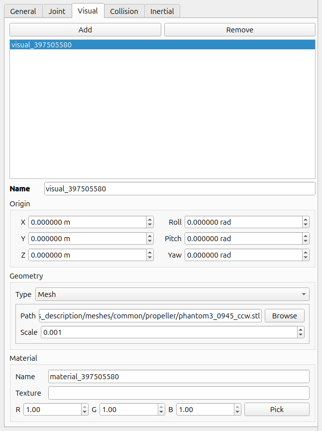

Joint タブでジョイントの設定を行います．
プロペラはフレームに対して無限回転するため，Type には Continuous を選択します．
モデルビューを見ながら Origin を調整します．
プロペラは Z 軸まわりに回転するため，Axis を`(X, Y, Z) = (0, 0, 1)`とします．


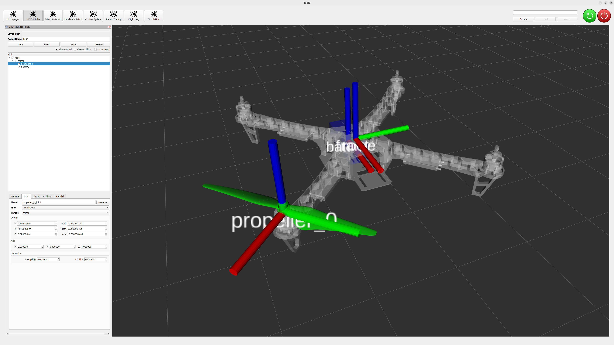

Collision タブでリンクの接触判定領域を設定します．
Add ボタンを押すと，Collison オブジェクトが追加されます．
Geometry の Type に Cylinder を選択し，
Origin と Cylinder の Radius，Length を丁度 Visual オブジェクトを覆い隠すくらいに調整します．


Inertial タブでリンクの質量特性を設定します．
Collision と同じく円柱で近似することにします．
Center of Mass を Collision の Origin と等しい値に設定し，Mass にプロペラの質量を入力します．
Inertia の Cylinder Inertia をクリックするとダイアログが表示され，
Radius，Length に Collision のそれらをそれぞれ入力すると，円柱の慣性テンソルがタブ内に反映されます．
Show Collision のチェックを外して Show Inertial に入れると，
ちょうどプロペラに重なる位置に等価質量の直方体が表示され，矛盾は無さそうだということがわかります．

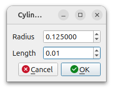


プロペラは全部で 4 枚なので他の 3 枚の設定を行うのですが，内容はほとんど同じなので`propeller_0`をクローンします．
`propeller_0`が選択された状態で Link ツリーを右クリックし，Clone Link を選択すると，
オリジナルとリンク・ジョイント名のみが異なる`propeller_0_1`が作成されます．
リンク名`propeller_0_1`を`propeller_1`に変更し，ジョイント名`propeller_0_joint_1`を`propeller_1_joint`に変更します．
今回，それぞれのプロペラはジョイント原点の符号と Visual のメッシュファイルのみが異なります．
`propeller_1`の Joint タブから Origin の符号を修正し，Visual タブの Geometry の Path を修正します．
同じ要領でもう 2 枚プロペラを増やし，合計 4 枚のプロペラを設定します．

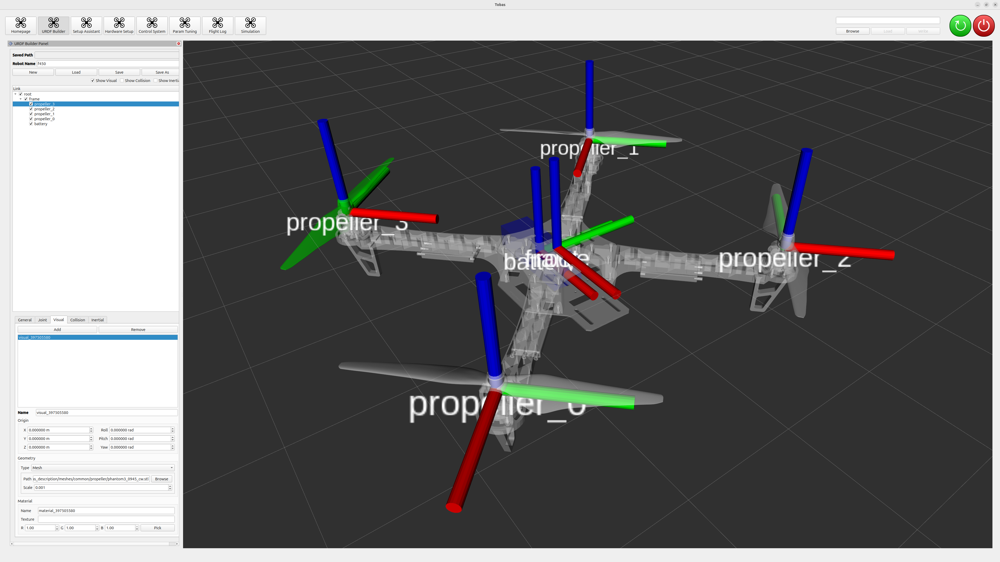

## FMU リンクの設定

---

バッテリーリンクと同じ要領で FMU リンクを追加します．
Inertial は Collision と同じジオメトリで直方体近似しました．


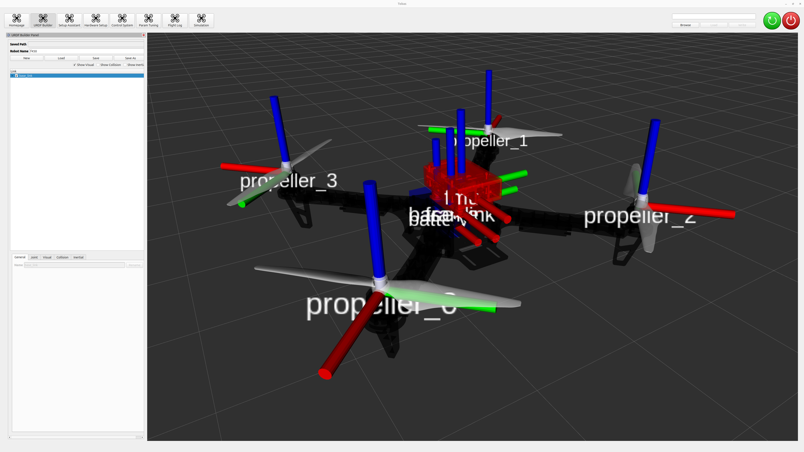

## URDF の保存

---

Save または Save As ボタンを押すとダイアログが表示されます．
適当な名前を設定し，Save ボタンを押して URDF を保存します．

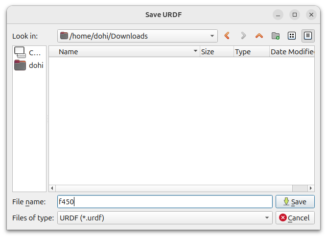
