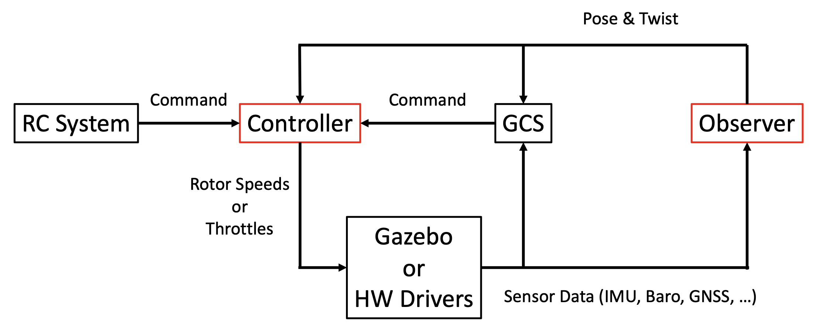

# カスタム制御器・観測器

Tobas の制御器・観測器を自作のものに置き換える手順について説明します．

## システム構成

---

以下は全体のシステム構成図です．
観測器 (Observer) は購読したセンサデータから機体の状態を推定し，
制御器 (Controller) は推定された状態と外部コマンドから各ロータの目標回転数もしくはスロットルを発行します．
この 2 つを置き換えることで，カスタム制御器・観測器を Tobas のシミュレーションもしくはハードウェアで試験することができます．

## Setup Assistant の設定

---

Setup Assistant の Controller, Observer のページで，それぞれ`Use Custom Controller/Observer`を選択してください．
これで Tobas の制御器・観測器が無効になります．

## 制御器・観測器の実装

---

[ユーザプログラム](user_code.md)と同じ要領で，ユーザパッケージに制御器・観測器を実装し，`common.launch`に記述してください．
使用できるセンサデータやモータコマンドの詳しい仕様は[ROS API](ros_api.md)を参照してください．
