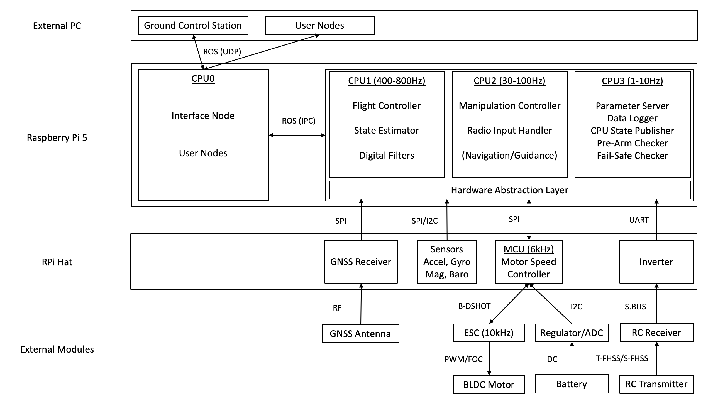
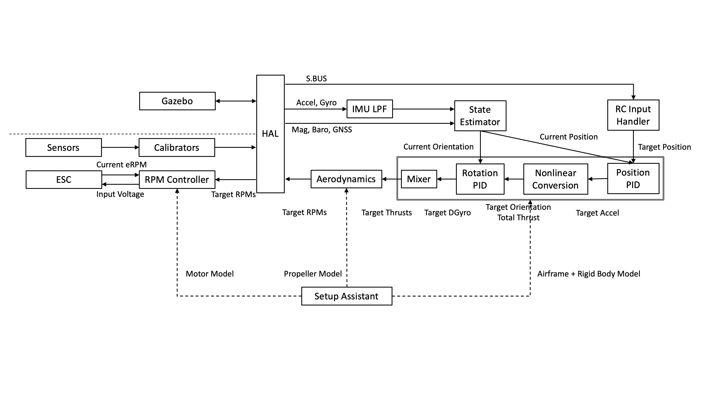

# System Architecture

This section outlines the overall system architecture of Tobas, divided into hardware and software.

## Hardware Architecture

---

The diagram below shows the hardware architecture.
Sensor data sent from the HAT via serial communication is converted into common ROS messages by the hardware abstraction layer (HAL) on the RPi,
and then processed by the flight code running on CPU1-3.
The target motor speeds output from the flight code pass through the HAL again and are sent to the MCU on the HAT for motor speed control,
and the calculated throttle is commanded to the ESC via digital communication.
On CPU0, an interface node for remote communication runs as a separate process from the flight code,
and any access to the flight controller from remote systems such as a ground station must always pass through this node.
This separation of communication-related processing into a different process and core is intended to ensure the real-time performance of the flight code and prevent unexpected behavior.

## Software Architecture

---

The diagram below shows the software architecture.
Sensor data from either a real vehicle or a vehicle in Gazebo is converted into common ROS messages by the HAL.
The sensor data is sent to the state estimator, where the vehicle's position, attitude, velocity, and angular velocity are estimated.
The estimated state is sent to the controller enclosed by the double border in the figure, where the target thrust for each propeller is calculated.
The target motor speed is then calculated from the target thrust according to the propeller model.
After passing through the HAL again, the target motor speed is commanded to either the real vehicle or the vehicle in Gazebo.
For a real vehicle, the voltage applied to the motor is calculated from the target motor speed by the motor controller on the MCU and sent to the ESC.
The physical model of the vehicle required by the flight controller and motor controller is obtained from the Tobas project created with the [Setup Assistant](../getting_started/airframe_config.md).

