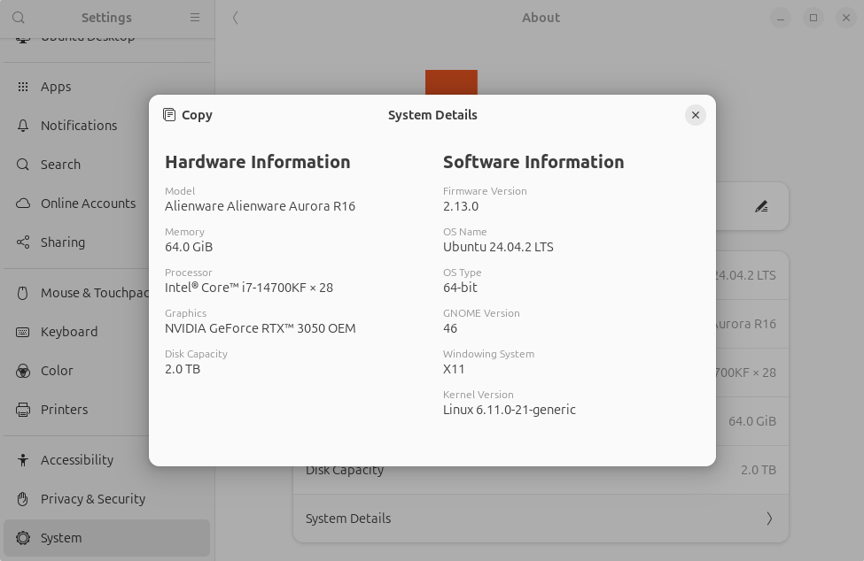

# Troubleshooting

This section summarizes the issues reported so far and their solutions.

## Gazebo is running slowly

---

### 1. The display server may not be set to X11

From
`Settings / System / About / System Details`
check that the display server is set to X11.



If it is not X11, for example if it shows Wayland,
then when you select your username on the Ubuntu login screen, use the gear icon that appears in the bottom-right corner to choose the display server as follows.

- If `Ubuntu` or `Ubuntu on Wayland` can be selected → `Ubuntu`
- If `Ubuntu on Xorg` or `Ubuntu` can be selected → `Ubuntu on Xorg`

## It says an obviously existing project folder does not exist: Local directory /.../hoge.TBS does not exist.

---

Python's `os.path.isdir()` is returning `False` even though the directory exists.
The cause is unknown, but updating the apt packages resolved the issue.

```bash
$ sudo apt update
$ sudo apt upgrade -y
$ sudo apt autoremove --purge -y
$ sudo apt autoclean
```

## ROS communication between the FC and PC does not work

---

### 1. The firewall may be blocking UDP

ROS 2 inter-network communication uses UDP internally,
but the firewall may not be allowing it.
Check the firewall status with the following command,
and if the list of allowed ports does not include UDP ports in the 7400 range, this may be the cause.

```bash
$ sudo ufw status
```

Ideally, only the required ports should be allowed,
but for now, disabling UFW and rebooting will allow communication.

```bash
$ sudo ufw disable
$ sudo reboot
```

## I created and wrote user code, but the FC is not operating

---

A runtime error may have occurred.
Log in to the Raspberry Pi via SSH, and check the console output with `journalctl` to get some clues.
You can move with the arrow keys and exit with the `Q` key.

```bash
$ ssh pi@${hostname}.local  # or pi@${ip_address}
$ journalctl -u tobas_real_realtime.service -e  # or tobas_real_interface.service
```