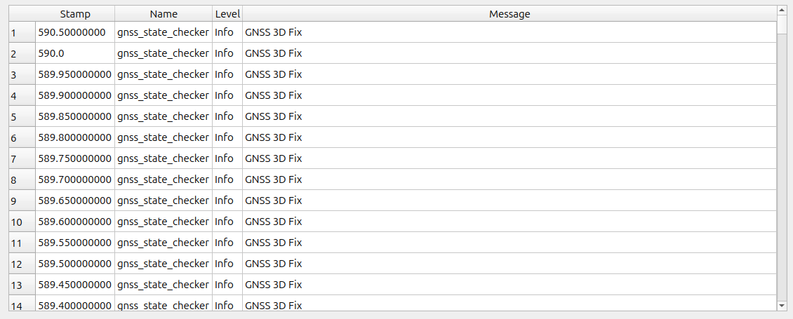

# User Code (Python)

This section assumes that the user has learned the basics of Python and ROS 2.
For learning ROS 2, please refer to
<a href=https://docs.ros.org/en/jazzy/Tutorials.html target="_blank">Tutorials | ROS 2 Documentation</a>.

Among the ROS packages included in a Tobas project created with Setup Assistant (example: tobas_f450.TBS),
the user Python package (example: tobas_f450_user_py) is a Python package that the user can edit freely.
It includes the following three launch files.

- `common.launch.py`: Launched in both real hardware and simulation.
- `real.launch.py`: Launched only on real hardware.
- `gazebo.launch.py`: Launched only during simulation.

As an example, let's create a Python node that checks the GNSS status and outputs a message when 3D positioning is available.
Please edit `tobas_f450_user_py/tobas_f450_user_py/user_node.py` as follows.

```python
import rclpy
from rclpy.node import Node
from rclpy.qos import QoSProfile, ReliabilityPolicy, DurabilityPolicy

from tobas_msgs.msg import Message
from tobas_msgs.msg import Gnss


class GnssStateCheckerNode(Node):
    def __init__(self) -> None:
        super().__init__("gnss_state_checker")

        qos = QoSProfile(depth=1)
        qos.reliability = ReliabilityPolicy.BEST_EFFORT
        qos.durability = DurabilityPolicy.VOLATILE

        self._message_pub = self.create_publisher(Message, "message", qos)
        self._gnss_sub = self.create_subscription(Gnss, "gnss", self._gnss_callback, qos)

    def _gnss_callback(self, gnss: Gnss) -> None:
        message = Message()
        message.header.stamp = gnss.header.stamp
        message.name = self.get_name()

        if gnss.fix_type == Gnss.FIX_3D:
            message.level = Message.LEVEL_INFO
            message.message = "GNSS 3D Fix"
            self._message_pub.publish(message)


def main(args=None) -> None:
    rclpy.init(args=args)
    node = GnssStateCheckerNode()
    rclpy.spin(node)


if __name__ == "__main__":
    main()
```

Configure this node to start automatically.
Uncomment the `add_action` section in `tobas_f450_user_py/launch/common.launch.py`.

```python
# Do not delete or rename this file because it is executed in tobas_f450_config/common_interface.launch.py.

from launch import LaunchDescription
from launch_ros.actions import Node


def generate_launch_description():
    ld = LaunchDescription()

    # Please add the nodes that run both on real hardware and in simulation.

    ld.add_action(
        Node(
            package="tobas_f450_user_py",
            executable="user_node",
            namespace="f450",
        )
    )

    return ld
```

When you start the simulation from the GCS, a message will be displayed in the console of `Control System`.



For details on the API, see [ROS API](./ros_api.md).
