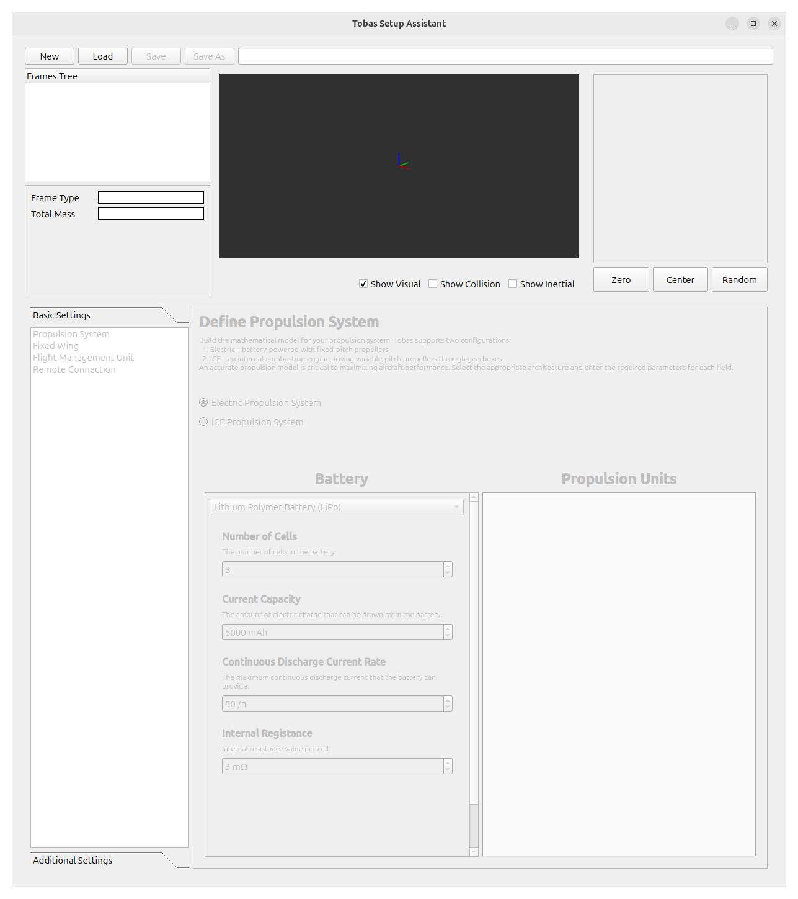
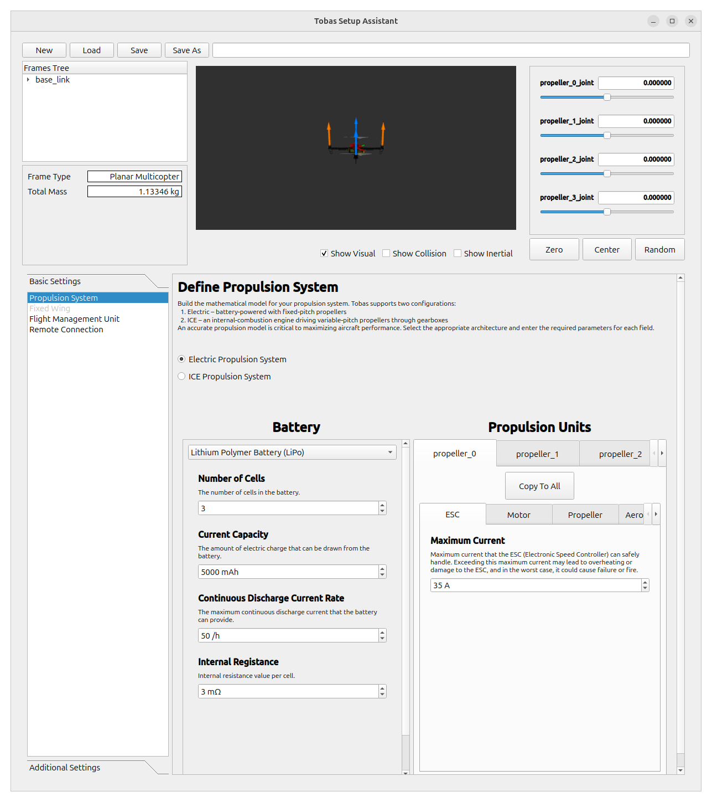
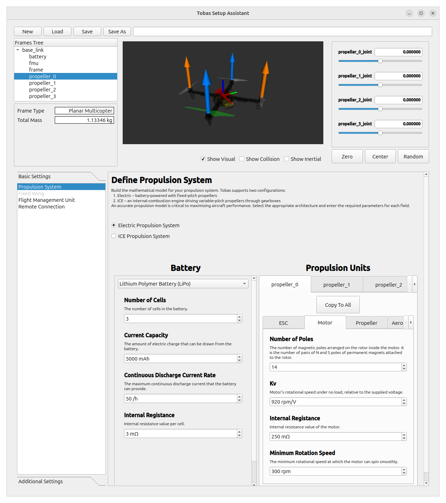
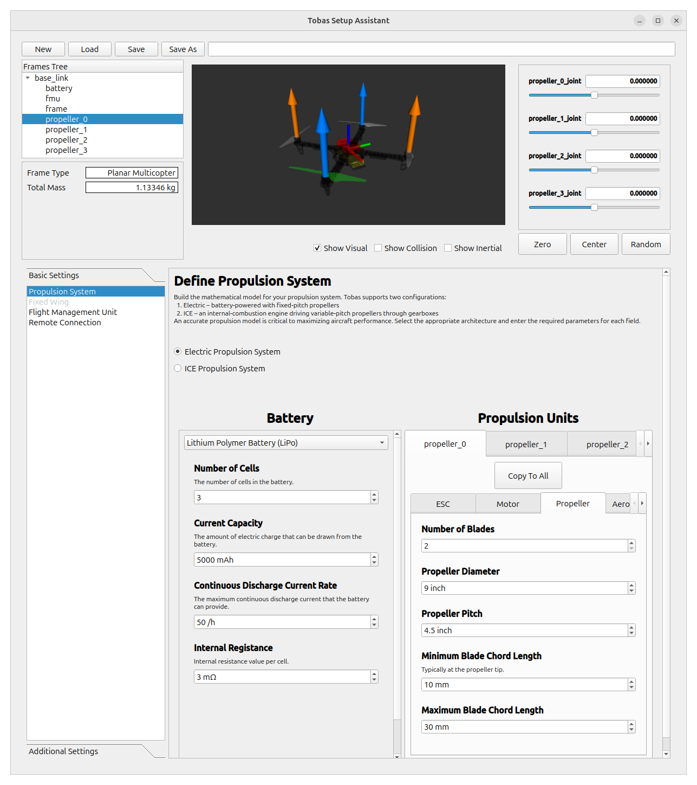
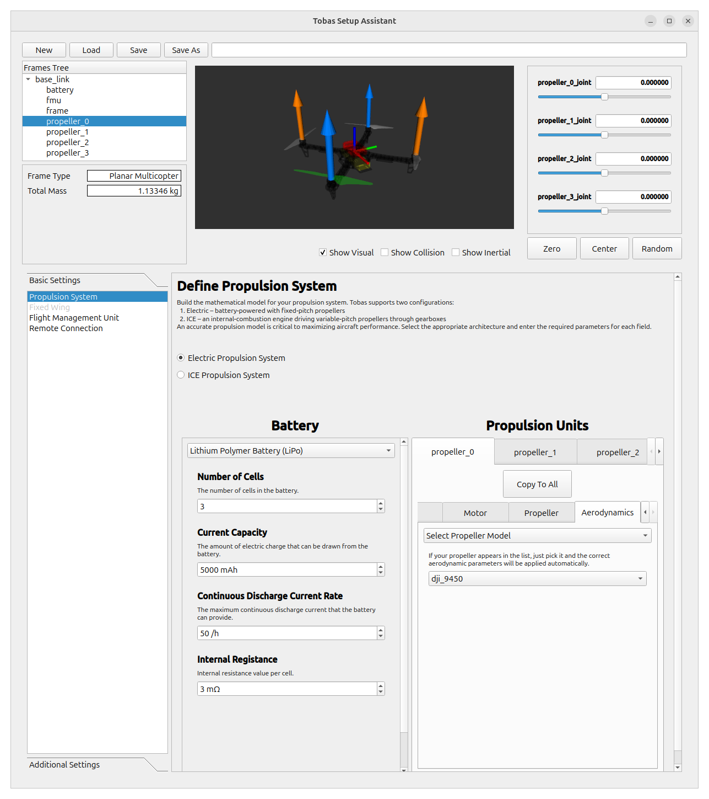
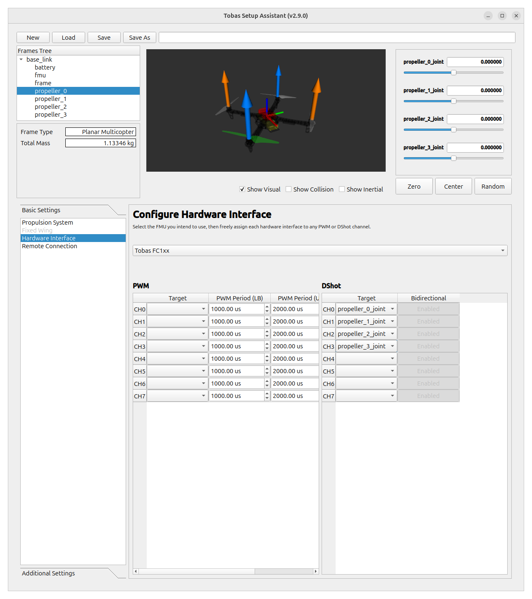
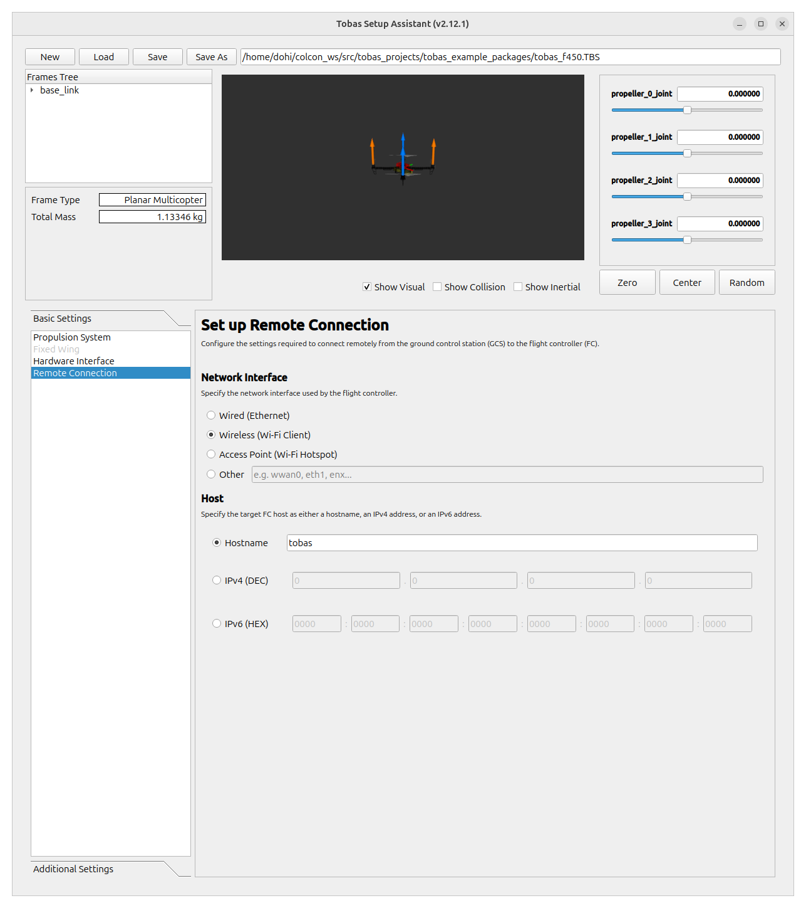
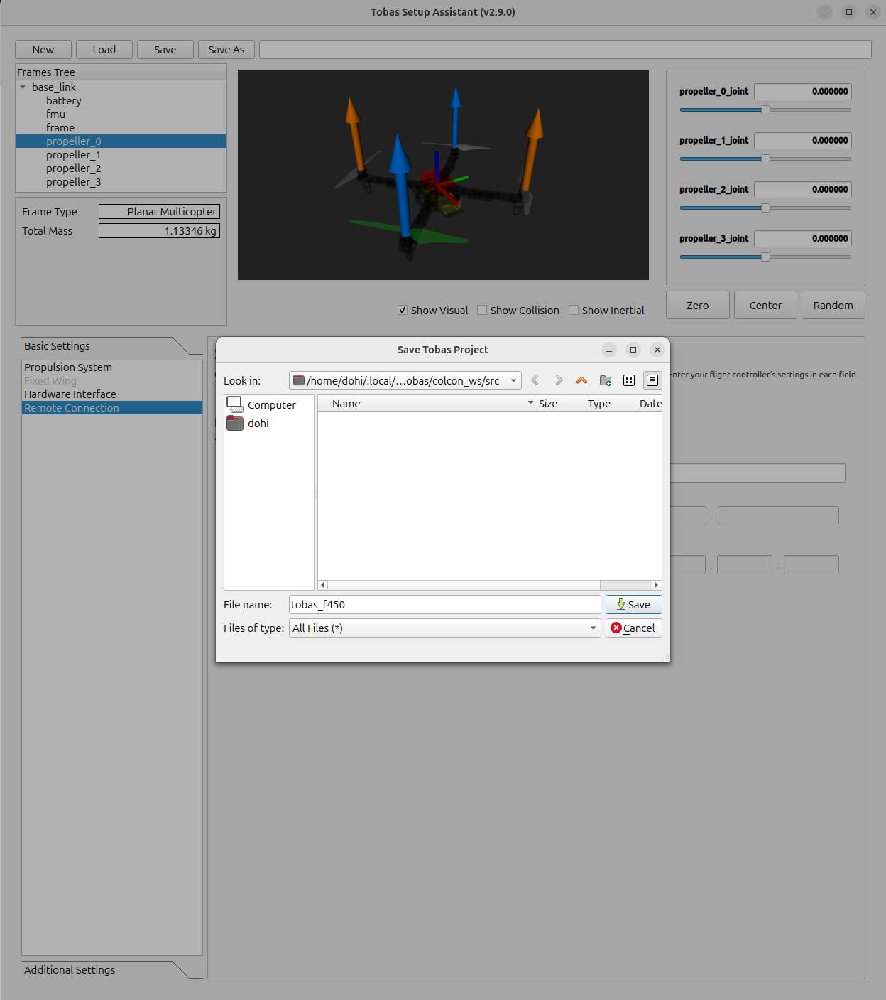

# Airframe Configuration Settings

<!-- ゲームの広告と同じで，全てを理解することよりもとりあえず何も考えずに簡単に動かせることが大事． -->
<!-- 後々必要になる面倒な作業は隠して面白いところを見せる． -->

Use Tobas Setup Assistant to configure the airframe.
Tobas Setup Assistant is a GUI for creating the project folder required to fly a drone with Tobas.
The project folder contains all the information needed to fly the drone, such as the airframe's mass properties, the propeller's aerodynamic characteristics, and the motor's electrical characteristics.
To use Tobas Setup Assistant, you need a Universal Aircraft Description Language (UADF) file that describes your airframe.
For details on UADF, see [What is UADF](../additional_information/what_is_uadf.md).

## Preparation

---

In this tutorial, we use the DJI F450, a typical quadcopter.
The components are as follows:

- Flight controller: <a href=https://tobas.jp/product target="_blank">Tobas FC101</a>
- Power Module: <a href=https://tobas.jp/product target="_blank">Tobas PM101</a>
- Frame: <a href=https://ja.aliexpress.com/item/1005007683004849.html target="_blank">DJI F450 Frame</a>
- Battery: <a href=https://ja.aliexpress.com/item/4000244479545.html target="_blank">HRB 3S 5000mAh 50C</a>
- Motor: <a href=https://ja.aliexpress.com/item/1005008178619191.html target="_blank">DJI A2212 920KV</a> (CW x 2, CCW x 2)
- Propeller: <a href=https://ja.aliexpress.com/item/1005004372872772.html target="_blank">DJI 9450</a> (CW x 2, CCW x 2)
- ESC: <a href=https://www.fly-color.net/index.php?c=category&id=234 target="\_blank">Flycolor Raptor5 35A</a> x 4
- GNSS antenna: <a href=https://www.topgnss.store/en-jp/products/2pcs-l1-l5-helical-antenna-uav-flight-control-antenna-gps-glonass-galileo-bds-rtk-handheld-receiver-an-103-topgnss-helical target="_blank">TOPGNSS AN-103</a>
- RC receiver: <a href=https://www.rc.futaba.co.jp/products/detail/I00000018 target="_blank">Futaba R3001SB</a>

You need to create a UADF for the airframe, but in this tutorial we will use one that has already been prepared.

## Launch

---

Launch `TobasSetupAssistant` from the application menu, or run the following in a terminal.

```bash
$ ros2 launch tobas_setup_assistant airframe_config.launch.py
```



## Loading the UADF

---

Click `New`, select `/opt/tobas/share/tobas_description/urdf/f450.uadf` in the file dialog, and click `Open`.
The airframe will then appear in the model view, and each settings page will be enabled.



## Propulsion System

---

Configure the propulsion system.
Since this airframe uses electric motors, leave `Electric Propulsion System` checked.

### Battery

Configure the battery settings.
Check the battery specifications and enter appropriate values for each item.


### Propulsion Units

Configure each propulsion unit.

First, configure the `propeller_0` link.
Check the specifications of each component and enter appropriate values for `ESC`, `Motor`, and `Propeller`.

<!-- prettier-ignore-start -->
!!! tip
    If you are not sure which propeller on the airframe corresponds to the displayed link name,
    click the link name from `Frame Tree` in the upper-left corner of the screen to highlight it in the model view.
<!-- prettier-ignore-end -->






In `Aerodynamics`, configure the aerodynamic properties of the propeller.
You can choose from multiple configuration methods, but since the DJI 9450 propeller used here already has a prepared model, use that one.
Select `Select Propeller Model` from the first dropdown list, then select `dji_9450` from the dropdown below it.



Since all four propulsion units on this airframe are identical, click `Copy To All` to copy the `propeller_0` settings to the other three.
Make sure the `propeller_0` settings are also reflected in the other tabs.

## Hardware Interface

---

Configure the hardware connection settings.　
Make sure `Tobas FC1xx` is selected,
then set the DShot channel appropriately for each of the four propulsion units.



<!-- prettier-ignore-start -->
!!! note
    If you do not specify an interface here, for example when using a CAN-ESC,
    the hardware will not be driven as-is,
    so you will need to create your own ROS node to connect the hardware and the Tobas software.
<!-- prettier-ignore-end -->

## Remote Connection

---

Configure the settings for remotely connecting from the ground station to the FC.

### Network Interface

Specify the network interface that the FC uses to communicate externally.
In this tutorial, we use a pocket Wi-Fi device for communication between the FC and GCS, so select `Wireless`.
If you use wired LAN, select `Wired`.
If you use the Raspberry Pi's built-in access point without an external communication module, select `Access Point`.
For any other configuration, such as using a VPN interface `tun0`, select `Other` and specify the interface name directly.

### Host

Configure the address used by the GCS to identify the FC on the LAN.
If the FC has a fixed IP address, you can use it directly, but in this tutorial we will use a convenient host name instead.
Select `Hostname` and enter the FC host name configured in [Boot Device Configuration](./bootmedia_config.md).



## Saving the Project

Click `Save`, then in the file dialog save it as `tobas_f450.TBS` under `~/.local/share/tobas/colcon_ws/src/`.



## Next Step

---

This completes the procedure.
Close Setup Assistant.
Next, assemble the actual airframe and set up the hardware.