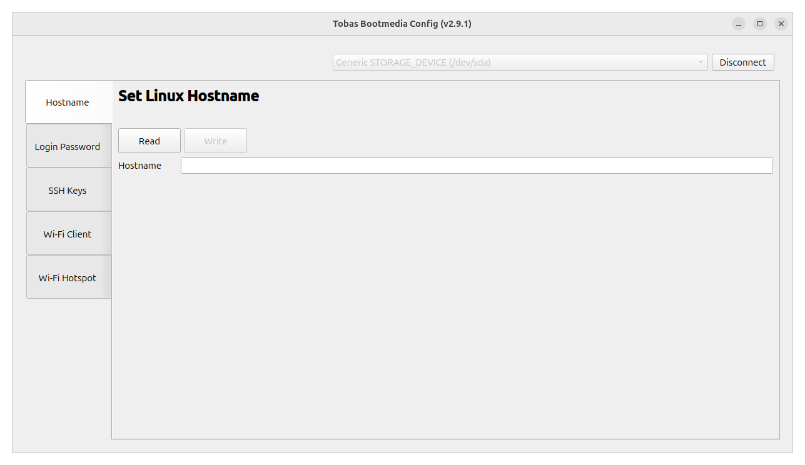
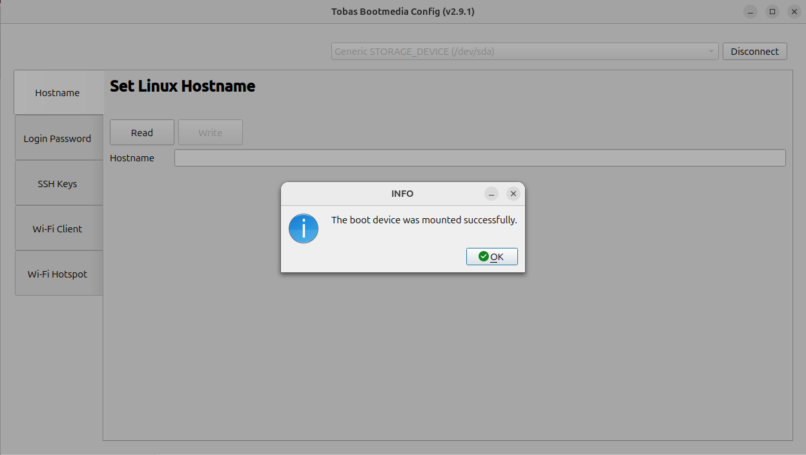
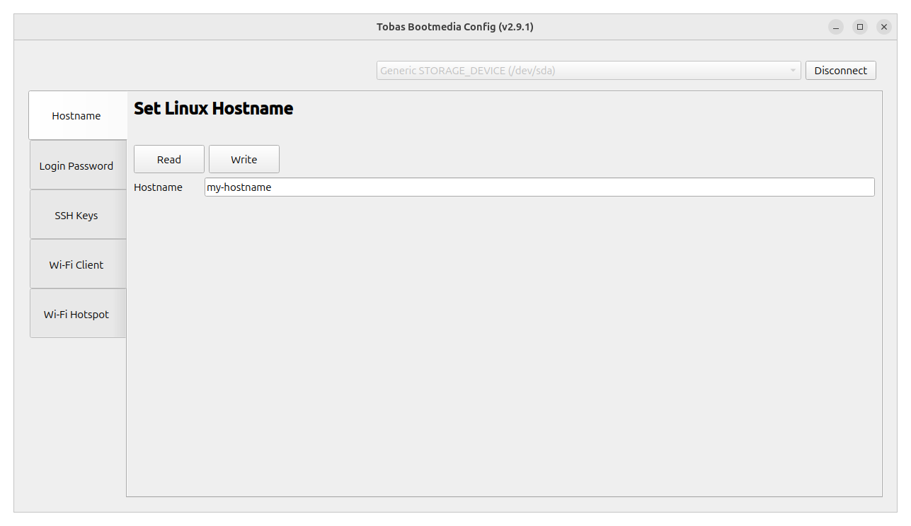
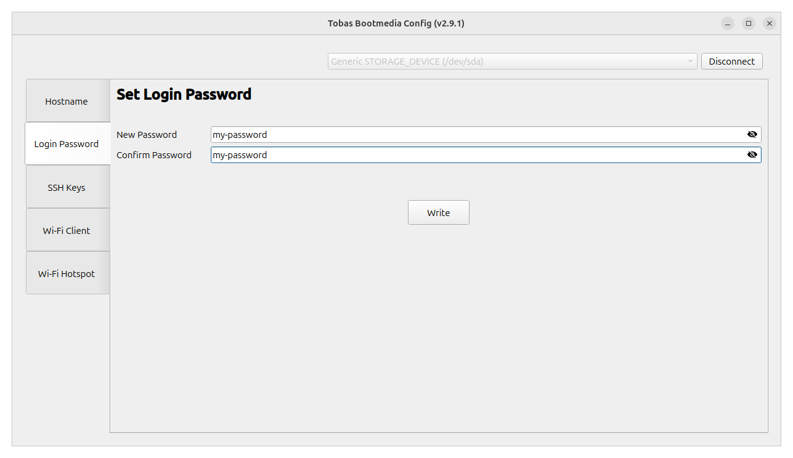
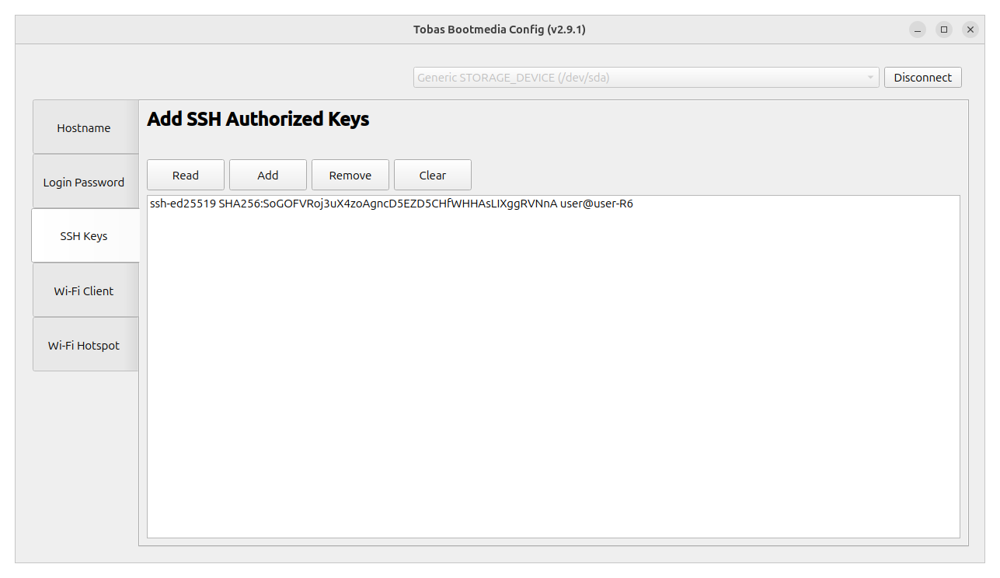
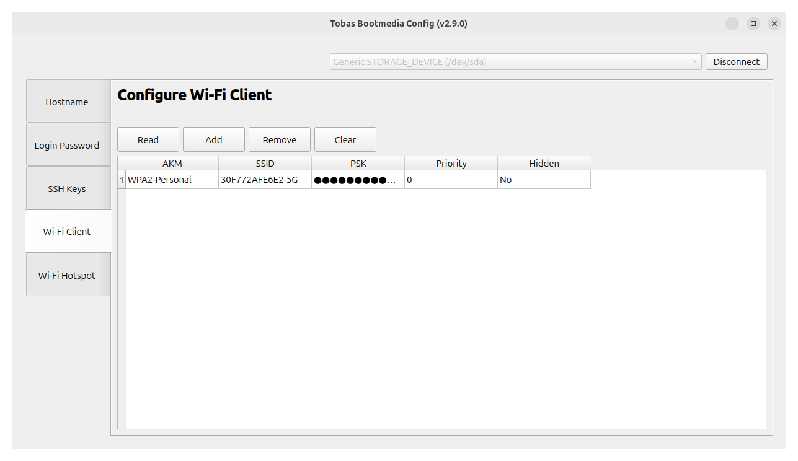
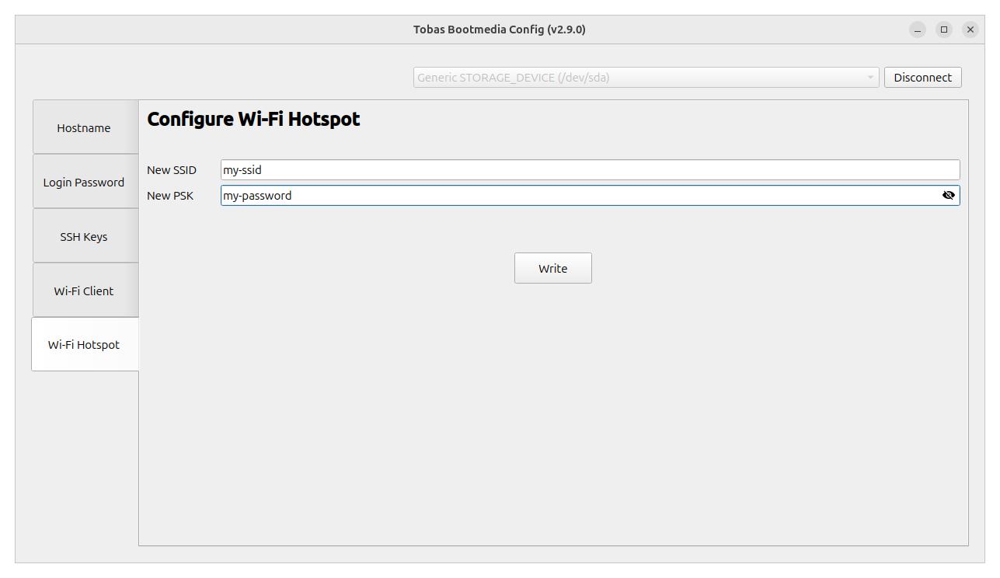
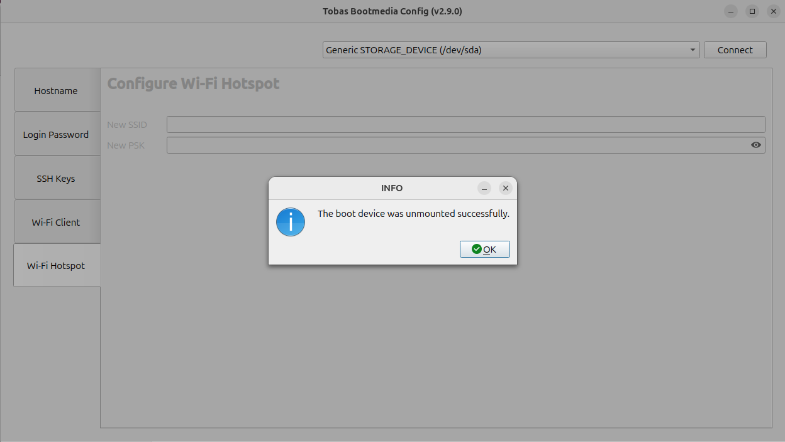

# Boot Device Configuration

First, directly edit the boot device to perform the initial communication-related setup.
Prepare a microSD card with the Tobas image written to it.

## Preparation

---

### Launch the Configuration GUI

Open `TobasBootmediaConfig` from the application menu, or run the following in a terminal.
Since external volumes are handled here, your user login password will be required.

```bash
$ tobas_bootmedia_config
```



### Connect to the Boot Device

Insert the SD card into your PC using a suitable USB card reader.
If the Tobas image has been written correctly, you will be able to select the SD card from the selection list at the top of the GUI.

Make sure the correct SD card is selected, then click `Connect`.
The SD card will be mounted on the PC, and the various configuration pages will become available.



## Configuration Items

---

### Hostname

Edit the Linux hostname.

In Tobas, the hostname is used by default to identify devices on the network,
so hostnames within the expected subnet must be unique.
You can also identify devices by fixed IP address, but if you use multiple units at the same time, it is recommended to make sure their hostnames do not conflict, just in case.

Click `Read` to load the current hostname (`tobas` by default), which enables the `Write` button.
Edit the hostname, then click `Write` to write the new hostname to the SD card.
After writing, click `Read` again and confirm that the change has been applied.



### Login Password

Edit the login password.

It will work even if you leave the default `raspberry` unchanged,
but changing it is recommended for security reasons.

Enter the login password in `New Password`, and enter the same password again in `Confirm Password` for confirmation.
If they match and the password is valid, the `Write` button will be enabled.
Click `Write` to write the entered password to the SD card.



### SSH Keys

Configure SSH key authentication.

In Tobas, some SSH key authentication is used to operate the flight controller (FC) from the ground station,
so the public key of the PC used as the ground station must be registered on the FC.

First, create an SSH key.
Launch `Passwords and Keys` from the application menu,
then click the `+` button in the upper-left corner and select `Secure Shell Key`.
In the dialog that appears, enter an appropriate identifier in Description (such as `<username>@<hostname>`),
then click `Generate`.
In the next dialog, click `OK` to generate the SSH public and private keys. It is fine to leave the password field blank.
Then click `OpenSSH keys` to confirm that the created key is listed.
Double-click the key, note down the `Public key` shown in the dialog, and then close `Passwords and Keys`.


Return to `Tobas Bootmedia Config` and click `Read`.
The currently registered public keys will be listed, and the other buttons will become enabled.
At first, no public keys are registered, so the list will remain empty.
Click `Add`, then copy and paste the public key you noted earlier into the dialog that appears.
Click `OK`, and the public key will be added to the list and written to the SD card at the same time.



### Wi-Fi Client

Configure the FC to operate as a Wi-Fi client.

Tobas uses ROS 2 (DDS) for remote communication,
so all devices that need to communicate, such as the FC and the ground station, must belong to the same subnet.
If you use only Ethernet, or if you operate the FC as an access point, you may skip this section.

Click `Read` to reflect the currently connectable access points in the table and enable the other buttons.
At first, no access points are registered, so the table will remain empty.
Click `Add`, then enter the SSID and PSK of the access point you want to connect to in the dialog that appears.
`Priority` is the connection priority; if multiple networks are available, higher values are given higher priority.
Click `OK` to add the access point to the table and write it to the SD card at the same time.



### Wi-Fi Hotspot

Configure the FC to operate as a Wi-Fi access point.

As mentioned above, the FC and the ground station must belong to the same subnet in order to communicate,
but making the FC itself an access point is convenient because it eliminates the need for an external router during outdoor test flights and similar situations.
If you operate the FC only as a Wi-Fi client, you may skip this section.

Enter any SSID and PSK in `New SSID` and `New PSK`, respectively.
If both are valid, the `Write` button will be enabled.
Click `Write` to write the entered SSID and PSK to the SD card.



## Finish

---

Once all settings are complete, click `Disconnect`.
The boot device will be unmounted and ready to remove.
Close the GUI, and properly remove the SD card from the PC.



## Next Step

---

This completes the procedure.
Next, use Tobas Setup Assistant to create your first project.
