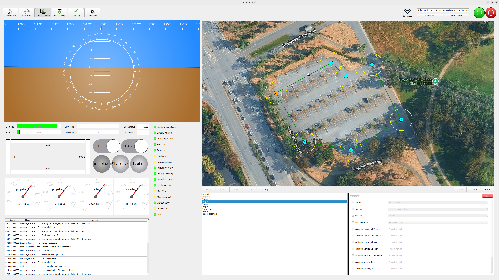
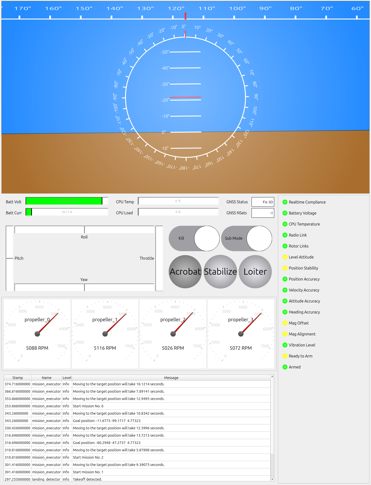
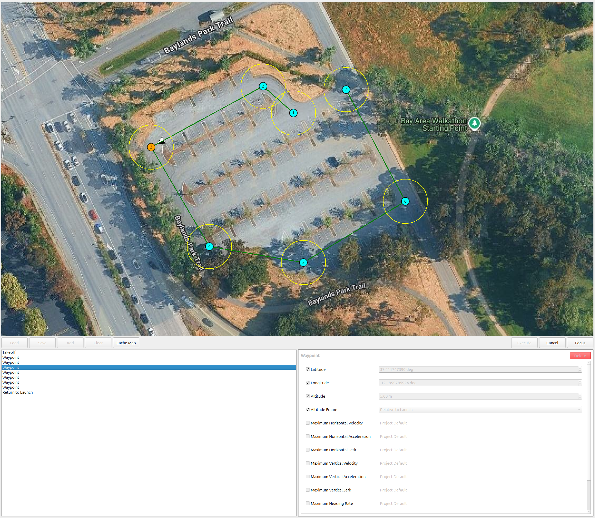
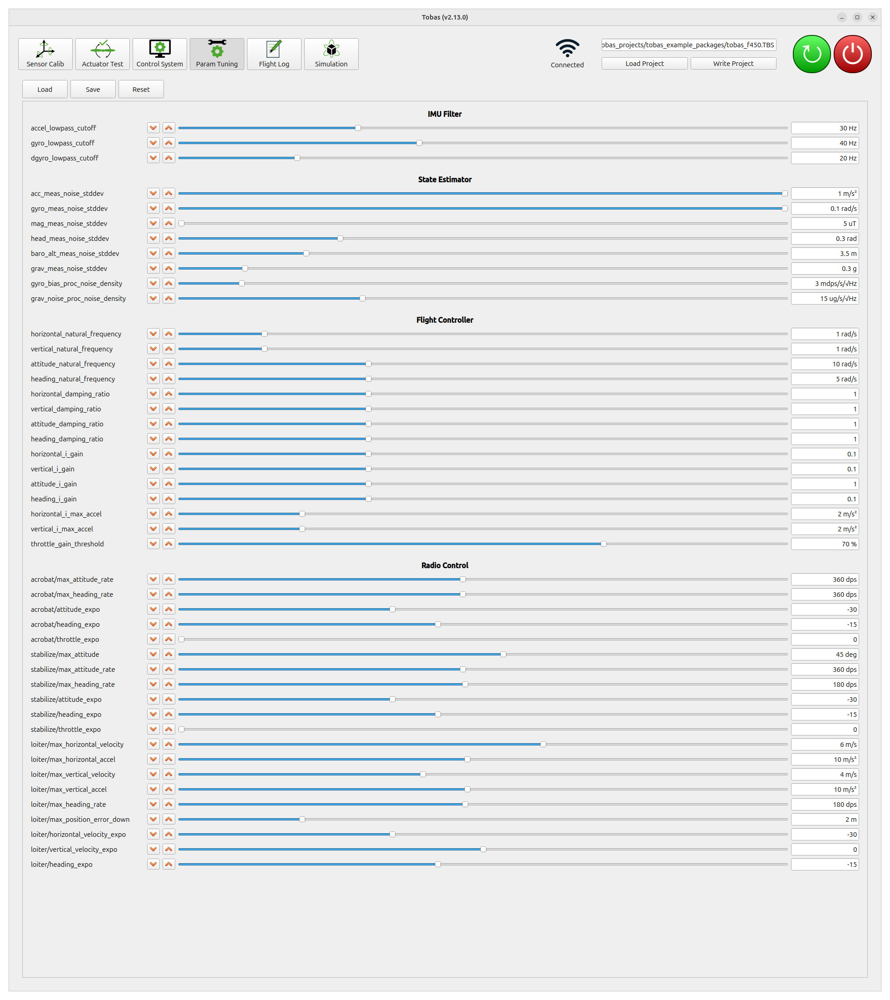
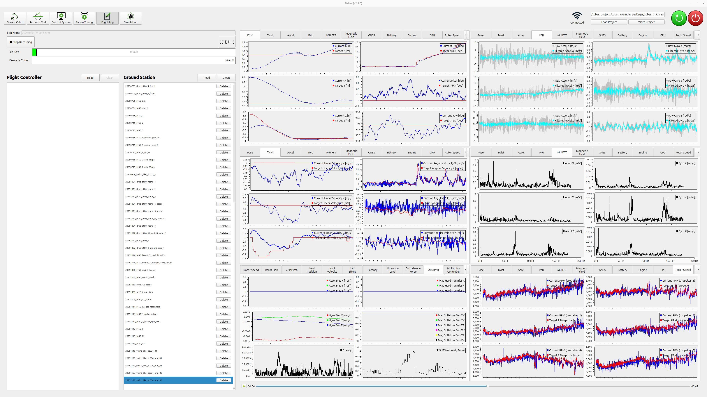

# Flight Testing

## Startup and Shutdown Procedures

---

### Startup Procedure

1. Connect the battery to the drone.
1. Connect the PC to the same network as the FC.
1. Launch `TobasGCS`.
1. Click `Load Project` and load `tobas_f450.TBS`.
1. Click `Control System` in the tool buttons to open it.
1. Pass the pre-arm safety checks and confirm that `Ready to Arm` is lit green.
1. Turn on the transmitter, turn on the `Enable` switch, and turn off the `Kill` switch.
1. Select the flight mode using the transmitter switch. Initially, `Stabilize` (attitude control mode) is safe.
1. Arm by holding the throttle stick down and the yaw stick to the right for 1 second.
1. After arming, return the yaw stick to center and gradually raise the throttle stick.

<iframe width="560" height="315" src="https://www.youtube.com/embed/sHoA8yKJPs4?si=CCOEPsu6z9hd7zOb" title="YouTube video player" frameborder="0" allow="accelerometer; autoplay; clipboard-write; encrypted-media; gyroscope; picture-in-picture; web-share" referrerpolicy="strict-origin-when-cross-origin" allowfullscreen></iframe>
 

<!-- prettier-ignore-start -->
!!! note
    In environments where GNSS cannot be used, such as indoors, the position- and velocity-related checks cannot be passed,
    so you need to disable those checks in the Fail-Safe tab of Setup Assistant.
<!-- prettier-ignore-end -->

### Shutdown Procedure

1. After landing, the drone will automatically disarm after a certain period while the throttle stick is kept low.
   Alternatively, you can disarm immediately by turning on the `Kill` switch.
1. Click the GCS power button (red) to shut down the FC.
1. Taking sufficient care for safety, cut power to the FC and ESC.

The following sections describe each function of the ground control station.

## Control System

---

`Control System` is a tool for monitoring the drone status and planning missions.

### Status Monitoring

The left side of the screen is the status monitoring area, where the following information is displayed:

- Attitude: roll, pitch, yaw
- Battery status: voltage, current
- CPU status: temperature, load
- GNSS status: status, number of satellites
- RC input: sticks, kill, flight mode, other switches
- Status of each motor: rotation speed, communication status
- Status: Pre-Arm Check, Post-Arm Check, etc.
- Messages from each node

### Mission Planning

The right side of the screen is the mission planning area, where you can plan and execute flight missions.

1. Click `Add` to add commands.
   In the figure below, a mission is planned that performs `Takeoff`, passes through 9 `Waypoint`, then `Return to Home` and `Land`.
1. Set the parameters for each command using the dialog at the bottom right of the screen.
   Waypoint coordinates can also be adjusted by dragging and dropping the icons on the map.
1. Press the `Execute` button to execute the mission.

<!-- prettier-ignore-start -->
!!! note
    If the `Enable` switch on the transmitter is on, transmitter commands take priority, so be sure to execute with it turned off.
<!-- prettier-ignore-end -->

## Param Tuning

---

`Param Tuning` is a tool for tuning flight-related parameters online.

### Procedure

1. Click `Load` to load the current parameters from the FC.
1. You can tune parameters online using the increment/decrement buttons or sliders.
1. Click `Save` to save the current parameters in the project folder on the local PC.
1. After the flight, click `Write` to flash the saved parameters to the FC.

### Main Parameters

#### attitude_natural_frequency

This parameter relates to the responsiveness of attitude control.
A larger value makes the response to the target attitude faster, but if it is too large, attitude control becomes unstable.
Increase the value gradually while confirming that no oscillation occurs.
For this airframe, it could be increased up to 25rad/s.

#### heading_natural_frequency

This parameter relates to the responsiveness of heading control.
A larger value makes the response to the target heading faster, but if it is too large, heading control becomes unstable.
Increase the value gradually while confirming that no oscillation occurs.
This time, we left it at the default value.

#### horizontal_natural_frequency

This parameter relates to the responsiveness of horizontal position control.
A larger value makes the response to the target position faster, but if it is too large, position control becomes unstable.
Increase the value gradually while confirming that no oscillation occurs.
This time, we left it at the default value.

#### vertical_natural_frequency

This parameter relates to the responsiveness of vertical position control.
A larger value makes the response to the target altitude faster, but if it is too large, altitude control becomes unstable.
Increase the value gradually while confirming that no oscillation occurs.
This time, we left it at the default value.

#### gyro_lowpass_cutoff

This is the cutoff frequency of the gyroscope sensor’s low-pass filter.
A lower value suppresses gyroscope noise more strongly,
but if it is too low, the signal delay may destabilize angular rate control.
Check the flight log, described later.
If **the motor RPM target oscillates with an amplitude of 10% or more of the hovering RPM**,
consider the post-filter angular rate oscillation to be too large and reduce this value.
This time, we left it at the default value.

## Flight Log

---

`Flight Log` is a tool for recording and replaying in-flight status.

### Recording Flight Logs

1. Enter a log name in `Log Name` (example: 20260101_f450_hover).
1. Press the `Start Recording` button to start recording the log. Continuous recording is supported up to 5GB.
1. Press the `Stop Recording` button to stop recording.

### Viewing Flight Logs

1. Press the `Read` button on the FC side and the PC side to display the list of logs saved on each side.
1. Press the `Download` button to the right of a log name in the FC-side list to download the corresponding log to the PC side.
1. Click a log name in the PC-side list to plot the saved data on the right side.
1. You can control the displayed log time using the play/stop buttons and slider at the bottom right.
