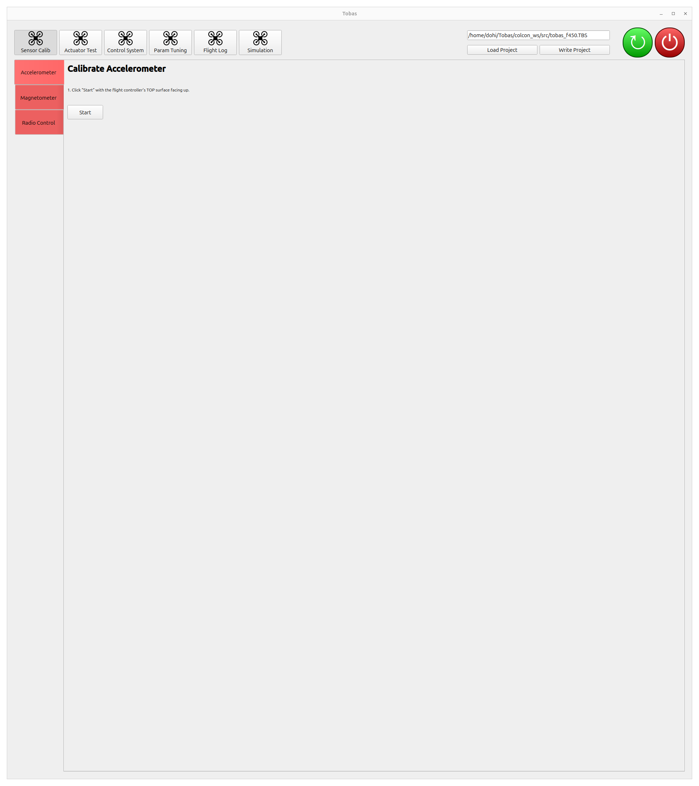
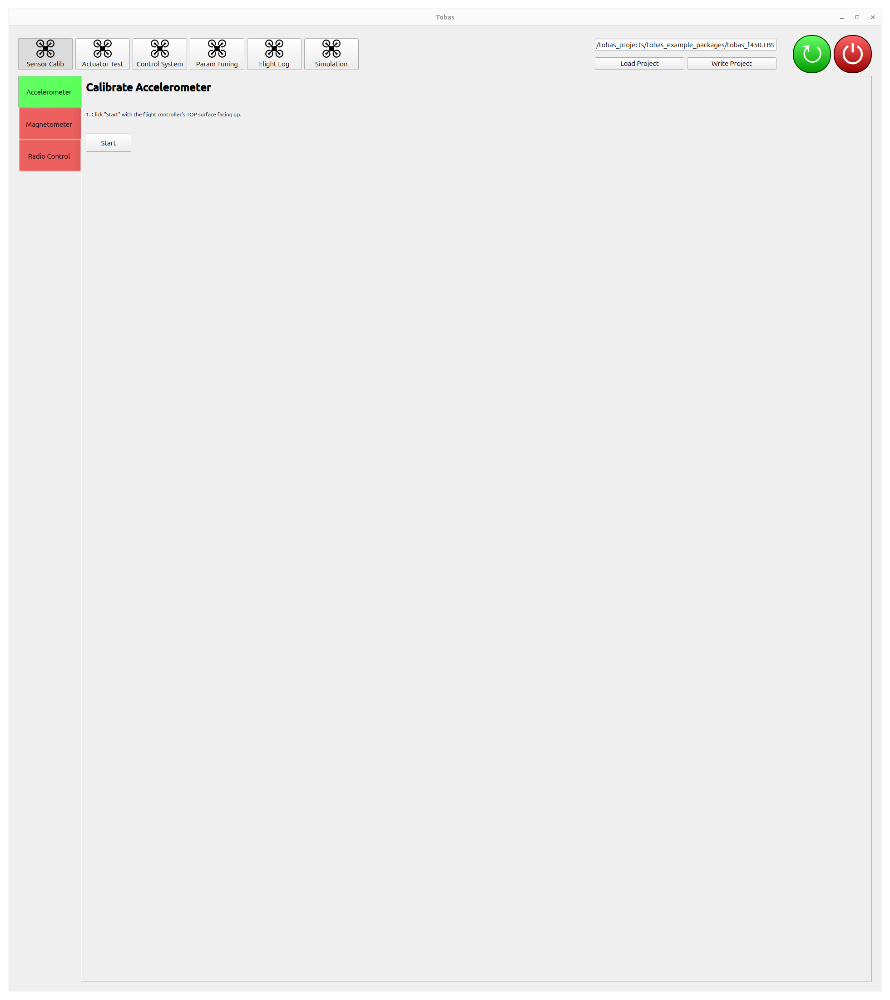
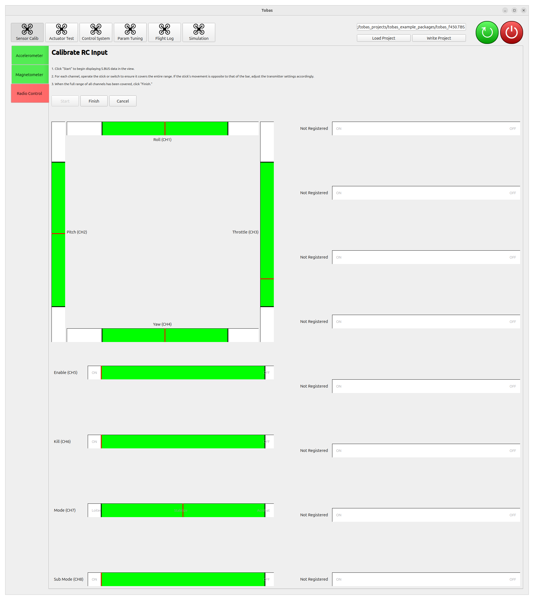
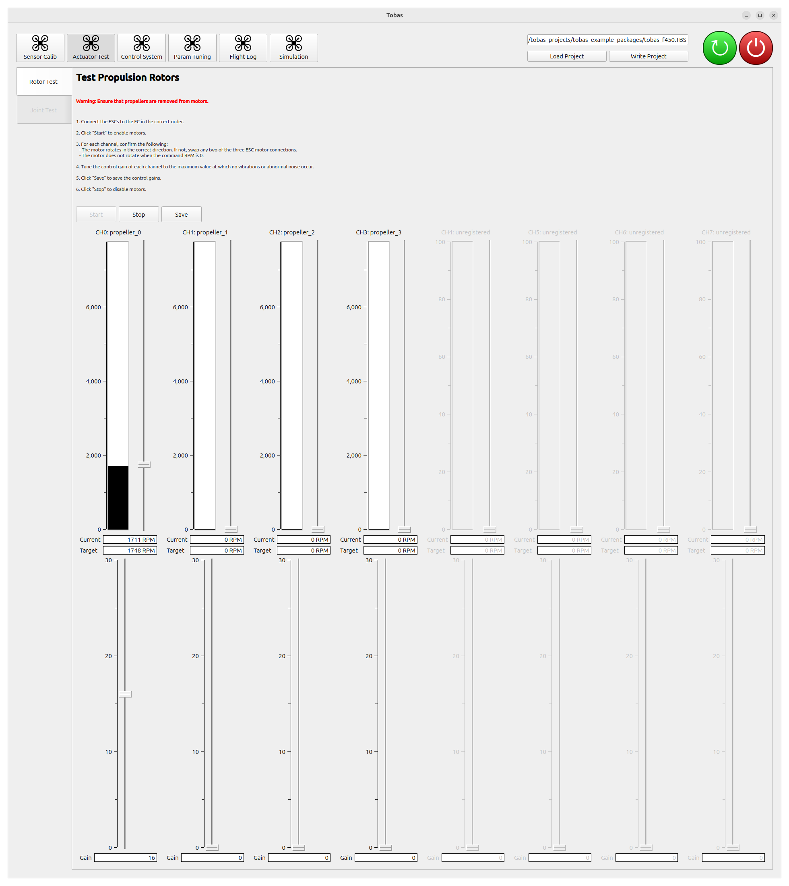
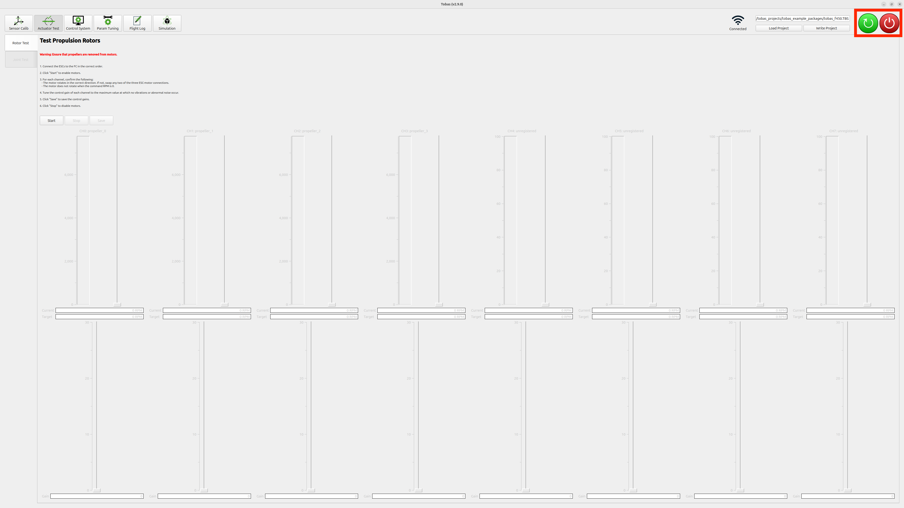

# Hardware Setup

## Building the Vehicle

---

Build the actual vehicle according to the settings configured in Setup Assistant.

<!-- TODO: Navio2のような詳細な手順 -->
<!-- cf. https://docs.emlid.com/navio2/hardware-setup/ -->
<!-- cf. https://docs.emlid.com/navio2/ardupilot/typical-setup-schemes/ -->

<!-- HTMLではパスはページ生成後の相対URLとして解決されることに注意 -->


<!-- prettier-ignore-start -->
!!! note
    When mounting the flight controller on the airframe, be sure to apply at least basic vibration isolation.
    If the mounting is too rigid, vibrations from the motors and propellers may make the accelerometer readings noisy and reduce attitude estimation accuracy.
    On the other hand, if it is too soft, gyro measurements may be delayed, which can cause oscillation in angular velocity control.
    Easy-to-use options include
    <a href=https://holybro.com/products/foam-pads-20pcs target="_blank">Holybro Foam Pads</a> and
    <a href=https://rc.kyosho.com/ja/z8006b.html target="_blank">Kyosho Z8006B</a>.
<!-- prettier-ignore-end -->

## Transmitter Setup

---

The S.BUS signal is assumed to have 8 or more channels.
In Tobas, the role of each RC input channel is as follows:

| Channel | Role            | Interface        |
| :------ | :-------------- | :--------------- |
| CH1     | Roll            | Lever            |
| CH2     | Pitch           | Lever            |
| CH3     | Throttle        | Lever            |
| CH4     | Yaw             | Lever            |
| CH5     | Flight mode     | 3-position switch |
| CH6     | Sub flight mode | 2-position switch |
| CH7     | Enable/disable  | 2-position switch |
| CH8     | Kill            | 2-position switch |
| CH9-16  | GPSw            | 2-position switch |

<br>

Sub flight mode is a switch for making finer flight mode changes within specific flight modes.
It is used when the four basic levers do not provide enough command degrees of freedom, such as for mode switching on vehicles that can control five or more axes simultaneously.
GPSw (General Purpose Switch) is a user-assignable switch.
You can configure the number of these in Setup Assistant according to the transmitter/receiver you use and your purpose.

For <a href=https://www.rc.futaba.co.jp/products/detail/I00000006 target="_blank">Futaba T10J</a>,
channels 1 through 4 are fixed as shown in the table above,
and you can freely assign switches for channel 5 and later.
Press and hold the `+` button on the transmitter to open the menu screen, then select `AUXチャンネル`.
This time, we used the following settings.

| Channel | Switch |
| :------ | :----- |
| CH5     | SwE    |
| CH6     | SwG    |
| CH7     | SwA    |
| CH8     | SwC    |
| CH9     | NULL   |
| CH10    | NULL   |

<br>

Also, when using a Futaba transmitter, you need to set the throttle lever to reverse.
Press and hold the `+` button on the transmitter to open the menu screen, then select `リバース`.
Set only the throttle lever (`THR`) to reverse (`REV`).

## Powering the FC

---

<span style="color: red;"><strong>Always power the FC through the power module via the Molex connector on the top of the board.</strong></span>
By design, the power module supplies power to the Raspberry Pi and the other systems, so do not power it through the Raspberry Pi's type-C port.
Reverse voltage may be applied to some ICs and cause damage.

<!-- prettier-ignore-start -->
!!! tip
      Of course, you can use a LiPo battery as the power source, but if the load is light, such as when you are only doing setup,
      it is convenient to use a commercially available AC adapter for laptops
      with an
      <a href=https://www.amazon.co.jp/dp/B08VZGR846 target="_blank">XT60 adapter</a>
      so that you do not need to worry about battery charge.
<!-- prettier-ignore-end -->

## Loading and Writing a Tobas Project

---

Connect the ground station PC to the same network as the FC.
If you configured multiple networks in [Boot Device Configuration](./bootmedia_config.md),
note that the highest-priority available network will be selected.

Launch `TobasGCS` from the application menu, or run the following in a terminal.

```bash
$ ros2 launch tobas_gcs gcs.launch.py
```

Click `Load Project`, then double-click the `tobas_f450.TBS` created in Setup Assistant to load it.
Click `Write Project` to send the project to the FC and build it there. This takes several minutes.



## Sensor Calibration

Calibrate each sensor.
Click `Sensor Calib` among the tool buttons at the top of the screen.

---

### Accelerometer Calibration

Calibrate the accelerometer.
Place the vehicle on a level surface and click `Start`.
Calibration will complete in a few seconds, and after a short while the tab color will change from red to green.



### Magnetometer Calibration

Calibrate the magnetometer.
Because the magnetometer is strongly affected by the surrounding environment, perform this with the FC mounted on the vehicle.
It is also preferable to do this in an environment without magnetic materials such as rebar nearby.

1. Click `Start`, and magnetometer values will start to appear as white point clouds.
1. For each of the six faces of the FC, slowly rotate the vehicle around the vertical axis with that face pointing upward.
   The process is complete when the progress bar reaches 100%.
1. When finished, click `Finish`. The estimated ellipsoid will be shown in blue, and the point cloud after distortion correction will be shown in green.
   The calibration is successful if the blue ellipsoid overlaps the white point cloud and the green point cloud forms a sphere around the origin.


### Radio Calibration

Calibrate the radio input (S.BUS).

1. Click `Start`, and the values of each S.BUS channel will start to be displayed.
1. For each channel, operate the lever or switch so that the entire operable range is covered.
   If the lever and the GUI bar move in opposite directions, change the transmitter settings appropriately.
1. When finished, click `Finish`.



## Actuator Test

Test the operation of each actuator.
Click `Actuator Test` among the tool buttons at the top of the screen.

---

### Rotor Test

<span style="color: red;"><strong>Warning: The motors will rotate during this operation. Be extremely careful if you perform this test with propellers attached.</strong></span>



1. Click `Start` to enable all motors for rotation.
1. For each motor, move the lever to command the rotation speed and check that the connection and rotation direction are correct.
1. Adjust the control gain for each motor.
   Increase the gain one by one while changing the target rotation speed and confirming that no oscillation occurs.
   Here, all gains were set to 17.
1. Click `Save` to save the control gains to the FC.
1. Click `Stop` to finish the test.

<!-- prettier-ignore-start -->
!!! note
    If the motors do not rotate, check whether the `ERR` lamp on the top of the FC is lit.
    If it is lit, turn the power off once and then power it on again.
<!-- prettier-ignore-end -->

### Joint Test

If the vehicle has PWM-driven joints such as tilt rotors or fixed-wing control surfaces, you can test the position commands for each joint.
This vehicle has no movable joints other than the propellers, so skip this step.

## Powering Off the FC

---

1. Press the red power button at the top right of the screen to shut down the FC.
1. Make sure the Raspberry Pi power button has changed from green to red, then unplug the power.



## Next Step

---

This completes the procedure.
In the next step, you will finally fly the vehicle.