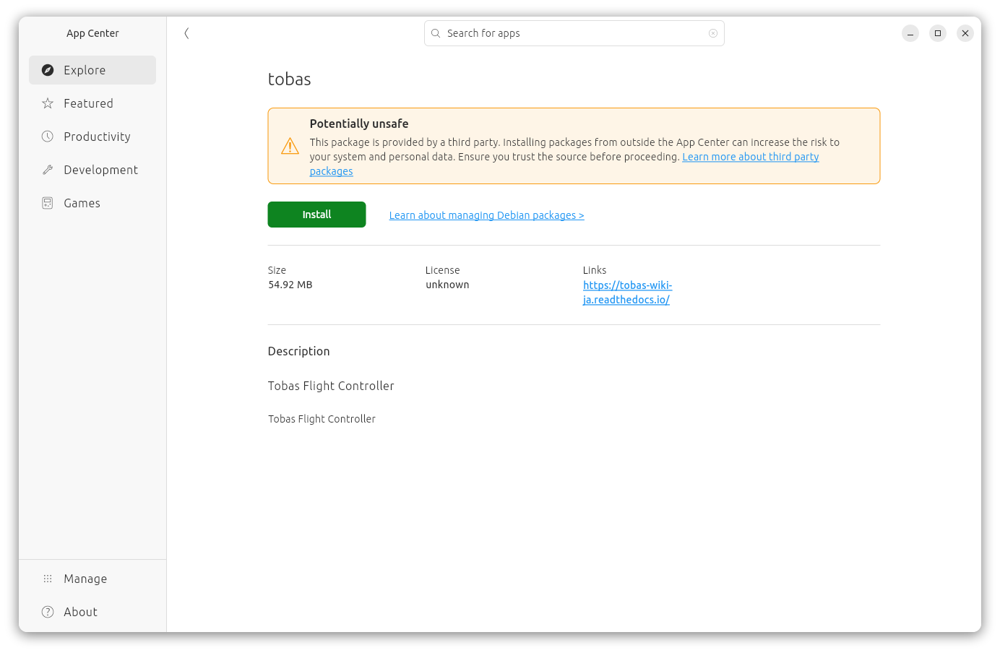
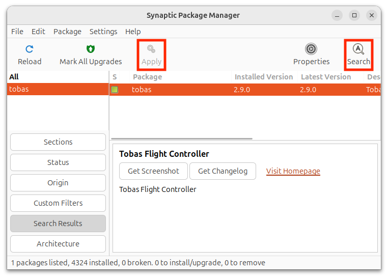
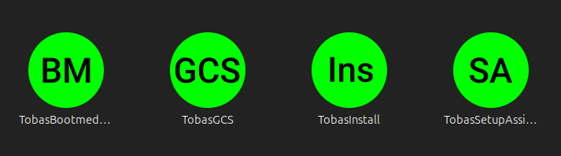
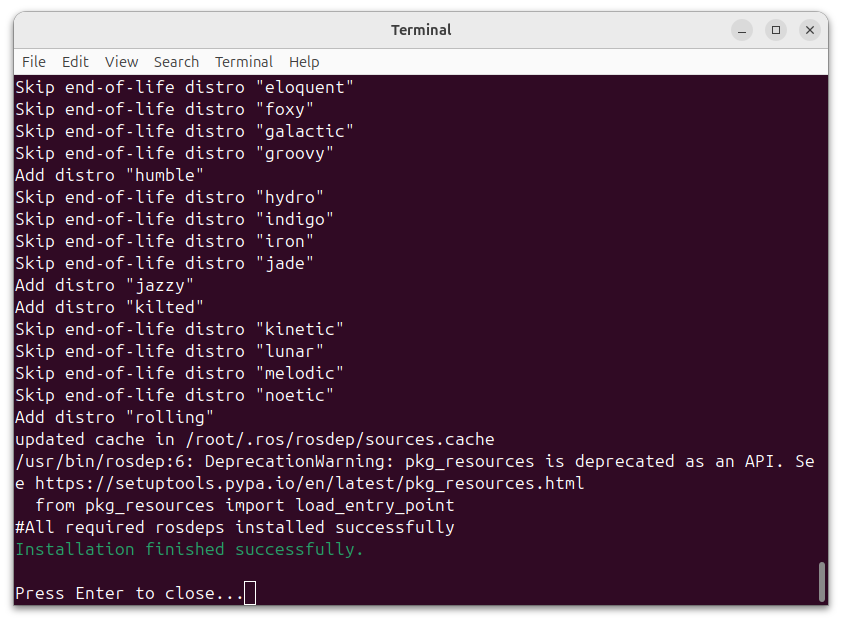
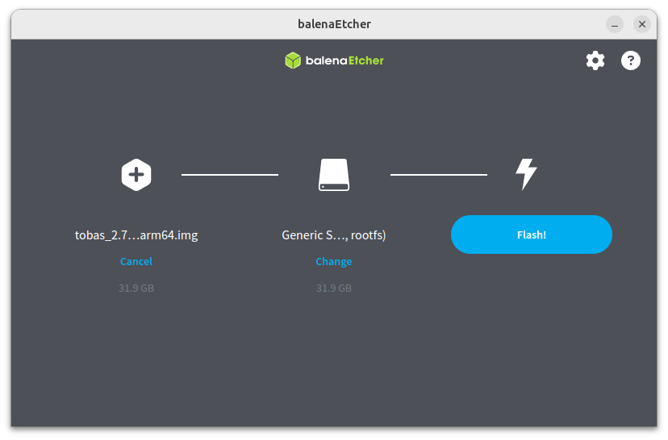

# Installation

## Installing Tobas on a PC

---

### Procedure (from the desktop)

Please download
<a href=https://drive.google.com/file/d/1BVtOWmo6aHrxy5Fax1PpkeR_EMCMBDwH/view target="_blank">tobas_2.13.0_amd64.deb</a>.

Open the file explorer and double-click the downloaded deb package to launch App Center.
Click `Install` to start the installation. This may take a few minutes.



If Tobas is already installed and you want to update it, you must first uninstall the old package.
Install and launch Synaptic Package Manager from App Center,
then right-click `tobas`, select complete removal, and apply the changes to uninstall the package so that it can be installed again.



When the installation is complete, the following will be added to the application menu:
`TobasBootmediaConfig`, `TobasGCS`, `TobasInstall`, `TobasSetupAssistant`



Launch `TobasInstall` from the application menu to open a terminal and start installing additional components. This may take several tens of minutes.
If `Installation finished successfully.` is displayed at the end of the terminal output, the installation was successful.
Press Enter to close the terminal.



### Procedure (from the terminal)

Download
<a href=https://drive.google.com/file/d/1BVtOWmo6aHrxy5Fax1PpkeR_EMCMBDwH/view target="_blank">tobas_2.13.0_amd64.deb</a>.

```bash
$ sudo apt install -y python3-pip
$ sudo pip install gdown --break-system-packages
$ cd ~/Download
$ gdown --fuzzy 'https://drive.google.com/file/d/1BVtOWmo6aHrxy5Fax1PpkeR_EMCMBDwH/view'
```

If Tobas is already installed and you want to update it, first uninstall the old package.

```bash
$ sudo dpkg -r tobas
```

Install Tobas.

```bash
$ sudo dpkg -i tobas_2.13.0_amd64.deb
```

Install the dependent packages.
If `Installation finished successfully.` is displayed at the end, the installation was successful.

```bash
$ tobas_install_prereqs
> ...
> Installation finished successfully.
```

## Writing the flight controller image

---

### Required items

- <a href=https://www.raspberrypi.com/products/raspberry-pi-5/ target="_blank">Raspberry Pi 5</a>
- Tobas HAT <!-- TODO: URL -->
- A micro SD card with at least 32GB of capacity (for example, <a href=https://www.sandisk.com/products/memory-cards/microsd-cards/sandisk-extreme-uhs-i-microsd target="_blank">SanDisk Extreme microSDXC™ UHS-I CARD - 32GB</a>)
- An SD card reader (for example, <a href=https://www.sandisk.com/products/accessories/memory-card-readers/sandisk-quickflow-microsd-usb-a-memory-card-reader target="_blank">SanDisk QuickFlow™ microSD™ UHS-I Card USB-A Reader</a>)

### Procedure (from the desktop)

Please download
<a href=https://drive.google.com/file/d/1etk2XPJz1U5ZHVq6YdjSPrK0U3GHJ6Ju/view target="_blank">tobas_2.13.0_arm64.img.gz</a>.

Install any suitable image flasher. For example, the following can be used:

- <a href=https://etcher.balena.io/ target="_blank">balenaEtcher</a>
- <a href=https://www.raspberrypi.com/software/ target="_blank">Raspberry Pi Imager</a>

Connect the SD card to the PC using the card reader.

Launch the image flasher, select the downloaded image and the target SD card, and start writing.
The following is the balenaEtcher screen.



When it finishes successfully, remove the SD card from the PC.

### Procedure (from the terminal)

Download
<a href=https://drive.google.com/file/d/1etk2XPJz1U5ZHVq6YdjSPrK0U3GHJ6Ju/view target="_blank">tobas_2.13.0_arm64.img.gz</a>.

```bash
$ sudo apt install -y python3-pip
$ sudo pip install gdown --break-system-packages
$ cd ~/Download
$ gdown --fuzzy 'https://drive.google.com/file/d/1etk2XPJz1U5ZHVq6YdjSPrK0U3GHJ6Ju/view'
```

Extract the downloaded file.

```bash
$ sudo apt install -y gzip
$ gunzip tobas_2.13.0_arm64.img.gz
```

Connect the SD card to the PC using the card reader.

Write the image to the SD card.
Replace `/dev/sdx` with the actual path.

```bash
$ sudo dd if=tobas_2.13.0_arm64.img of=/dev/sdx bs=4M conv=fsync status=progress
```

When it finishes successfully, remove the SD card from the PC.

<!-- prettier-ignore-start -->
!!! note
    The PC deb package and the FC image are compatible as long as their versions match up to the minor version (the second digit).
    For example, PC v1.2.3 and FC v1.2.4 are compatible, but operation is not guaranteed for v1.2.3 and v1.3.3.
<!-- prettier-ignore-end -->

## Proceed to the next step

---

Installation is now complete.
To apply the changes made during installation, we recommend restarting the PC once before proceeding.
Next, use Tobas Bootmedia Config to perform the initial pre-boot configuration.