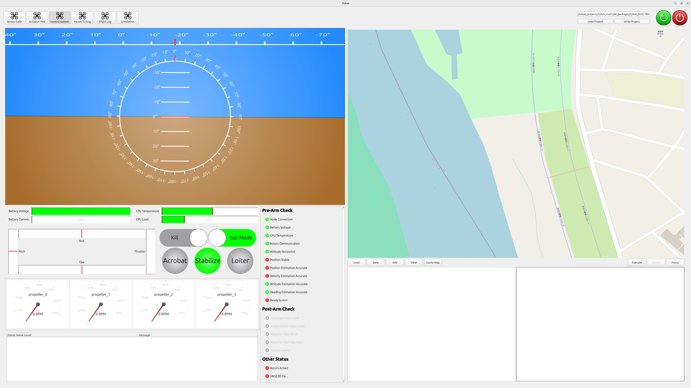
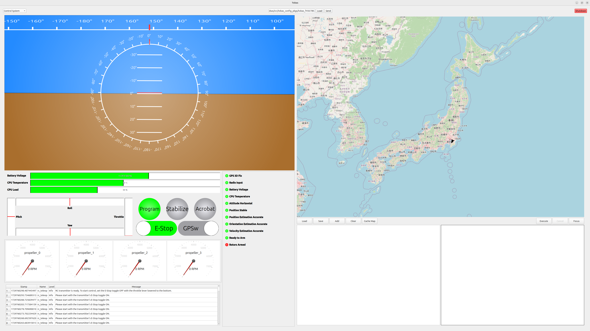
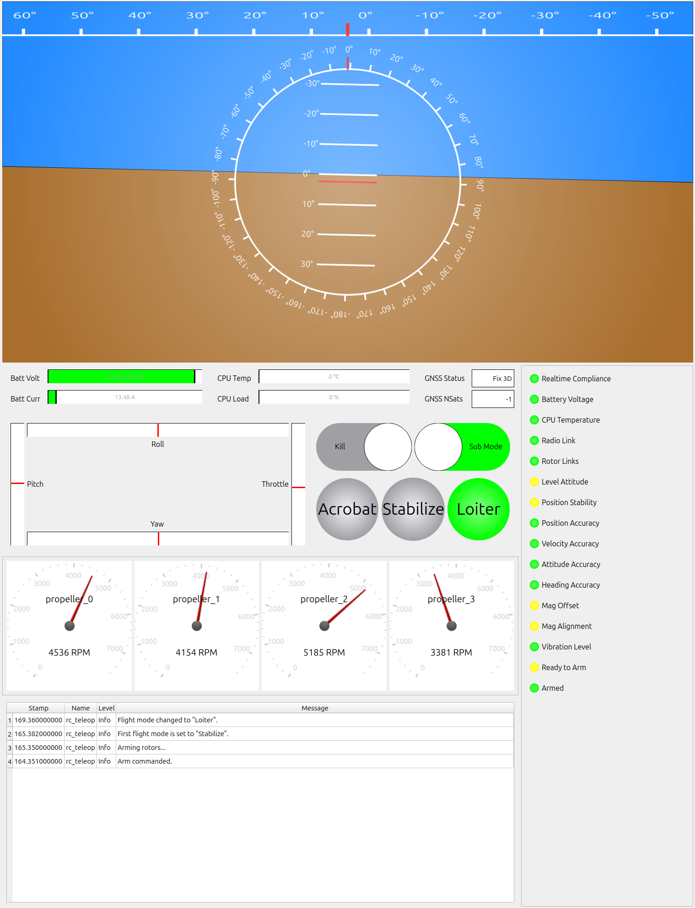
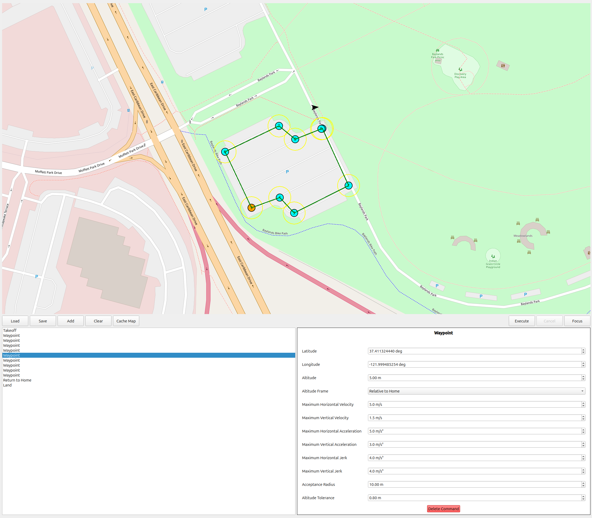
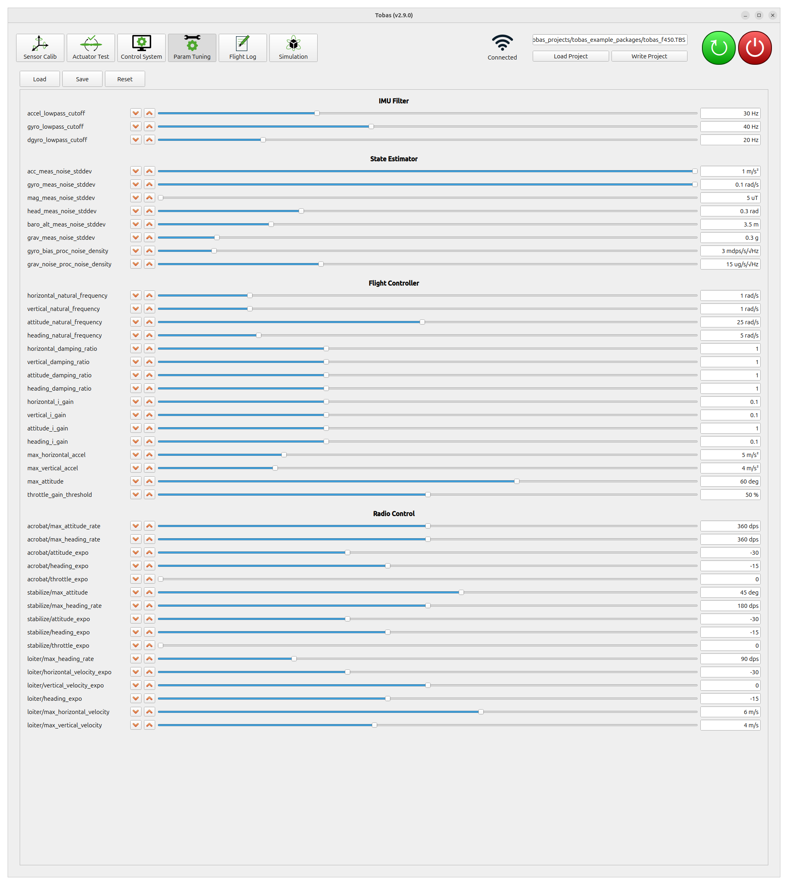

# 飛行試験

## 開始・終了の手順

---

### 開始の手順

1. ドローンにバッテリーを接続します．
1. PC を FC と同じネットワークに接続します．
1. `TobasGCS`を起動します．
1. `Load Project`をクリックし，`tobas_f450.TBS`を読み込みます．
1. ツールボタンの中にある`Control System`をクリックして開きます．
1. アーム前の安全確認にパスし，`Ready to Arm`が緑色に点灯していることを確認します．
1. プロポの電源を入れ，`Enable` スイッチをオンにし，`Kill`スイッチをオフにします．
1. プロポのスイッチで飛行モードを決めます．最初は`Stabilize` (姿勢制御モード) が安全です．
1. スロットルレバーを下，ヨーレバーを右に傾けた状態で 1 秒間維持するとアームします．
1. アームしたらヨーレバーを戻し，スロットルレバーを少しずつ上げます．

<iframe width="560" height="315" src="https://www.youtube.com/embed/sHoA8yKJPs4?si=CCOEPsu6z9hd7zOb" title="YouTube video player" frameborder="0" allow="accelerometer; autoplay; clipboard-write; encrypted-media; gyroscope; picture-in-picture; web-share" referrerpolicy="strict-origin-when-cross-origin" allowfullscreen></iframe>
 

<!-- prettier-ignore-start -->
!!! note
    屋内などGNSSが使えない環境では位置・速度に関するチェック項目にパスできないため，
    Setup AssistantのFail-Safeのタブからそれらに関するチェックを外す必要があります．
<!-- prettier-ignore-end -->

### 終了の手順

1. 着陸後スロットルレバーを下げた状態で一定時間経つと自動的にディスアームします．
   もしくは，`Kill`スイッチをオンにすることで即座にディスアームできます．
1. GCS の電源ボタン (赤色) をクリックし，FC をシャットダウンします．
1. 安全に十分に気をつけて，FC と ESC への給電を切ります．

以下では地上局の各機能について説明します．

## Control System

---

`Control System`は，ドローンの状態監視とミッション計画を行うためのツールです．

### 状態監視機能

画面左側は状態監視機能であり，以下の情報が表示されます．

- 姿勢: ロール，ピッチ，ヨー
- バッテリーの状態: 電圧，電流
- CPU の状態: 温度，負荷
- GNSS の状態: ステータス，衛星数
- RC 入力: レバー，キル，飛行モード，その他スイッチ
- 各モータの状態: 回転数，通信状態
- ステータス: Pre-Arm Check，Post-Arm Check，その他
- 各ノードからのメッセージ

### ミッション計画機能

画面右側はミッション計画機能であり，飛行ミッションの計画と実行ができます．

1. `Add`をクリックしてコマンドを追加します．
   下図では`Takeoff`の後，9 つの`Waypoint`を経由し，`Return to Home`してから`Land`するミッションを計画しています．
1. 画面右下のダイアログから各コマンドに対応したパラメータを設定します．
   ウェイポイントの座標は画面上のマップ中のアイコンをドラッグアンドドロップすること でも操作できます．
1. `Execute`ボタンを押すとミッションが実行されます．

<!-- prettier-ignore-start -->
!!! note
    プロポの`Enable`スイッチがオンだとプロポからの指令が優先されるため，必ずオフにした状態で実行してください．
<!-- prettier-ignore-end -->

## Param Tuning

---

`Param Tuning`は，飛行に関するパラメータをオンラインで調整するためのツールです．

### 手順

1. `Load`をクリックすると，FC から現在のパラメータが読み込まれます．
1. 増減ボタンまたはスライダー操作でパラメータをオンラインで調整できます．
1. `Save`をクリックすると，現在のパラメータがローカル PC 内のプロジェクトフォルダに保存されます．
1. 飛行終了後に`Write`をクリックして保存したパラメータを FC にフラッシュします．

### 主要なパラメータ

#### attitude_natural_frequency

姿勢制御の応答性に関するパラメータです．
大きいほど目標姿勢への応答が早くなりますが，大きすぎると姿勢制御が不安定になります．
振動が発生しないことを確認しながら少しずつ値を大きくしてください．
今回の機体では 25rad/s まで上げることができました．

#### heading_natural_frequency

姿勢制御の応答性に関するパラメータです．
大きいほど目標方位への応答が早くなりますが，大きすぎると方位制御が不安定になります．
振動が発生しないことを確認しながら少しずつ値を大きくしてください．
今回はデフォルトのままとしました．

#### horizontal_natural_frequency

水平位置制御の応答性に関するパラメータです．
大きいほど目標位置への応答が早くなりますが，大きすぎると位置制御が不安定になります．
振動が発生しないことを確認しながら少しずつ値を大きくしてください．
今回はデフォルトのままとしました．

#### vertical_natural_frequency

垂直位置制御の応答性に関するパラメータです．
大きいほど目標高度への応答が早くなりますが，大きすぎると高度制御が不安定になります．
振動が発生しないことを確認しながら少しずつ値を大きくしてください．
今回はデフォルトのままとしました．

#### accel_lowpass_cutoff

加速度センサの 1 次ローパスフィルタのカットオフ周波数です．
姿勢推定には影響せず，制御にのみ使用されます．
飛行ログを確認し，フィルター後の加速度のノイズが強すぎる場合は下げてください．
今回はデフォルトのままとしました．

#### gyro_lowpass_cutoff

ジャイロセンサの 1 次ローパスフィルタのカットオフ周波数です．
姿勢推定には影響せず，制御にのみ使用されます．
飛行ログを確認し，フィルター後のジャイロのノイズが強すぎる場合は下げてください．
今回はデフォルトのままとしました．

## Flight Log

---

`Flight Log`は，飛行中の状態の記録，再生を行うためのツールです．

### 飛行ログの記録

1. `Log Name`にログの名前 (例: 20260101_f450_hover) を入力してください．
1. `Start Recording`ボタンを押すと，ログの記録が開始します．最大 5GB まで連続して記録できるようになっています．
1. `Stop Recording`ボタンを押すと記録が終了します．

### 飛行ログの表示

1. FC 側と PC 側の`Read`ボタンを押すと，それぞれに保存されているログのリストが表示されます．
1. FC 側のリスト中のログ名の右にある`Download`ボタンを押すと，対応したログが PC 側にダウンロードされます．
1. PC 側のリスト中のログ名をクリックすると，保存されているデータが右側にプロットされます．
1. 右下の再生・停止ボタンやスライダーでログの表示時刻を操作できます．
