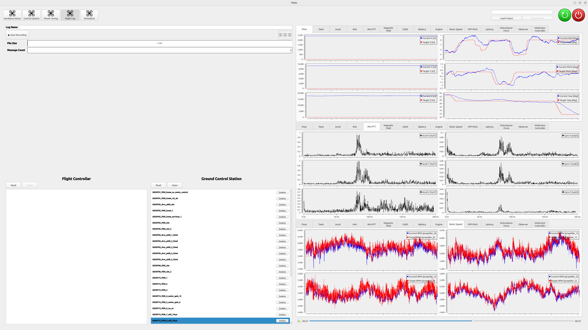

# 飛行試験

[シミュレーション](./gazebo_simulation.md) で問題なければ，実機での飛行試験を行います．

## 開始・終了の手順

---

シミュレーションを起動すること以外は前ページの HITL の手順と全く同じです．
機体と十分に距離をとり，安全に飛行させてください．

<iframe width="560" height="315" src="https://www.youtube.com/embed/sHoA8yKJPs4?si=CCOEPsu6z9hd7zOb" title="YouTube video player" frameborder="0" allow="accelerometer; autoplay; clipboard-write; encrypted-media; gyroscope; picture-in-picture; web-share" referrerpolicy="strict-origin-when-cross-origin" allowfullscreen></iframe>
 

もしもシミュレーションは成功したにもかかわらず実機は失敗した場合，
まずは [URDF](./create_urdf.md) や [Setup Assistant](./setup_assistant.md) の設定に誤りがないか確認してください．
それでも解決しない場合は，代表の土肥 (masa0u0masa(at)gmail.com) まで連絡していただけると幸いです．

## Flight Log

---

`Flight Log`は，飛行中の状態の記録，再生を行うためのツールです．

## 飛行ログの記録

1. `Log Name`にログの名前 (例: 20250101_f450_hover) を入力してください．
1. `Start Recording`ボタンを押すと，ログの記録が開始します．最大 5GB まで連続して記録できるようになっています．
1. `Stop Recording`ボタンを押すと記録が終了します．

## 飛行ログの表示

1. FC 側と PC 側の`Read`ボタンを押すと，それぞれに保存されているログのリストが表示されます．
1. FC 側のリスト中のログ名の右にある`Download`ボタンを押すと，対応したログが PC 側にダウンロードされます．
1. PC 側のリスト中のログ名をクリックすると，保存されているデータが右側にプロットされます．
1. 右下の再生・停止ボタンやスライダーでログの表示時刻を操作できます．
