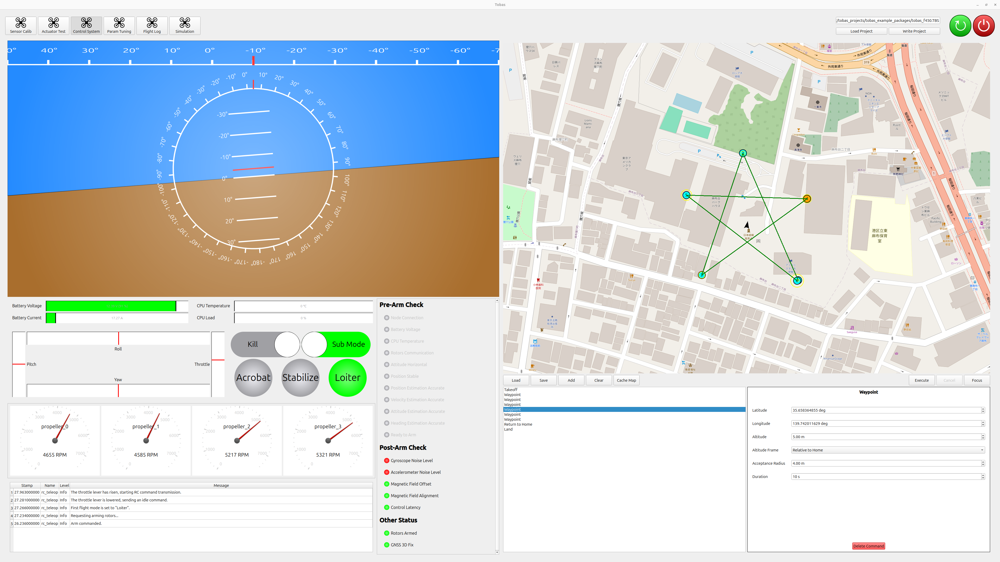

# 飛行試験

実機での飛行試験を行う手順について説明します．

## 開始の手順

---

フライトコントローラと ESC にバッテリーを接続し，給電されていることを確認します．

アクセスポイントに接続するなど，PC をラズパイと同じネットワークに接続した状態で Tobas GUI を立ち上げ，`Control System`を開きます．
ヘッダの`Load`ボタンから`tobas_f450.TBS`を読み込むと，現在のセンサ情報等が表示されます．

ステータス欄の`Ready to Arm`が緑色に点灯していることを確認します．
プロポの E_STOP (CH5) を一度オンにしてからオフにするとモータがアームされ，プロポから操縦できるようになります．

<strong>警告: アーム後に E_STOP をオンにすると，全てのモータが緊急停止します．</strong>

<iframe width="560" height="315" src="https://www.youtube.com/embed/EldjS8AnBjw?si=mdp2SFPWEta51UOP" title="YouTube video player" frameborder="0" allow="accelerometer; autoplay; clipboard-write; encrypted-media; gyroscope; picture-in-picture; web-share" allowfullscreen></iframe>
 

<!-- TODO: Mission Planner, Parameter Tuning, Flight Log -->

## 終了の手順

---

1. ドローンを安全に着陸させます．
1. E_STOP (CH5) をオンにし，モータを停止します．
1. ヘッダー右の`Shutdown`ボタンからラズパイと GUI をシャットダウンします．
1. バッテリーを取り外します．
