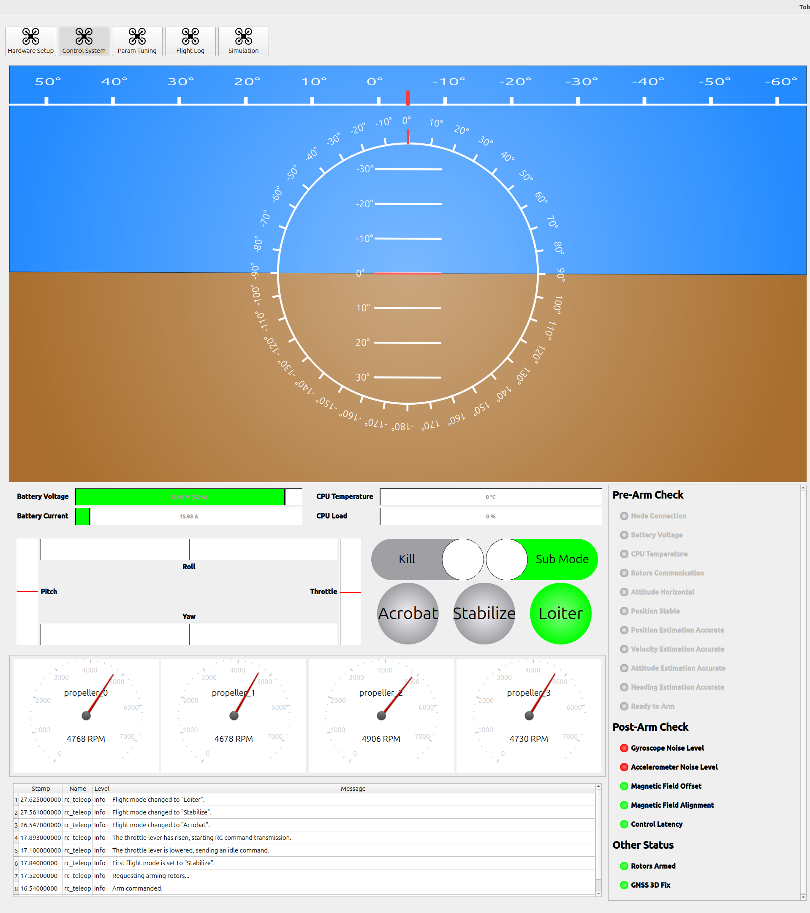
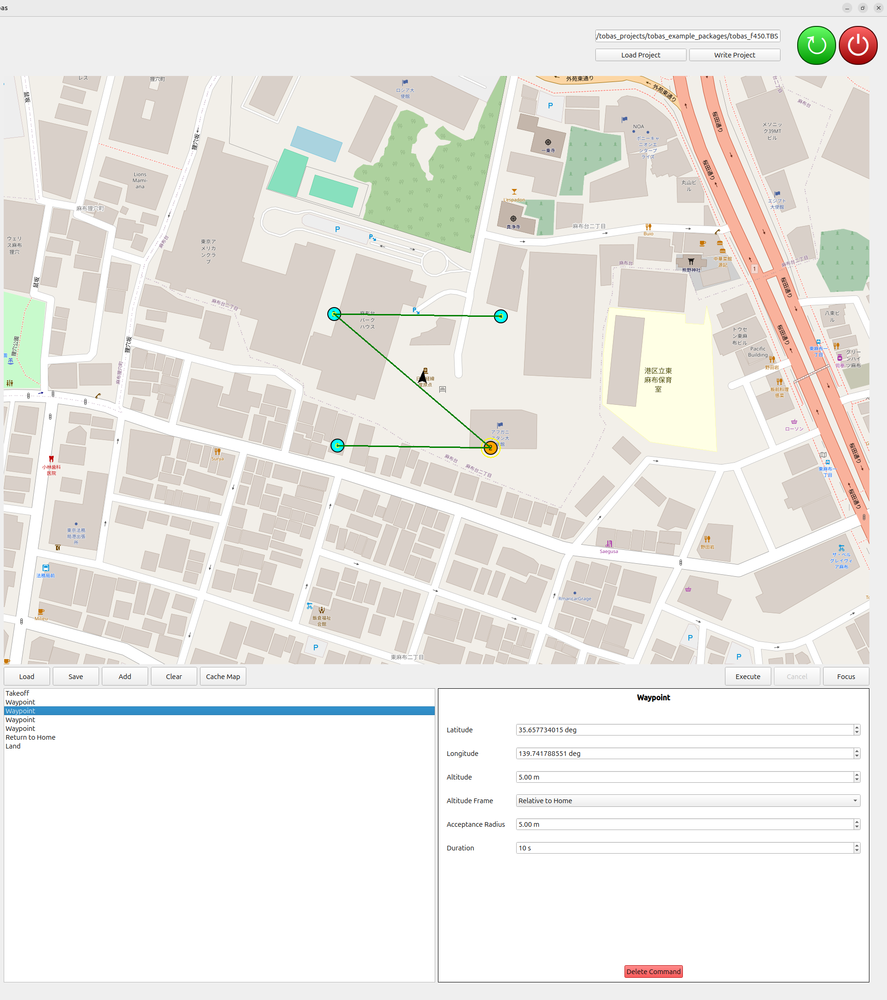
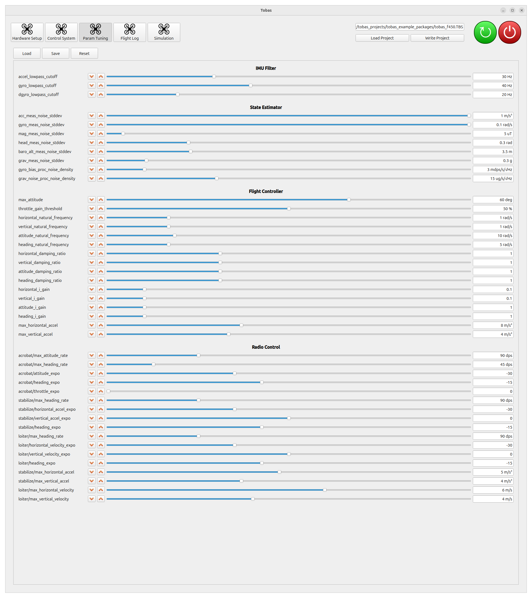

# 飛行試験

## 開始・終了の手順

---

### 開始の手順

1. FMU と全ての ESC に適切に給電します．
1. PC を FMU と同じネットワークに接続します．
1. `TobasGCS`を起動します．
1. `Load Project`をクリックし，`f450.TBS`を読み込みます．
1. `Control System`を開きます．
1. `Pre-Arm Check`の全ての項目が達成できていることを確認します．
1. プロポの電源を入れ，`Enable` スイッチをオンにし，`Kill`スイッチをオフにします．
1. スロットルレバーを下，ヨーレバーを右に傾けた状態で 1 秒間維持するとアームします．
1. アームしたら各レバーで操縦することができます．

<iframe width="560" height="315" src="https://www.youtube.com/embed/sHoA8yKJPs4?si=CCOEPsu6z9hd7zOb" title="YouTube video player" frameborder="0" allow="accelerometer; autoplay; clipboard-write; encrypted-media; gyroscope; picture-in-picture; web-share" referrerpolicy="strict-origin-when-cross-origin" allowfullscreen></iframe>
 

### 終了の手順

1. スロットルレバーを下，ヨーレバーを左に傾けた状態で 1 秒間維持するとディスアームします．
   もしくは，`Kill`スイッチをオンにすることでもディスアームできます．
1. GCS の電源ボタンをクリックし，FMU をシャットダウンします．
1. 安全に十分に気をつけて，FMU と ESC への給電を切ります．

以下では地上局の各機能について説明します．

## Control System

---

`Control System`は，ドローンの状態監視とミッション計画を行うためのツールです．

### 状態監視機能

画面左側は状態監視機能であり，以下の情報が表示されます．

- 姿勢: ロール，ピッチ，ヨー
- バッテリーの状態: 電圧，電流
- CPU の状態: 温度，負荷
- RC 入力: レバー，キル，飛行モード，その他スイッチ
- 各モータの状態: 回転数，通信状態
- ステータス: Pre-Arm Check，Post-Arm Check，その他
- 各ノードからのメッセージ

### ミッション計画機能

画面右側はミッション計画機能であり，飛行ミッションの計画と実行ができます．

1. `Add`をクリックしてコマンドを追加します．
   下図では`Takeoff`の後，4 つの`Waypoint`を経由し，`Return to Home`してから`Land`するミッションを計画しています．
1. 画面右下のダイアログから各コマンドに対応したパラメータを設定します．
   ウェイポイントの座標は画面上のマップ中のアイコンをドラッグアンドドロップすること でも操作できます．
1. `Execute`ボタンを押すとミッションが実行されます．

**注意**: プロポの`Enable`スイッチがオンだとプロポからの指令が優先されるため，必ずオフにした状態で実行してください．

## Param Tuning

---

`Param Tuning`は，飛行に関するパラメータをオンラインで調整するためのツールです．

### 手順

1. `Load`をクリックすると，FMU から現在のパラメータが読み込まれます．
1. 増減ボタンまたはスライダー操作でパラメータをオンラインで調整できます．
1. `Save`をクリックすると調整したパラメータが保存され，次回以降の起動時にも反映されるようになります．

### 主要なパラメータ

#### attitude_natural_frequency

姿勢制御の応答性に関するパラメータです．
大きいほど目標姿勢への応答が早くなりますが，大きすぎると姿勢制御が不安定になります．
安定性を損なわないよう，なるべく大きな値に調整してください．

#### heading_natural_frequency

姿勢制御の応答性に関するパラメータです．
大きいほど目標方位への応答が早くなりますが，大きすぎると方位制御が不安定になります．
安定性を損なわないよう，なるべく大きな値に調整してください．

#### horizontal_natural_frequency

水平位置制御の応答性に関するパラメータです．
大きいほど目標位置への応答が早くなりますが，大きすぎると位置制御が不安定になります．
安定性を損なわないよう，なるべく大きな値に調整してください．

#### vertical_natural_frequency

垂直位置制御の応答性に関するパラメータです．
大きいほど目標姿勢への応答が早くなりますが，大きすぎると位置制御が不安定になります．
安定性を損なわないよう，なるべく大きな値に調整してください．

#### accel_lowpass_cutoff

加速度センサの 1 次ローパスフィルタのカットオフ周波数です．
姿勢推定には影響せず，制御にのみ使用されます．
飛行ログを確認し，フィルター後の加速度のノイズが強すぎる場合は下げてください．

#### gyro_lowpass_cutoff

ジャイロセンサの 1 次ローパスフィルタのカットオフ周波数です．
姿勢推定には影響せず，制御にのみ使用されます．
飛行ログを確認し，フィルター後のジャイロのノイズが強すぎる場合は下げてください．

## Flight Log

---

`Flight Log`は，飛行中の状態の記録，再生を行うためのツールです．

### 飛行ログの記録

1. `Log Name`にログの名前 (例: 20250101_f450_hover) を入力してください．
1. `Start Recording`ボタンを押すと，ログの記録が開始します．最大 5GB まで連続して記録できるようになっています．
1. `Stop Recording`ボタンを押すと記録が終了します．

### 飛行ログの表示

1. FC 側と PC 側の`Read`ボタンを押すと，それぞれに保存されているログのリストが表示されます．
1. FC 側のリスト中のログ名の右にある`Download`ボタンを押すと，対応したログが PC 側にダウンロードされます．
1. PC 側のリスト中のログ名をクリックすると，保存されているデータが右側にプロットされます．
1. 右下の再生・停止ボタンやスライダーでログの表示時刻を操作できます．
