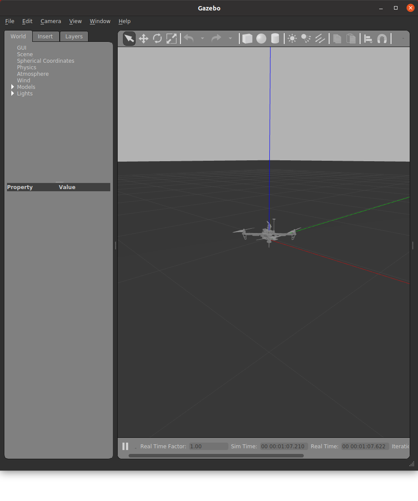
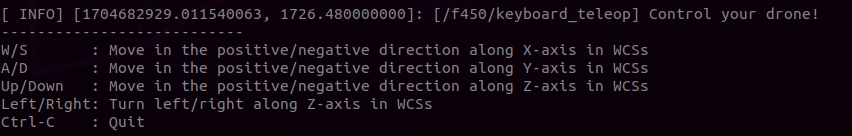
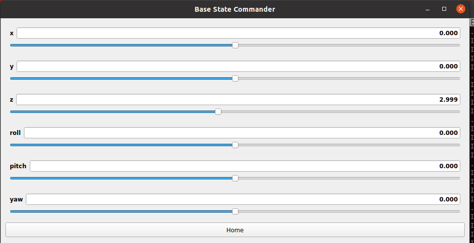
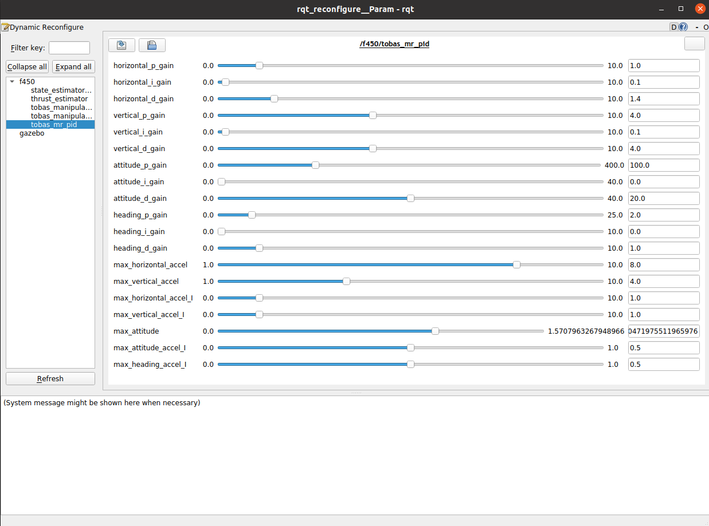

# Gazebo Simulation

前ページで作成した Tobas パッケージを用いて，ドローンのシミュレーションを行います．

## 前準備

---

catkin ワークスペースの環境変数を現在のシェルに読み込ませます:

```bash
$ source ~/catkin_ws/devel/setup.bash
```

このコマンドは端末を開く (ターミナルのページを増やす) ごとに実行する必要がありますが，
`~/.bashrc`に書き込むことで端末を開いた時に自動で実行されるようになり，手間が省けます:

```bash
$ echo "source ~/catkin_ws/devel/setup.bash" >> ~/.bashrc
```

## Gazebo シミュレーションの起動

---

以下のコマンドでシミュレーションを起動します:

```bash
$ roslaunch tobas_f450_config gazebo.launch
```

モデリングしたドローンが原点位置に配置されています．



## Tobas ソフトウェアの起動

---

以下のコマンドで，制御器や観測器などの主要なソフトウェアを起動します:

```bash
$ roslaunch tobas_f450_config bringup.launch
```

緑色で`[INFO] Controller is ready`と表示されたら，ドローンの飛行準備が整ったので，ROS API でドローンを操作することができます．


## ドローンの遠隔操作

---

### キーボードから操作

PC のキーボードからドローンを操作することができます．
以下のコマンドを実行します:

```bash
$ roslaunch tobas_f450_config keyboard_teleop.launch
```

すると，Gazebo 上のドローンが離陸し，一定の高度でホバリングします．
端末を見ると操作方法が表示されており，端末にフォーカスした状態でキーを押すことでドローンの位置を操作できます．



### GUI で操作

GUI でドローンを操作することもできます．
先程の keyboard_teleop.launch を Ctrl + C でシャットダウンし，以下のコマンドを実行します:

```bash
$ roslaunch tobas_f450_config gui_teleop.launch

```

バーを動かすことでドローンの位置を操作できます．
今回は回転翼機なので操作できるのは`x`，`y`，`z`，`yaw`のみであり，`roll`，`pitch`を直接操作することはできません．



### ROS API で操作

ROS API 用いてドローンに指令を送ることもできます．
ユーザのプログラムからドローンの情報にアクセスできるため，アプリケーションを作成する際に有用です．
詳しくは[ROS API](ros_api.md)をご覧ください．

まず，ドローンを操作するスクリプトを配置するための ROS パッケージを作成します．

```bash
$ cd ~/catkin_ws/src/
$ catkin_create_pkg my_tobas_example
```

一度ビルドとソースを行い，パッケージをシェルに読み込ませます．

```bash
$ catkin build my_tobas_example
$ source ~/catkin_ws/devel/setup.bash
```

次に，スクリプトを ROS パッケージ内に作成します．
以下は`takeoff_action`アクションで離陸し，`command/pos_vel_acc_yaw`トピックで位置指令を行う Python スクリプトの例です．
これを`my_tobas_example/scripts/`以下に配置してください．

```python
#!/usr/bin/env python3

import rospy
import actionlib

from tobas_msgs.msg import TakeoffAction, TakeoffGoal, TakeoffResult, PosVelAccYaw

ALTITUDE = 3.0  # [m]
SIDE_LENGTH = 5.0  # [m]
INTERVAL = 5.0  # [s]


if __name__ == "__main__":
    # ROSノードの初期化
    rospy.init_node("command_square_trajectory")

    # 離陸アクションクライアントの作成
    takeoff_client = actionlib.SimpleActionClient("takeoff_action", TakeoffAction)

    # アクションサーバーが起動するのを待つ
    takeoff_client.wait_for_server()

    # アクションゴールを作成
    takeoff_goal = TakeoffGoal()
    takeoff_goal.target_altitude = ALTITUDE
    takeoff_goal.target_duration = INTERVAL

    # アクションゴールを送信
    takeoff_client.send_goal_and_wait(takeoff_goal)

    # アクションの結果を取得
    takeoff_result: TakeoffResult = takeoff_client.get_result()
    if takeoff_result.error_code < 0:
        rospy.logerr("Takeoff action failed.")
        rospy.signal_shutdown()

    # コマンドのパブリッシャーを作成
    command_pub = rospy.Publisher("command/pos_vel_acc_yaw", PosVelAccYaw, queue_size=1)

    # 正方形の頂点を指令し続ける
    while not rospy.is_shutdown():
        # 頂点1
        command = PosVelAccYaw()
        command.pos.x = SIDE_LENGTH / 2
        command.pos.y = SIDE_LENGTH / 2
        command.pos.z = ALTITUDE
        command_pub.publish(command)
        rospy.sleep(INTERVAL)

        # 頂点2
        command = PosVelAccYaw()
        command.pos.x = -SIDE_LENGTH / 2
        command.pos.y = SIDE_LENGTH / 2
        command.pos.z = ALTITUDE
        command_pub.publish(command)
        rospy.sleep(INTERVAL)

        # 頂点3
        command = PosVelAccYaw()
        command.pos.x = -SIDE_LENGTH / 2
        command.pos.y = -SIDE_LENGTH / 2
        command.pos.z = ALTITUDE
        command_pub.publish(command)
        rospy.sleep(INTERVAL)

        # 頂点4
        command = PosVelAccYaw()
        command.pos.x = SIDE_LENGTH / 2
        command.pos.y = -SIDE_LENGTH / 2
        command.pos.z = ALTITUDE
        command_pub.publish(command)
        rospy.sleep(INTERVAL)
```

スクリプトに実行権限を与えます．

```bash
$ chmod u+x ~/catkin_ws/src/my_tobas_example/scripts/command_square_trajectory_node.py
```

スクリプトを実行すると，ドローンが離陸後に正方形の辺上を移動し続けます．
トピックはドローンの名前空間 (URDF 作成時に設定した`Robot Name`) 内に存在するため，名前空間`__ns`を指定します．

```bash
$ rosrun my_tobas_example command_square_trajectory_node.py __ns:=f450
```

## パラメータチューニング

---

必要であれば飛行中にオンラインでパラメータを調整することができます．
以下のコマンドで調整用の GUI を立ち上げます:

```bash
$ rosrun rqt_reconfigure rqt_reconfigure
```



オンラインで調整可能な全てのパラメータが表示され，水平バー，エディタ等で値を調整することができます．
パラメータ名にカーソルを重ねると，パラメータの説明文が表示されます．
詳しくは<a href=https://wiki.ros.org/rqt_reconfigure>rqt_reconfigure | ROS</a>をご覧ください．
