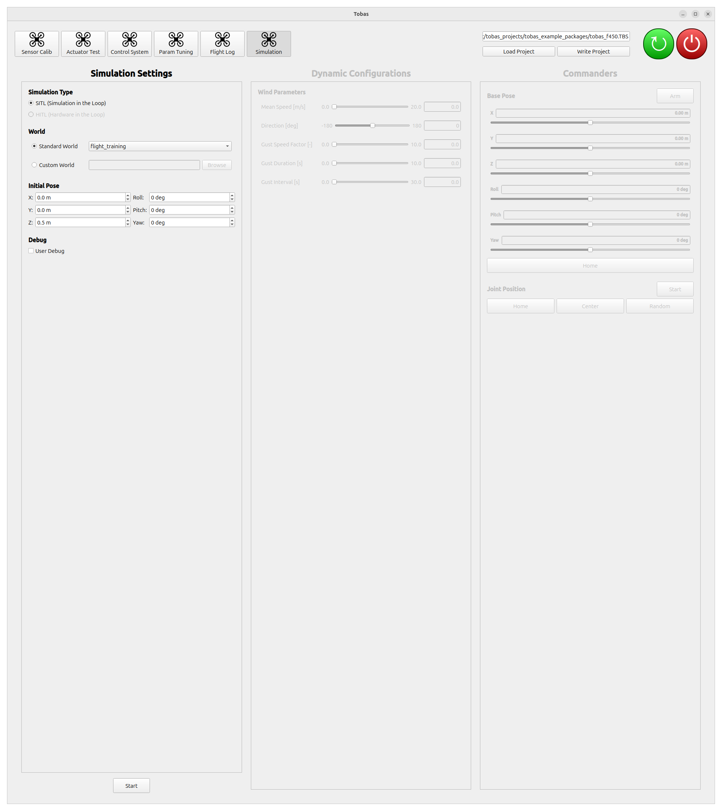
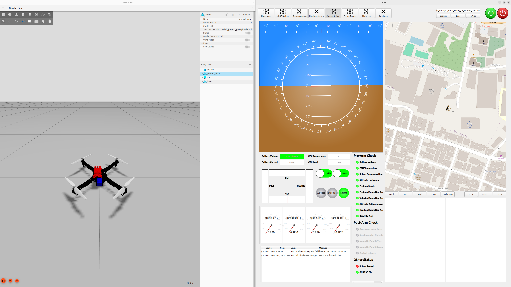
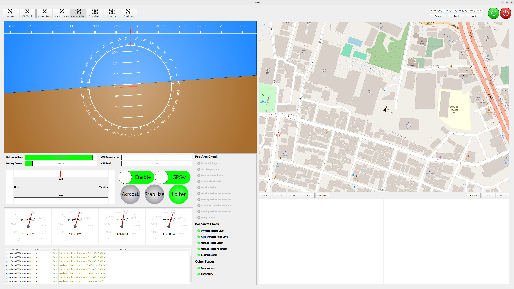
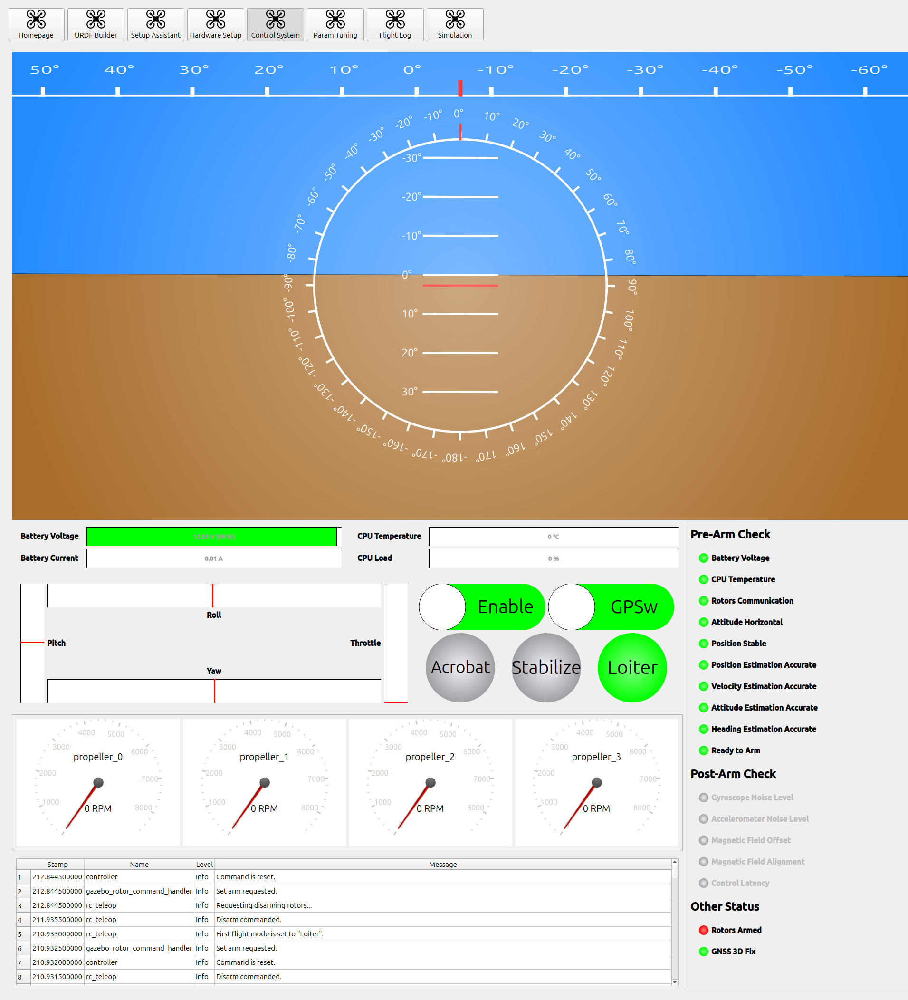
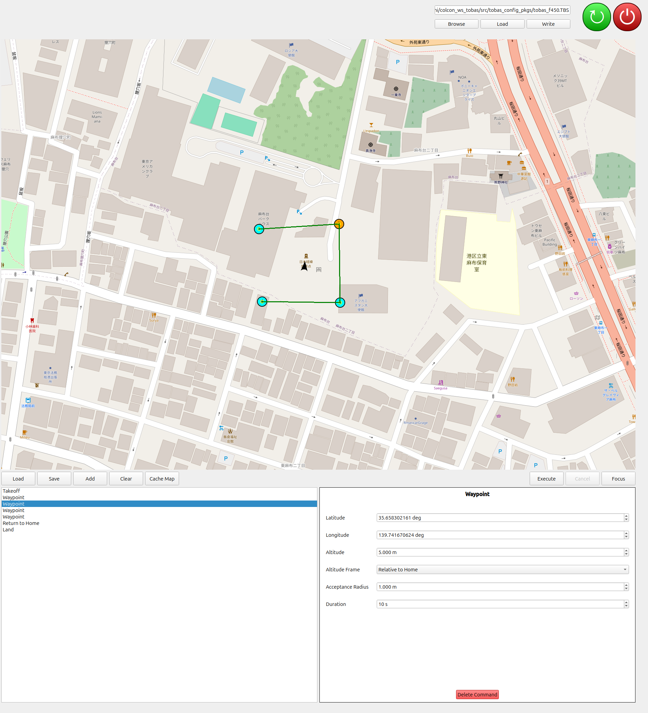
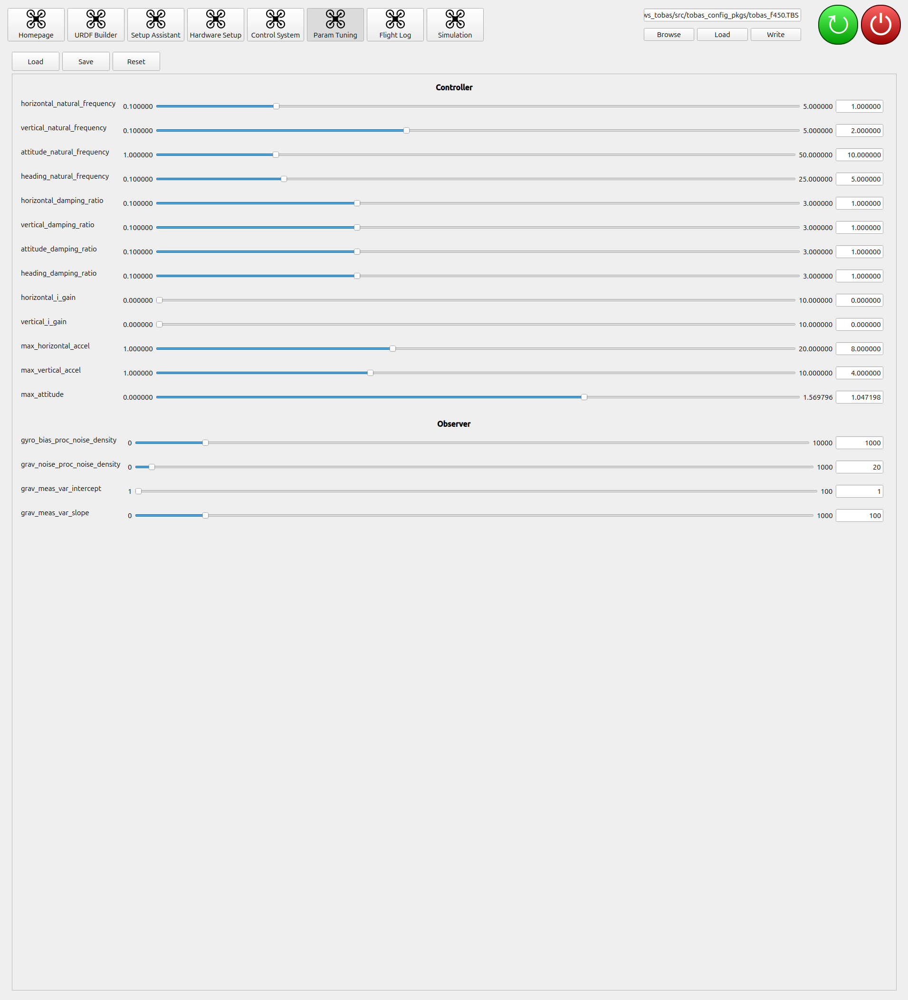

# Gazebo シミュレーション

ドローンの物理シミュレーションを行います．
Tobas プロジェクトの作成とハードウェアセットアップは既に済んでいることを前提とします．

## 開始・終了の手順

---

PC をフライトコントローラと同じネットワークに接続したうえで Tobas を起動し，`tobas_f450.TBS`を読み込みます．

ツールボタンから`Simulation`を選択し，`Static Configurations`の`Simulation Type`を`HITL`に，`World`を`Standard World`の`basic`に設定します．

`Start`ボタンを押すと Gazebo が起動し，ドローンが原点位置に配置されます．これには数分かかることがあります．

`Terminate`ボタンを押すとシミュレーションが終了し，一定時間後に FC との通信が再開します．

## プロポでの操縦

---

1. プロポの電源を入れ，Enable スイッチをオンにします．
1. 飛行モードを`Loiter`，つまり GNSS 位置指令モードにします．
1. Pre-Arm Check の項目をすべて満たしていることを確認します．
1. スロットルレバーを下，ヨーレバーを右に傾けた状態で 5 秒間維持するとアームします．
1. アームしたら各レバーで操縦することができます．
1. スロットルレバーを下，ヨーレバーを左に傾けた状態で 2 秒間維持するとディスアームします．

## Control System

---

`Control System`は，ドローンの状態監視とミッション計画を行うためのツールです．

### 状態監視機能

画面左側は状態監視機能であり，以下の情報が表示されます．

- 姿勢: ロール，ピッチ，ヨー
- バッテリーの状態: 電圧，電流
- CPU の状態: 温度，負荷
- RC 入力: レバー，有効/無効，飛行モード，その他スイッチ
- 各モータの状態: 回転数，通信状態
- ステータス: Pre-Arm Check，Post-Arm Check，その他
- 各ノードからのメッセージ

### ミッション計画機能

画面右側はミッション計画機能であり，飛行ミッションの計画と実行ができます．

1. `Add`ボタンからコマンドを追加します．下図では`Takeoff`の後，4 つの`Waypoint`を経由し，`Return to Home`してから`Land`するミッションを計画しています．
1. 画面右下のダイアログからミッションの詳細なパラメータを設定します．ウェイポイントの座標は画面上のマップ中のアイコンをドラッグアンドドロップすることでも操作できます．
1. `Execute`ボタンを押すとミッションが実行されます．

**注意:** プロポの`Enable`スイッチがオンだとプロポからの指令が優先されるため，必ずオフにした状態で実行してください．

## Param Tuning

---

`Param Tuning`は，飛行に関するパラメータをオンラインで調整するためのツールです．

1. FC に接続，またはシミュレーションを起動した状態で`Load`ボタンを押すと，制御器や観測器に関する現在のパラメータが読み込まれます．
1. スライダーをリリース，またはテキストボックスに値を入力して Enter ボタンを押すと，パラメータが即座に反映されます．
1. `Save`ボタンを押すと調整したパラメータが保存され，次回以降の起動時にも反映されるようになります．

