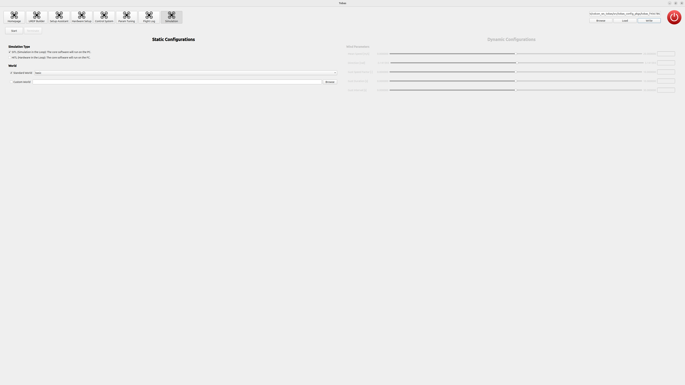

# Gazebo シミュレーション

ドローンの物理シミュレーションを行います．
Tobas パッケージの作成とハードウェアセットアップは既に済んでいることを前提とします．

## 開始の手順

---

PC をフライトコントローラと同じネットワークに接続したうえで Tobas を起動し，`tobas_f450.TBS`を読み込みます．

ツールボタンから`Simulation`のページを開き，`Static Configurations`の`Simulation Type`を`HITL`に，`World`を`Standard World`の`basic`に設定します．

`Start`ボタンを押すと Gazebo が起動し，ドローンが原点位置に配置されます．これには数分かかることがあります．

## プロポでの操縦

---

1. プロポの電源を入れます．
1. スロットルレバーを一番下まで下げます．
1. `E-Stop`トグルを一度オンにしてからオフにすると，一定時間後にモータがアームします．
1. プロペラが回転し始めたら各レバーで操縦することができます．

<strong>警告: アーム後に E_STOP をオンにすると，全てのモータが緊急停止します．</strong>

<!-- TODO: Mission Planner, Parameter Tuning, Flight Log -->

## 終了の手順

`Simulation`ページの`Terminate`ボタンを押すとシミュレーションが終了し，一定時間後にフライトコントローラからとの通常の通信に戻ります．
