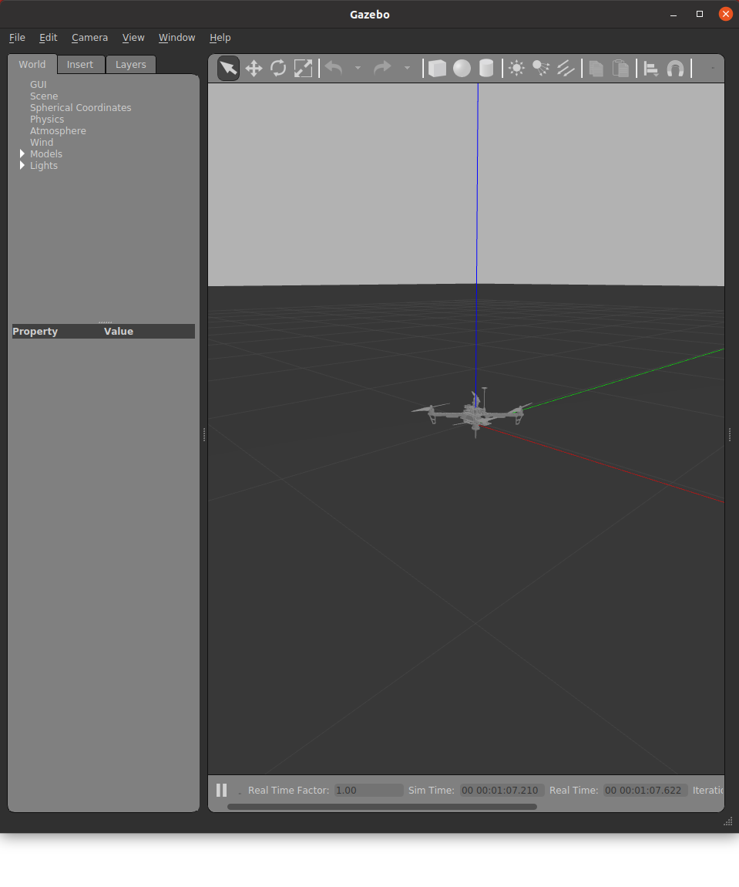

# Gazebo シミュレーション

ドローンの物理シミュレーションを行います．
Tobas パッケージの作成とハードウェアセットアップは既に済んでいることを前提とします．

## Gazebo シミュレーションの起動

---

1. ラズパイのアクセスポイントに接続します．SSID は`raspberry_wifi`，パスワードは`raspberry`です．
1. Applications から Tobas を起動します．
1. ヘッダー中央の`Load`ボタンを押し，Setup Assistant で作成した`tobas_f450.TBS`を選択します．
1. ラズパイへの書き込みが済んでいなければ，`Send`ボタンを押して設定をラズパイに書き込みます．これには数分かかります．
1. ヘッダー左の選択リストから`Simulation`を選択します．`Start`ボタンが有効化されていることを確認します．

`Start`ボタンを押すと Gazebo が起動し，ドローンが原点位置に配置されます．これには数十秒かかります．

## プロポでの操縦

---

1. プロポの電源を入れます．
1. スロットルレバーを一番下まで下げます．
1. `E-Stop`トグルを一度オンにしてからオフにすると，数秒後にモータがアームします．
1. プロペラが回転し始めたら各レバーで操縦することができます．

<strong>警告: アーム後に E_STOP をオンにすると，全てのモータが緊急停止します．</strong>

## 管制システム

---

ヘッダー左の選択リストから`Control System`を選択してください．
管制システムでは，機体に関する様々な状態をリアルタイムで監視することができます．

 
