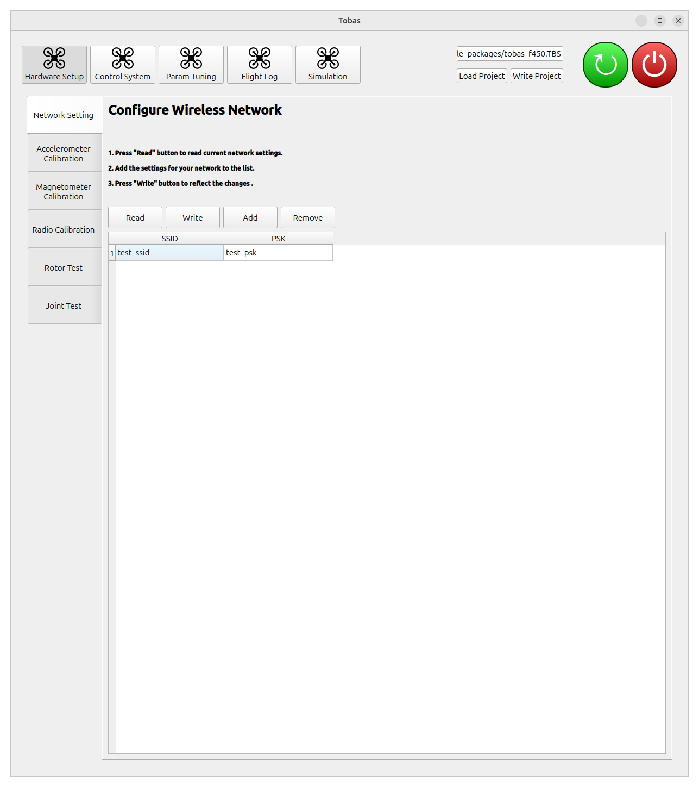
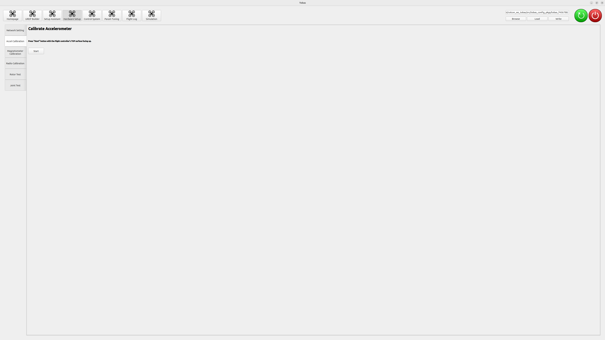
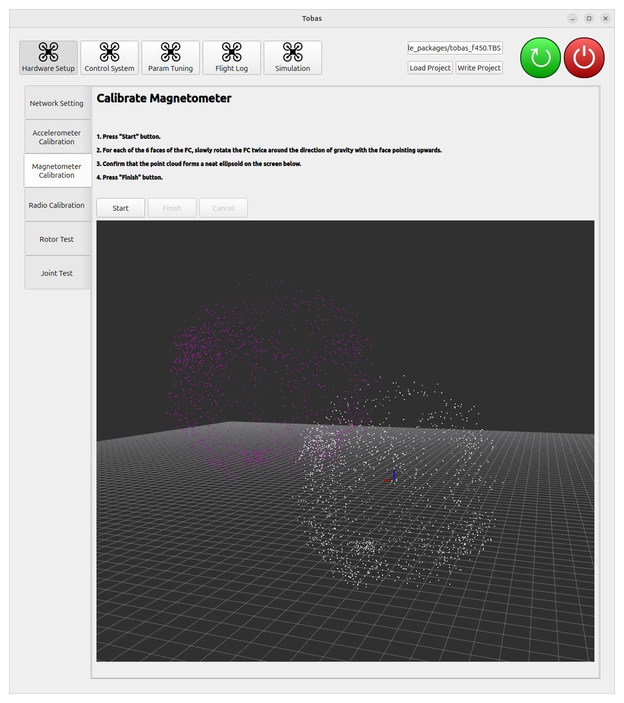
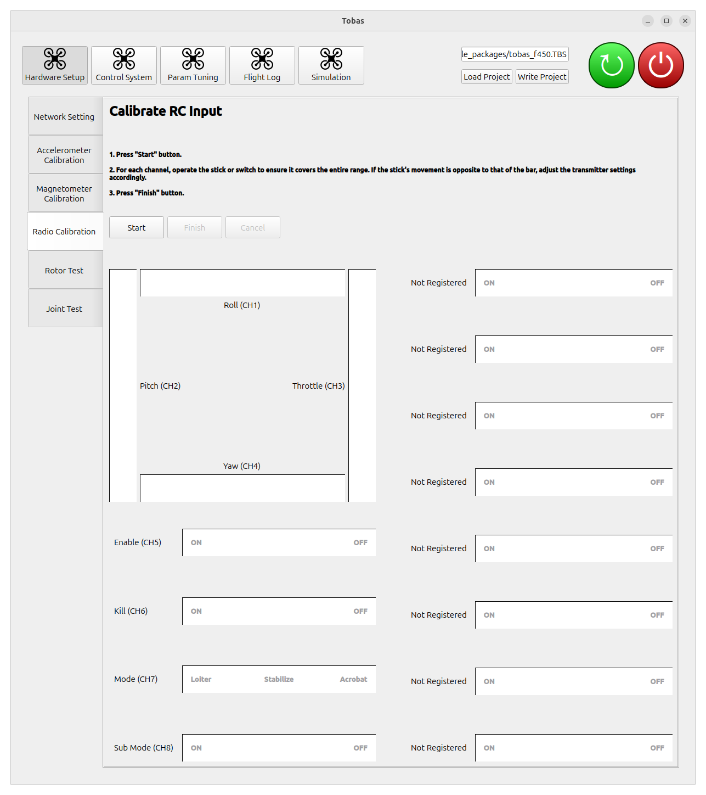
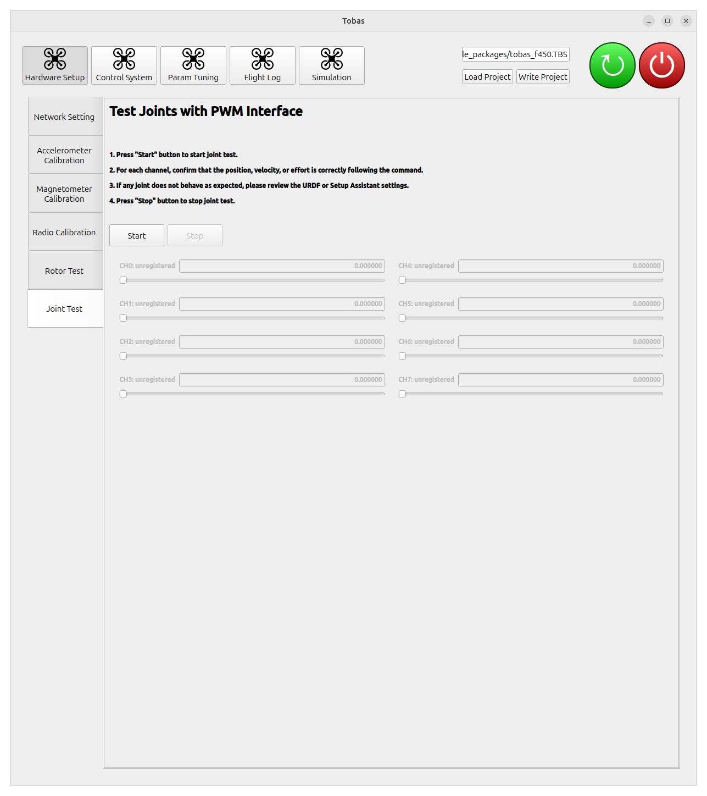

# ハードウェア設定

FMU に関する設定を行います．

## 実機の作成

---

設計通りに実機を作成します．
FC と地上基地局の通信はラズパイの内蔵 WiFi で行うため，テレメトリモジュールは不要です．

<!-- TODO: Navio2のような詳細な手順 -->
<!-- cf. https://docs.emlid.com/navio2/hardware-setup/ -->
<!-- cf. https://docs.emlid.com/navio2/ardupilot/typical-setup-schemes/ -->

 

## プロポの設定

---

S.BUS の信号は 8 チャンネルを想定しています．
RC 入力の各チャンネルの意味は以下のようになっています:

| チャンネル | 意味       |
| :--------- | :--------- |
| CH1        | ロール     |
| CH2        | ピッチ     |
| CH3        | ヨー       |
| CH4        | スラスト   |
| CH5        | 有効/無効  |
| CH6        | ---        |
| CH7        | 飛行モード |
| CH8        | GPSw       |

GPSw (General Purpose Switch) は一般用途に使えるスイッチであり，
ティルトロータマルチコプターの飛行モードの切り替えなど，制御器によっては使用することがあります．

T10J の場合はチャンネル 1 からチャンネル 4 までは上の表で固定されており，
チャンネル 5 以降に対応するレバーをを AUX チャンネルで割り当てることができます．
今回は次のように設定しました．

| チャンネル | スイッチ |
| :--------- | :------- |
| CH5        | SwA      |
| CH7        | SwE      |
| CH8        | SwD      |

 

## Tobas パッケージのロードと書き込み

---

1. FC を起動します．
1. PC を FC と同じネットワークに接続します．
1. Applications から Tobas を起動します．
1. 右上の`Browse`ボタンから，Setup Assistant で作成した`tobas_f450.TBS`を選択し，`Load`ボタンで読み込みます．
1. `Write`ボタンを押して設定をラズパイに書き込みます．これには数分かかります．

## 各種設定

---

### Network Setting

WiFi の設定を行います．

1. `Read`ボタンを押してください．現在の設定が読み込まれます．
1. `Add`ボタンでフィールドを追加し，接続するネットワークの SSID と PSK を入力してください．
1. `Write`ボタンを押して設定を FC に反映してください．

### Accelerometer Calibration

加速度センサのキャリブレーションを行います．
FMU を組み込んだ機体を水平面上に置き，`Start`ボタンを押してください．
数秒でキャリブレーションが完了します．

### Magnetometer Calibration

地磁気センサのキャリブレーションを行います．

1. `Start`ボタンを押してください．すると，地磁気の値が紫色の点で表示され始めます．
1. 点群がきれいな楕円体を描くように機体を全方位にゆっくりと回転させてください．6 面それぞれが上を向いた状態で Z 軸回りに 2 周ずつ回転させるのがおすすめです．
1. 完了したら`Finish`ボタンを押してください．キャリブレーション後の白色の点群が原点周りのきれいな球を描いていれば成功です．

### Radio Calibration

ラジオ入力 (S.BUS) のキャリブレーションを行います．

1. `Start`ボタンを押してください．すると，S.BUS の各チャンネルの値が表示され始めます．
1. それぞれのチャンネルについて，操作可能な範囲全体をカバーするようにレバーまたはスイッチを操作してください．
   レバーと GUI のバーの動作が反対方向の場合は，プロポ側の設定を適切に変更してください．
1. `Finish`ボタンを押してキャリブレーションを完了してください．

### Rotor Test

<strong>警告: 必ず全てのプロペラを取り外した状態で実行してください．</strong>

1. `Start`ボタンを押してください．全てのモータがアームされます．
1. それぞれのモータについて，レバーを動かして回転させ，RC 出力チャンネルと回転方向が正しいことを確認してください．
1. それぞれのモータについて，回転数が振動しない程度に制御ゲインを調整してください．
1. `Save`ボタンを押して制御ゲインを保存してください．
1. `Stop`ボタンを押してテストを終了してください．

### Joint Test

機体が固定翼機の操舵面のような PWM 駆動関節を持つ場合は，それぞれの関節の位置指令テストを行うことができます．
今回の機体はプロペラ以外の可動関節をもたないためスキップします．

