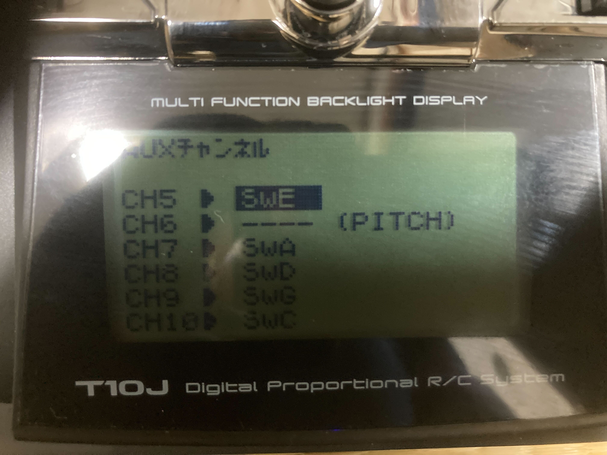
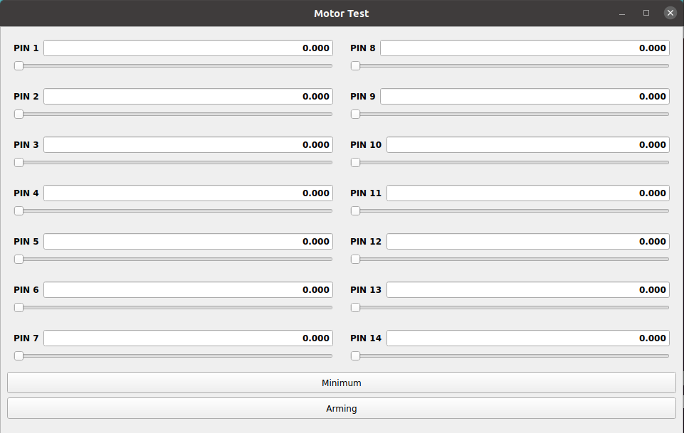

# Hardware Setup

シミュレーションが成功したことを確認したため，実機の設定を行います．

## 実機の作成

---

以下のサイトを参考に，実機を作成します．

- <a href=https://docs.emlid.com/navio2/hardware-setup target="_blank">Hardware setup | Navio2</a>
- <a href=https://docs.emlid.com/navio2/ardupilot/typical-setup-schemes target="_blank">Typical setup schemes | Navio2</a>

 

その際に以下の点に注意してください:

### モータの回転方向が Setup Assistant の設定と一致している

モータ回転方向の設定は`tobas_f450_config/config/f450.tbsf`の`rotor_x/direction`で確認できます．
`rotor_x/link_name`に対して正しい回転方向のモータが取り付けられていることを確認してください．

### ESC のピン番号が Setup Assistant の設定と一致している

ESC のピン番号の設定は`tobas_f450_config/config/f450.tbsf`の`rotor_x/pin`で確認できます．
この番号と Navio2 に記載されているピン番号が一致していることを確認してください．

### 振動対策

プロペラの振動のセンサへの悪影響を軽減するため，なるべく物理的な振動対策を行うようにしてください．
例えば<a href=https://docs.emlid.com/navio2/hardware-setup/#anti-vibration-mount>Anti-vibration mount | Navio2</a>
を 3D プリントして使うことができます．

## ネットワーク設定

---

ラズパイをディスプレイ，キーボード，マウスに接続してから電源を入れます．
初期パスワードである`raspberry`を入力してログインしてください．

`/boot/wpa_supplicant.conf`にネットワークの SSID とパスワードを入力します．
以下のように 1 つ以上の`network`を定義してください．
`ssid`が SSID，`psk`がパスワードです．
複数のネットワークが利用可能のときは`priority`が大きいほうが優先されます．

```txt
country=GB
ctrl_interface=DIR=/var/run/wpa_supplicant GROUP=netdev
update_config=1

network={
  ssid="ssid_of_wifi"
  psk="password_of_wifi"
  key_mgmt=WPA-PSK
  priority=0
}

network={
  ssid="ssid_of_mobile_router"
  psk="password_of_mobile_router"
  key_mgmt=WPA-PSK
  priority=1
}
```

この例では 1 つ目に WiFi，2 つ目にモバイルルータの設定を書き，後者の優先度を大きく設定しています．
屋外などの非 WiFi 環境では PC とラズパイの通信にモバイルルータを用いると便利です．
今回は<a href=https://www.aterm.jp/product/atermstation/product/mobile/mr05ln/ target="_blank">NEC MR05LN</a>を使用します．

ラズパイを再起動すると，自動的にネットワークに接続します．
これ以降ラズパイのディスプレイ，キーボード，マウスは必要ありません．

## ラズパイへの SSH 接続

---

PC で以下のコマンドを実行すると，PC からラズパイに SSH 接続します:

```bash
user@pc $ ssh pi@navio
```

パスワードは先程と同じく`raspberry`です．
これでラズパイを遠隔で操作できるようになりました．

## Tobas パッケージの送信

---

Tobas Setup Assistant で作成したパッケージを SSH でラズパイに送信します．
外部 PC で以下のコマンドを実行します:

```bash
user@pc $ scp -r ~/catkin_ws/src/tobas_f450_config pi@navio:~/catkin_ws/src/
```

Tobas パッケージをラズパイでビルドします:

```bash
pi@navio $ cd ~/catkin_ws/
pi@navio $ catkin build tobas_f450_config
```

## プロポの設定

---

S.BUS の信号は 8 チャンネルを想定しています．
RC 入力の各チャンネルの意味は以下のようになっています:

| チャンネル | 意味       |
| :--------- | :--------- |
| CH1        | ロール     |
| CH2        | ピッチ     |
| CH3        | ヨー       |
| CH4        | スラスト   |
| CH5        | 飛行モード |
| CH6        | ---        |
| CH7        | 緊急停止   |
| CH8        | GPSw       |

GPSw (General Purpose Switch) は一般用途に使えるスイッチであり，
非平面ロータ配置マルチコプターの飛行モードの切り替えなど，制御器によっては使用することがあります．

T10J の場合はチャンネル 1 からチャンネル 4 までは上の表で固定されており，
チャンネル 5 以降に対応するレバーをを AUX チャンネルで割り当てることができます．
今回は次のように設定しました．



## キャリブレーション

---

センサー等のキャリブレーションを行います．
外部 PC をラズパイに SSH 接続した状態で以下を実行してください．

### 加速度センサ

以下を実行し，コンソールの指示に従ってください:

```bash
pi@navio $ ~/tobas/lib/tobas_real/accel_calibration
```

### 地磁気センサ

以下を実行し，コンソールの指示に従ってください:

```bash
pi@navio $ ~/tobas/lib/tobas_real/mag_calibration
```

### バッテリー電圧

バッテリーと Navio2 が正しく接続していることを確認してください．
以下を実行し，コンソールの指示に従ってください:

```bash
pi@navio $ ~/tobas/lib/tobas_real/adc_calibration
```

### RC 入力

RC レシーバと Navio2 が正しく接続し，RC レシーバと RC トランスミッタが通信できることを確認してください．
以下を実行し，コンソールの指示に従ってください:

```bash
pi@navio $ ~/tobas/lib/tobas_real/rcin_calibration
```

### ESC

<span style="color: red;"><strong>警告: プロペラがモータから取り外されていることを確認してください．</strong></span>

以下を確認してください:

- ESC のピン番号と Navio2 のピン番号が一致している．
- バッテリーが Navio2 から取り外され，ラズパイが type-C からのみ給電されている．

以下を実行し，コンソールの指示に従ってください:

```bash
pi@navio $ su
root@navio $ /home/pi/tobas/lib/tobas_real/esc_calibration
```

キャリブレーションが成功したかどうかを確認します．
以下を実行してください:

```bash
root@navio $ roslaunch tobas_motor_test motors_handler.launch
```

外部 PC で以下を実行してください:

```bash
user@pc $ export ROS_MASTER_URI=http://(ラズパイのIPアドレス):11311  # e.g. export ROS_MASTER_URI=http://192.168.1.1:11311
user@pc $ roslaunch tobas_motor_test motor_test_gui.launch
```

ラズパイの IP アドレスは以下のコマンドで取得できます:

```bash
pi@navio $ hostname -I
>> 192.168.1.1
```



まず，<span style="color: red;"><strong>全てのモータの回転方向が正しいことを確認してください．</strong></span>
回転方向が反対の場合は，ESC とブラシレスモータの接続線のうち任意の 2 本を入れ替えてください．

次に，全てのモータについて以下の点を確認してください:

- スロットルが 0.0 のとき，モータは回転しない.
- スロットルが 0.1 のとき，モータはゆっくり回転する.
- スロットルが 1.0 に向けて上昇するにつれ，回転音が徐々に高くなる．
- 同じモデルの 2 つのモータは，同じスロットルで概ね同じ高さの回転音を発する．

これらの条件が満たされない場合，ESC は正しくキャリブレーションされていません．
その場合は，キャリブレーションをやり直すか，<a href=https://github.com/bitdump/BLHeli target="_blank">BLHeli-Suite</a>
などのツールを用いて PWM の範囲を 1000us ~ 2000us に設定してください．

### センサノイズの計測 (実行しなくてもよい)

<span style="color: red;"><strong>警告: この操作ではプロペラをつけた状態でモータを回転させます．</strong></span>

プロペラの回転により発生する振動は，IMU，特に加速度センサに非常に大きな影響を与えます．
そのため，飛行前にプロペラをつけた状態でモータを回転させてセンサノイズを計測することで，
実際の飛行状態に近いデータを得ることができ，状態推定の精度を向上させることができます．

実行前に以下の点を確認してください:

- バッテリー，ESC，モータ，プロペラ，ラズパイが正しく接続されている．
- <span style="color: red;"><strong>ドローンが動かないようにしっかりと固定されている．</strong></span>

<span style="color: red;"><strong>すぐに Ctrl+C でプログラムを停止できるように構えた状態で</strong></span>以下を実行してください:

```bash
pi@navio $ su
root@navio $ /home/pi/tobas/lib/tobas_real/measure_sensor_noise
```
