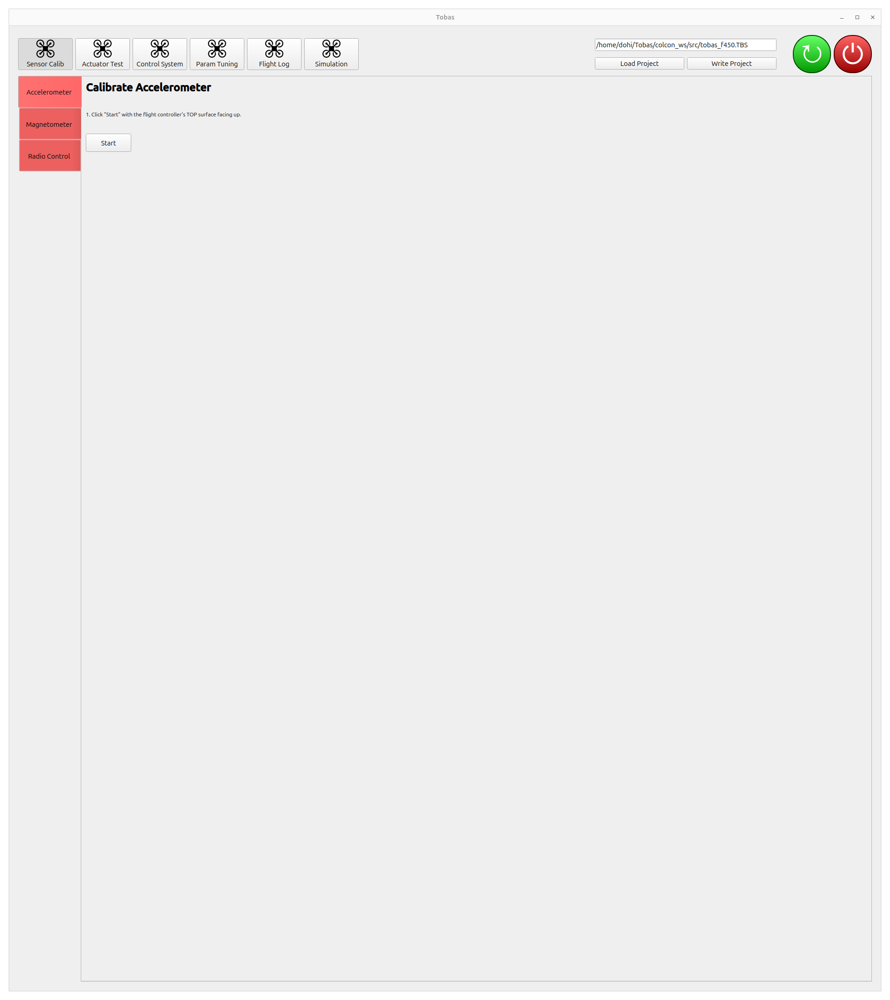
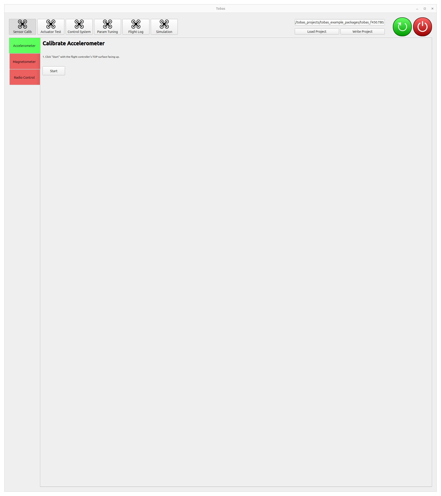
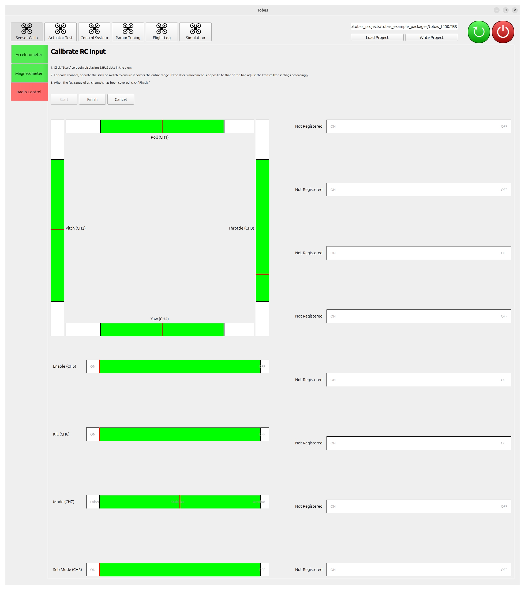
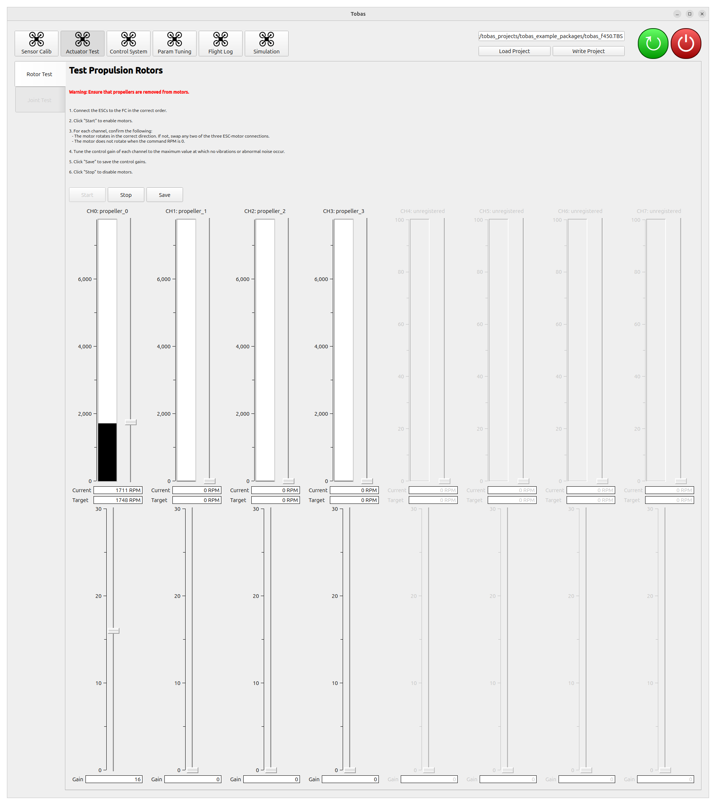

# 実機のセットアップ

## 実機の作成

---

Setup Assistant で設定したとおりに実機を作成します．

<!-- TODO: Navio2のような詳細な手順 -->
<!-- cf. https://docs.emlid.com/navio2/hardware-setup/ -->
<!-- cf. https://docs.emlid.com/navio2/ardupilot/typical-setup-schemes/ -->


## プロポの設定

---

S.BUS の信号は 8 チャンネル以上を想定しています．
Tobas では，RC 入力の各チャンネルの役割は以下のようになっています:

| チャンネル | 役割           | インターフェース |
| :--------- | :------------- | :--------------- |
| CH1        | ロール         | レバー           |
| CH2        | ピッチ         | レバー           |
| CH3        | スロットル     | レバー           |
| CH4        | ヨー           | レバー           |
| CH5        | 飛行モード     | 3 段階スイッチ   |
| CH6        | サブ飛行モード | 2 段階スイッチ   |
| CH7        | 有効/無効      | 2 段階スイッチ   |
| CH8        | Kill           | 2 段階スイッチ   |
| CH9-16     | GPSw           | 2 段階スイッチ   |

<br>

サブ飛行モードは特定の飛行モードにおける更に細かい飛行モード変更のためのスイッチです．
5 軸以上を同時に制御可能な機体のモード変更など，基本の 4 レバーではコマンドの自由度が不足する場合に使用されます．
GPSw (General Purpose Switch) はユーザが自由に使えるスイッチです．
使用する送受信機や目的に合わせて，Setup Assistant でその個数を設定することができます．

<a href=https://www.rc.futaba.co.jp/products/detail/I00000006 target="_blank">Futaba T10J</a>
の場合はチャンネル 1 からチャンネル 4 までは上の表で固定されており，
チャンネル 5 以降に対応するスイッチを自由に割り当てることができます．
プロポの`+`ボタンを長押しでメニュー画面に入り，`AUXチャンネル`を選択してください．
今回は次のように設定しました．

| チャンネル | スイッチ |
| :--------- | :------- |
| CH5        | SwE      |
| CH6        | SwG      |
| CH7        | SwA      |
| CH8        | SwC      |
| CH9        | NULL     |
| CH10       | NULL     |

<br>

また，Futaba のプロポを用いる場合はスロットルレバーをリバースに設定する必要があります．
プロポの`+`ボタンを長押しでメニュー画面に入り，`リバース`を選択してください．
スロットルレバー (`THR`) のみをリバース (`REV`) に設定してください．

## Tobas プロジェクトの読み込みと書き込み

---

FC に電源を投入し，地上局用の PC を FC と同じネットワークに接続します．
[Boot Device Configuration](./bootmedia_config.md)で複数のネットワークを設定した場合は，
利用可能な最も優先度の高いネットワークが選択されていることに注意してください．

アプリケーションメニューから`TobasGCS`を起動するか，もしくはターミナルで以下を実行します．

```bash
$ ros2 launch tobas_gcs gcs.launch.py
```

`Load Project`をクリックし，Setup Assistant で作成した`tobas_f450.TBS`をダブルクリックして読み込みます．
`Write Project`をクリックすると，プロジェクトが FC に送信された後にビルドされます．これには数分かかります．



## Sensor Calibration

各センサのキャリブレーションを行います．
画面上部のツールボタンの中にある`Sensor Calib`をクリックしてください．

---

### Accelerometer Calibration

加速度センサのキャリブレーションを行います．
機体を水平面上に置き，`Start`をクリックしてください．
数秒でキャリブレーションが完了し，しばらくするとタブが赤色から緑色に変化します．



### Magnetometer Calibration

地磁気センサのキャリブレーションを行います．
地磁気センサは周囲の環境の影響を強く受けるため，FC を機体に取り付けた状態で実行してください．
また，周囲に鉄筋などの磁性体が存在しない環境で実行することが望ましいです．

1. `Start`をクリックすると，地磁気の値が白色の点群として表示され始めます．
1. FC の 6 つの面それぞれについて，面を上に向けた状態で機体を鉛直軸周りにゆっくりと回転させてください．
   進捗バーが 100%に到達したら完了です．
1. 完了したら`Finish`をクリックしてください．推定された楕円体が青色，歪み補正後の点群が緑色で表示されます．
   青色の楕円体が白色の点群に重なっており，緑色の点群が原点周りに球を描いていれば成功です．


### Radio Calibration

ラジオ入力 (S.BUS) のキャリブレーションを行います．

1. `Start`をクリックすると，S.BUS の各チャンネルの値が表示され始めます．
1. それぞれのチャンネルについて，操作可能な範囲全体をカバーするようにレバーまたはスイッチを操作してください．
   レバーと GUI のバーの動作が反対方向の場合は，プロポ側の設定を適切に変更してください．
1. 完了したら`Finish`をクリックしてください．



## Actuator Test

各アクチュエータの動作テストを行います．
画面上部のツールボタンの中にある`Actuator Test`をクリックしてください．

---

### Rotor Test

<span style="color: red;"><strong>警告: この操作ではモータが回転します．プロペラを取り付けて実行する場合は十分に注意してください．</strong></span>



1. `Start`をクリックすると，全てのモータが回転できる状態になります．
1. それぞれのモータについて，レバーを動かして回転数を指令し，接続と回転方向が正しいことを確認してください．
1. それぞれのモータについて，制御ゲインを調整してください．回転数が振動しない最大のゲインの 1~2 段階下にすると良いです．
1. `Save`をクリックすると，制御ゲインが FC に保存されます．
1. `Stop`をクリックすると，テストが終了します．

<!-- prettier-ignore-start -->
!!! note
    モータが回転しない場合は，FC上面の`ERR`ランプが点灯していないか確認してください．
    点灯している場合は，一度電源を切ってから再び給電してみてください．
<!-- prettier-ignore-end -->

### Joint Test

機体がチルトロータや固定翼機の操舵面のような PWM 駆動関節を持つ場合は，それぞれの関節の位置指令テストを行うことができます．
今回の機体はプロペラ以外の可動関節をもたないためスキップします．

## 次の手順へ

---

これで作業は完了です．
次のステップではいよいよ機体を飛ばしてみます．
