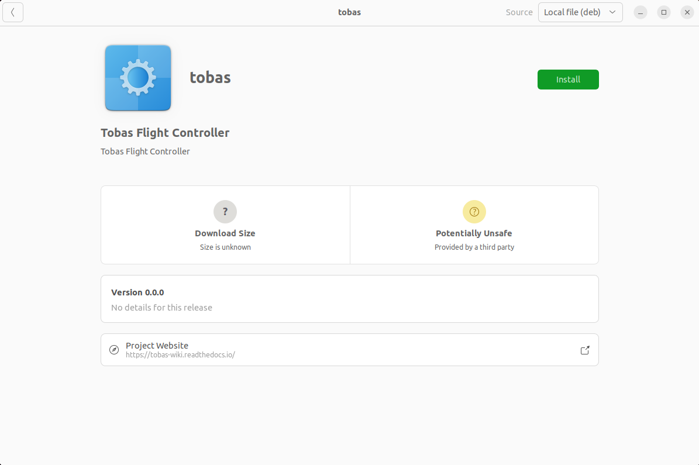
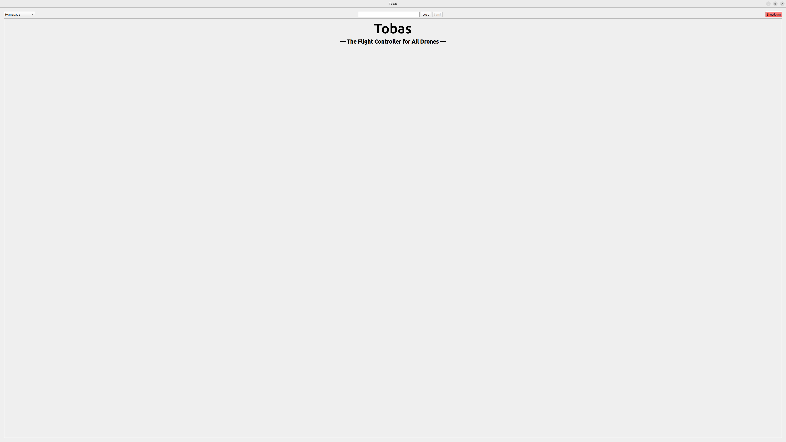

# Installation

## Ubuntu 20.04 LTS のデュアルブート

---

Tobas は Ubuntu 20.04 LTS 上で動作します．
Windows を使っている場合は WSL (Windows Subscription for Linux) を利用することもできますが，
不具合の報告もあるためネイティブインストール (Windows とデュアルブート) することを勧めます．
以下のサイトが参考になります:

- <a href=https://guminote.sakura.ne.jp/archives/233 target="_blank">Windows 10 の場合</a>
- <a href=https://jp.minitool.com/partition-disk/windows-11-and-linux-dual-boot.html target="_blank">Windows 11 の場合</a>

いずれにしても，以下の点に注意してください:

- Windows から BitLocker を無効にする (「解除中」ではまだ未完)
- BIOS の設定画面から Secure Boot を無効にする
- Ubuntu のインストール時に WiFi に接続し，Install third-party にチェックをつける

## PC への Tobas のインストール

---

1. tobas_x.x.x_amd64.deb をダウンロードしてください．
1. Files から tobas_x.x.x_amd64.deb をダブルクリックすると，Software Install が起動します．
1. Install を押すとインストールが開始されます．

## フライトコントローラのセットアップ

---

以下のハードウェアでフライトコントローラを構成します．

- <a href=https://www.raspberrypi.com/products/raspberry-pi-4-model-b/ target="_blank">Raspberry Pi Model 4B</a>
- <a href=https://navio2.hipi.io/ target="_blank">Navio2</a>

TODO: tobas-x.x.x がインストールされた Raspbian イメージをマイクロ SD に書き込む

## Tobas の起動

---

1. Tobas のイメージを書き込んだラズパイに給電してください．
1. ラズパイのアクセスポイントに接続してください．SSID は`raspberry_wifi`，パスワードは`raspberry`です．
1. Applications 内の Tobas をクリックすると GUI が起動します．

`raspberry_wifi`に接続しなくても Tobas は起動しますが，一部の機能が制限されます．
