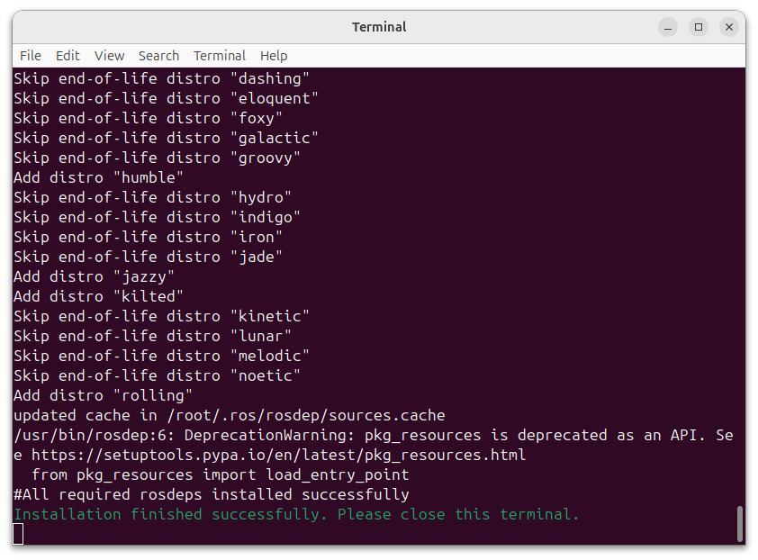

# インストール

## PC への Tobas のインストール

---

1. <a href=https://drive.google.com/file/d/1c-4ALeUQ1Ot2ZB8eEXENVPNiNxLpBGDG/view target="_blank">tobas_2.7.0_amd64.deb</a>をダウンロードしてください．
1. エクスプローラを開き，ダウンロードした deb パッケージをダブルクリックすると，App Center が起動します．これには数分かかることがあります．
1. `Install`をクリックするとインストールが開始します．これには数分かかることがあります．
1. インストールが完了すると，アプリケーションメニューに`TobasInstall`，`TobasBootmediaConfig`，`TobasSetupAssistant`，`TobasGCS`が追加されます．
1. アプリケーションメニューから`TobasInstall`を起動すると，ターミナルが開き追加のインストールが開始します．これには数十分かかることがあります．
   ターミナルの最後に`Installation finished successfully.`と表示されればインストール成功です．ターミナルを閉じてください．

## フライトコントローラのイメージ書き込み

---

### 必要なもの

- <a href=https://www.raspberrypi.com/products/raspberry-pi-5/ target="_blank">Raspberry Pi 5</a>
- Tobas HAT <!-- TODO: ホームページへのリンク -->
- 32GB 以上のマイクロ SD カード (例: <a href=https://shop.sandisk.com/ja-jp/products/memory-cards/microsd-cards/sandisk-extreme-uhs-i-microsd target="_blank">SanDisk Extreme 32GB</a>)

### 手順

1. <a href=https://drive.google.com/file/d/1MjfR1DEoKNEM6cuVDl58FnBEJPLeRhPJ/view target="_blank">tobas_2.7.0_arm64.img.gz</a>をダウンロードしてください．
1. マイクロ SD カードを，適当な SD カードリーダーを介して PC に接続してください．
1. <a href="https://etcher.balena.io/" target="_blank">balenaEtcher</a>などのイメージフラッシャーをインストールして起動してください．
1. イメージファイルにダウンロードしたイメージファイルを選択し，ターゲットにマイクロ SD カードを選択し，書き込みを開始してください．
1. 正常に終了したらマイクロ SD カードを PC から取り外し，FMU に挿入してください．

<!-- prettier-ignore-start -->
!!! note
    PC用のdebパッケージとFC用のイメージのバージョンは，マイナーバージョン (2桁目) まで一致していれば対応しています．
    例えば，PCがv1.2.3でFCがv1.2.4の場合は対応していますが，v1.2.3とv1.3.3の場合は動作が保証されません．
<!-- prettier-ignore-end -->

## 次の手順へ

---

これでインストールは完了です．
次は Tobas Bootmedia Config を用いて起動前の初期設定を行います．
