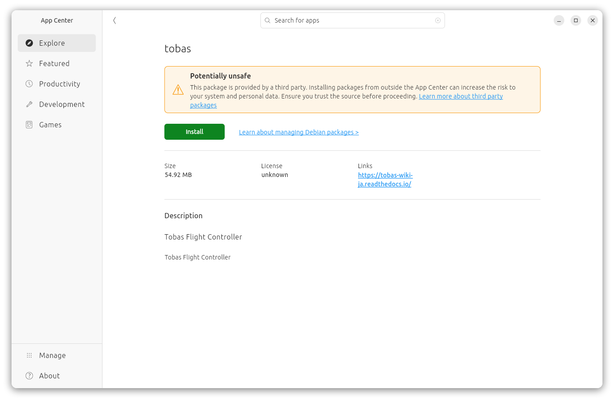
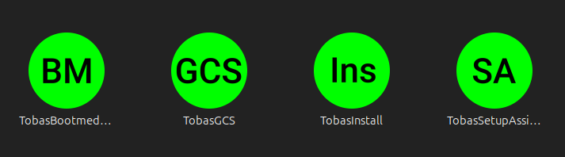
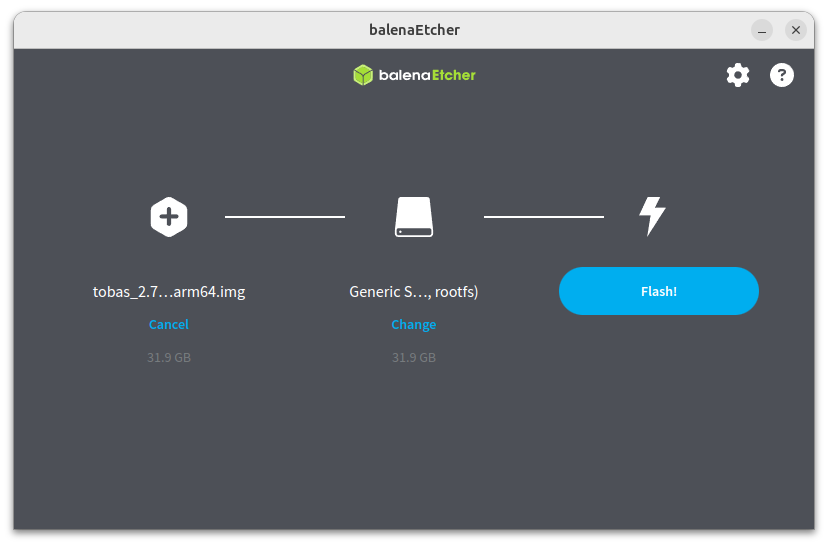

# インストール

## PC への Tobas のインストール

---

### 手順 (デスクトップから)

<a href=https://drive.google.com/file/d/1lm4Y_In__WT1oNqVqsW_EevMR5N7WAQU/view target="_blank">tobas_2.8.0_amd64.deb</a>
をダウンロードしてください．
ウイルススキャンはできなくても問題ありません．

エクスプローラを開き，ダウンロードした deb パッケージをダブルクリックすると，App Center が起動します．
`Install`をクリックするとインストールが開始します．これには数分かかることがあります．



インストールが完了すると，アプリケーションメニューに
`TobasBootmediaConfig`，`TobasGCS`，`TobasInstall`，`TobasSetupAssistant`
が追加されます．



アプリケーションメニューから`TobasInstall`を起動すると，ターミナルが開き追加のインストールが開始します．これには数十分かかることがあります．
ターミナルの最後に`Installation finished successfully.`と表示されればインストール成功です．
Enter キーを押してターミナルを閉じてください．


### 手順 (ターミナルから)

<a href=https://drive.google.com/file/d/1lm4Y_In__WT1oNqVqsW_EevMR5N7WAQU/view target="_blank">tobas_2.8.0_amd64.deb</a>
をダウンロードします．

```bash
$ sudo apt install -y python3-pip
$ sudo pip install gdown --break-system-packages
$ cd ~/Download
$ gdown --fuzzy 'https://drive.google.com/file/d/1lm4Y_In__WT1oNqVqsW_EevMR5N7WAQU/view'
```

Tobas をインストールします．

```bash
$ sudo dpkg -i tobas_2.8.0_amd64.deb
```

依存パッケージをインストールします．
最後に`Installation finished successfully.`と表示されればインストール成功です．

```bash
$ tobas_install_prereqs
> ...
> Installation finished successfully.
```

## フライトコントローラのイメージ書き込み

---

### 必要なもの

- <a href=https://www.raspberrypi.com/products/raspberry-pi-5/ target="_blank">Raspberry Pi 5</a>
- Tobas HAT <!-- TODO: URL -->
- 32GB 以上のマイクロ SD カード (例: <a href=https://shop.sandisk.com/ja-jp/products/memory-cards/microsd-cards/sandisk-extreme-uhs-i-microsd target="_blank">SanDisk Extreme 32GB</a>)
- SD カードリーダー (例: <a href=https://www.ankerjapan.com/products/a7612 target="_blank">Anker 2-in-1</a>)

### 手順 (デスクトップから)

<a href=https://drive.google.com/file/d/1zHG3gOVOFipMpKbjKfkf8CvWmIM4jpQd/view target="_blank">tobas_2.8.0_arm64.img.gz</a>
をダウンロードしてください．
ウイルススキャンはできなくても問題ありません．

適当なイメージフラッシャーをインストールしてください．例えば以下が使用可能です．

- <a href=https://etcher.balena.io/ target="_blank">balenaEtcher</a>
- <a href=https://www.raspberrypi.com/software/ target="_blank">Raspberry Pi Imager</a>

SD カードを，カードリーダーを介して PC に接続してください．

イメージフラッシャーを起動し，ダウンロードしたイメージと対象の SD カードを選択し，書き込みを開始してください．
以下は balenaEtcher の画面です．



正常に終了したら SD カードを PC から取り外してください．

### 手順 (ターミナルから)

<a href=https://drive.google.com/file/d/1zHG3gOVOFipMpKbjKfkf8CvWmIM4jpQd/view target="_blank">tobas_2.8.0_arm64.img.gz</a>
をダウンロードします．

```bash
$ sudo apt install -y python3-pip
$ sudo pip install gdown --break-system-packages
$ cd ~/Download
$ gdown --fuzzy 'https://drive.google.com/file/d/1zHG3gOVOFipMpKbjKfkf8CvWmIM4jpQd/view'
```

ダウンロードしたファイルを解凍します．

```bash
$ sudo apt install -y gzip
$ gunzip tobas_2.8.0_arm64.img.gz
```

SD カードを，カードリーダーを介して PC に接続してください．

イメージを SD カードに書き込みます．
`/dev/sdx`は実際のパスに置き換えてください．

```bash
$ sudo dd if=tobas_2.8.0_arm64.img of=/dev/sdx bs=4M conv=fsync status=progress
```

正常に終了したら SD カードを PC から取り外してください．

<!-- prettier-ignore-start -->
!!! note
    PC用のdebパッケージとFC用のイメージのバージョンは，マイナーバージョン (2桁目) まで一致していれば対応しています．
    例えば，PCがv1.2.3でFCがv1.2.4の場合は対応していますが，v1.2.3とv1.3.3の場合は動作が保証されません．
<!-- prettier-ignore-end -->

## 次の手順へ

---

これでインストールは完了です．
次は Tobas Bootmedia Config を用いて起動前の初期設定を行います．
