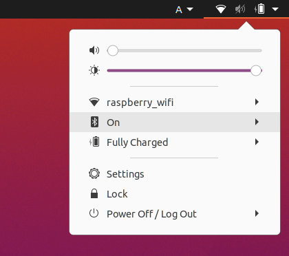

# Installation

## Ubuntu 20.04 LTS のデュアルブート

---

Tobas は Ubuntu 20.04 LTS 上で動作します．
Windows を使っている場合は WSL (Windows Subscription for Linux) を利用することもできますが，
不具合の報告もあるためネイティブインストール (Windows とデュアルブート) することを勧めます．
以下のサイトが参考になります:

- <a href=https://guminote.sakura.ne.jp/archives/233 target="_blank">Windows 10 の場合</a>
- <a href=https://jp.minitool.com/partition-disk/windows-11-and-linux-dual-boot.html target="_blank">Windows 11 の場合</a>

いずれにしても，以下の点に注意してください:

- Windows から BitLocker を無効にする (「解除中」ではまだ未完)
- BIOS の設定画面から Secure Boot を無効にする
- Ubuntu のインストール時に WiFi に接続し，Install third-party にチェックをつける
- Ubuntu 22.04 LTS へのアップグレードは行わない

## PC への Tobas のインストール

---

1. `tobas_x.x.x_amd64.deb`をダウンロードしてください．
1. Files から `tobas_x.x.x_amd64.deb`をダブルクリックすると，Software Install が起動します．これには数分かかることがあります．
1. Install を押すとインストールが開始され，Applications に Tobas と Tobas Install が追加されます．これには数分かかることがあります．
1. Applications から Tobas Install を起動すると，追加のインストールが開始します．これには数十分かかることがあります．

## フライトコントローラのセットアップ

---

### 必要なもの

- <a href=https://www.raspberrypi.com/products/raspberry-pi-4-model-b/ target="_blank">Raspberry Pi Model 4B</a>
- <a href=https://navio2.hipi.io/ target="_blank">Navio2</a>
- 32GB 以上マイクロ SD カード (例: <a href=https://www.amazon.co.jp/gp/product/B0B21BXZ6V/ref=sw_img_1?smid=AN1VRQENFRJN5&th=1 target="\_blank">SanDisk Extreme 32GB</a>)

### 手順

1. `tobas_x.x.x_armhf.img`をダウンロードしてください．
1. マイクロ SD カードを，適当な SD カードリーダーを介して PC に接続してください．
1. Applications から balenaEtcher を起動してください．
1. `Flash from file`から img ファイルを選択し，`Select target`からマイクロ SD カードを選択してください．
1. `Flash!`を押すとマイクロ SD カードに Linux OS イメージが書き込まれます．これには数十分かかることがあります．
1. マイクロ SD カードを PC から取り外し，ラズパイに挿入してください．

## Tobas の起動

---

1. Tobas のイメージを書き込んだラズパイに給電してください．
1. ラズパイのアクセスポイントに接続してください．SSID は`raspberry_wifi`，パスワードは`raspberry`です．
1. Applications 内の Tobas をクリックすると GUI が起動します．

- **注意:** Tobas の起動前にラズパイのアクセスポイントに接続する必要があります．
- **注意:** ラズパイに接続しなくても Tobas は起動しますが，一部の機能が制限されます．
