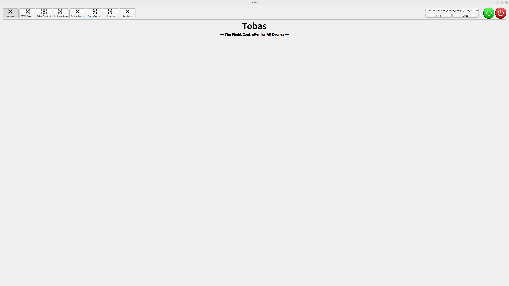

# インストール

## PC への Tobas のインストール

---

1. `tobas_x.x.x_amd64.deb`をダウンロードしてください．
1. Files から `tobas_x.x.x_amd64.deb`をダブルクリックすると，App Center が起動します．これには数分かかることがあります．
1. Install を押すとインストールが開始され，Applications に Tobas と Tobas Install が追加されます．これには数分かかることがあります．
1. Applications から Tobas Install を起動すると，ターミナルが開き追加のインストールが開始します．これには数十分かかることがあります．
   ターミナルの最後に`Installation finished successfully.`と表示されればインストール成功です．ターミナルを閉じてください．

## フライトコントローラのセットアップ

---

### 必要なもの

- <a href=https://www.raspberrypi.com/products/raspberry-pi-5/ target="_blank">Raspberry Pi 5</a>
- Tobas ラズベリーパイハット
- 32GB 以上マイクロ SD カード (例: <a href=https://shop.sandisk.com/ja-jp/products/memory-cards/microsd-cards/sandisk-extreme-uhs-i-microsd target="_blank">SanDisk Extreme 32GB</a>)

### 手順

1. `tobas_x.x.x_arm64.img.gz`をダウンロードしてください．
1. マイクロ SD カードを，適当な SD カードリーダーを介して PC に接続してください．
1. <a href="https://etcher.balena.io/" target="_blank">balenaEtcher</a>などのイメージフラッシャーをインストールして起動してください．
1. イメージファイルにダウンロードした img を選択し，ターゲットにマイクロ SD カードを選択し，書き込みを開始してください．
1. 正常に終了したらマイクロ SD カードを PC から取り外し，ラズパイに挿入してください．

## Tobas の起動

---

1. FC に Type-C またはラズパイハットの電源コネクタから給電してください．
1. ラズパイのアクセスポイントに接続してください．SSID は`raspberry_wifi`，パスワードは`raspberry`です．
1. Applications から`Tobas`をクリックすると GUI が起動します．

- **注意:** ラズパイのネットワーク設定前は，Tobas の起動前にラズパイのアクセスポイントに接続する必要があります．
- **注意:** ラズパイにネットワーク接続しなくても Tobas は起動しますが，一部の機能が制限されます．
