# Tobas Setup Assistant

Tobas Setup Assistant は，Tobas を用いてドローンを飛ばすのに必要な設定ファイルを生成するための GUI です．
前ページで作成した URDF を読み込み，プロペラの空気力学や制御器などの URDF には表現されていない項目の設定を行います．

## catkin ワークスペースの作成

---

Tobas Setup Assistant ではユーザの機体で Tobas を使用するのに必要な設定ファイルをまとめた ROS パッケージを作成します．
それを使うためには catkin ワークスペースが必要であり，以下のコマンドで作成できます:

```bash
$ mkdir -p ~/catkin_ws/src
$ cd ~/catkin_ws
$ catkin init
```

`catkin_ws`を他の名前に置き換えることもできます．

## Setup Assistant の起動と URDF のロード

---

ターミナルから Tobas Setup Assistant を起動します:

```bash
$ roslaunch tobas_setup_assistant setup_assistant.launch
```


`Browse`ボタンを押して先程作成した URDF を選択し，`Load`ボタンを押すと，URDF がロードされます．
画面左上の`Frames Tree`にはリンク名がツリー状に表示されており，リンク名をクリックすると中央のモデルビューで対応するリンクがハイライトされます．
画面右上には全ての可動関節名が表示されており，バーを動かすと中央のモデルビューで対応する関節角が変化します．

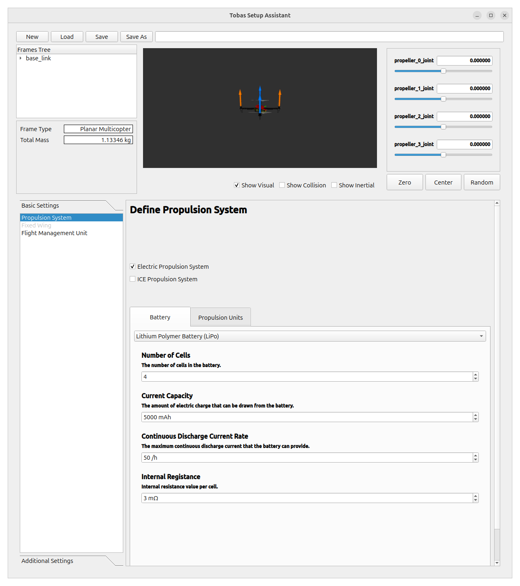

ロードが完了すると画面左のタブがアクティブになります．
これらのタブを上から順に設定していきます．

## Battery

---

バッテリーの設定を行います．
バッテリーの仕様を見ながら以下のように設定します:

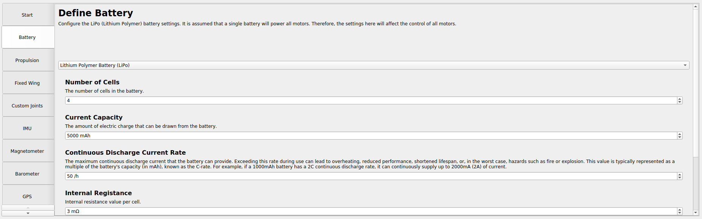

## Propulsion

---

推進系 (プロペラ) の設定を行います．
`Available Links`にプロペラとして利用可能なリンクが表示されています．
表示されない場合は，URDF Builder でプロペラリンクのジョイントタイプが`Continuous`になっているかどうかを確認してください．

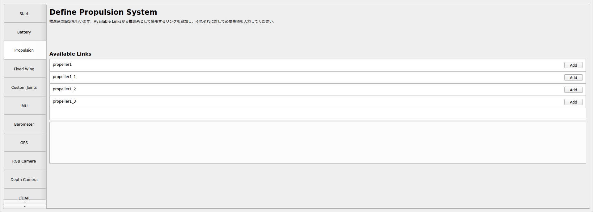

リンク名の右端の`Add`ボタンを押すと，モデルビューに推力方向が矢印で表示されると同時にそのプロペラの設定タブが追加されます．
推力の向きが間違っている場合は，URDF Builder でジョイントの`Axis`を修正してください．

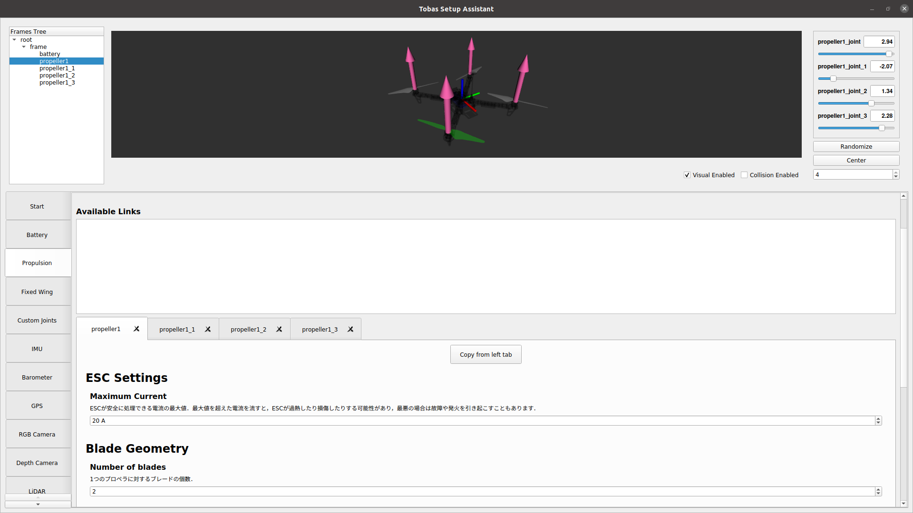

`propeller1`の設定を行います．
スペックシートを見ながら`ESC Settings`と`Blade Geometry`の各項目に適切な値を入力します．

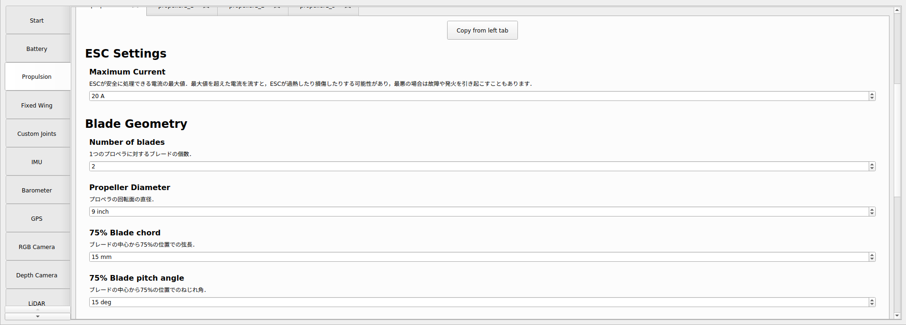

`Motor Settings`ではモータのダイナミクスに関する設定を行います．
複数の設定方法から選ぶことができ，`Set from experimental data`が望ましいのですが，
プロペラ込みのモータの実験データは持っていないため，今回は`Set from motor spec`を選択します．
スペックシートを見ながら各項目に適切な値を入力します．

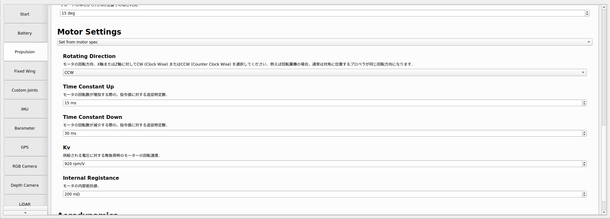

`Aerodynamics`ではプロペラの空力特性の設定を行います．
こちらも複数の設定方法から選ぶことができますが，精度の観点から`Set from blade geometry`は勧めません．
今回は`Set from UIUC propeller data site`を選択します．
<a href=https://m-selig.ae.illinois.edu/props/propDB.html target="_blank">UIUC Propeller Data Site</a>
とは様々なプロペラの空力特性の実験データをまとめたサイトであり，
例えば<a href=https://www.apcprop.com/ target="_blank">APC</a>のプロペラならば大抵のものはデータを得ることができます．
とはいえ今回使用している Phantom3 0945 のデータはないため，UIUC の Volume 1 の
<a href=https://m-selig.ae.illinois.edu/props/volume-1/data/apcsf_9x4.7_static_kt1032.txt target="_blank">9 X 4.7 のデータ</a>
で代用します．
Static データをテーブルに転記してください．

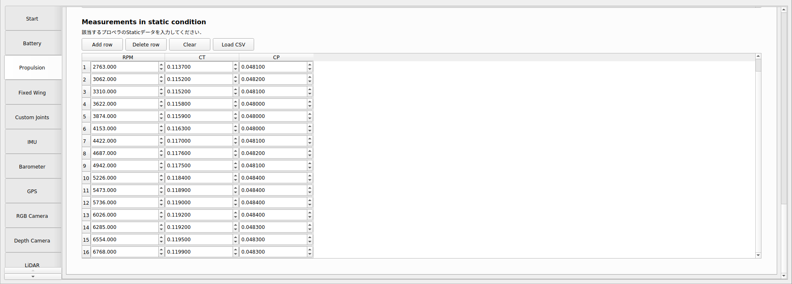

以下のような CSV ファイルを作成して`Load CSV`からロードすることもできます:

```csv
RPM,CT,CP
2763,0.1137,0.0481
3062,0.1152,0.0482
3310,0.1152,0.0481
3622,0.1158,0.0480
3874,0.1159,0.0480
4153,0.1163,0.0480
4422,0.1170,0.0481
4687,0.1176,0.0482
4942,0.1175,0.0481
5226,0.1184,0.0484
5473,0.1189,0.0484
5736,0.1190,0.0484
6026,0.1192,0.0484
6285,0.1192,0.0483
6554,0.1195,0.0483
6768,0.1199,0.0483
```

他の 3 枚のプロペラについても設定を行う必要がありますが，回転方向以外は同じなのでコピーします．
左のタブから順にタブ上部の`Copy from left tab`を押して左のタブの設定をコピーします．
`propeller1`の設定が他のプロペラにも反映されていることを確認し，各プロペラの`Rotating Direction`を適切に設定します．
リンク名と位置の対応がわからない場合は，`Frames Tree`のハイライト機能を用いて確認してください．

## Fixed Wing

---

固定翼の設定を行います．
今回は回転翼機なのでパスします．

## Custom Joints

---

推進系，固定翼駄面以外の関節の設定を行います．
今回はプロペラ以外の可動関節は無いためパスします．

## オンボードセンサ (IMU, Barometer, GPS)

---

9 軸 IMU，気圧センサ，GPS はフライトコントローラに組み込まれています．
基本的に設定はデフォルトで構いませんが，GNSS レシーバの位置がルートフレームから離れているため，今回 GPS のオフセットだけは修正します．

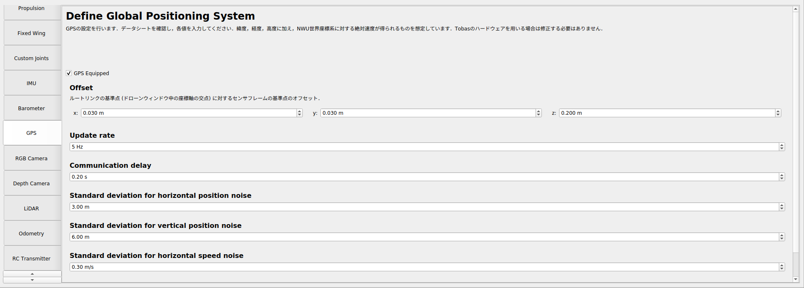

## 追加センサ (Camera, LiDAR, Odometry)

---

カメラ，LiDAR，オドメトリを発行する機器の設定を行います．
今回はいずれも搭載しないためパスします．

## RC Transmitter

---

プロポに関する設定を行います．
`The number of flight modes`を 2 に設定します．

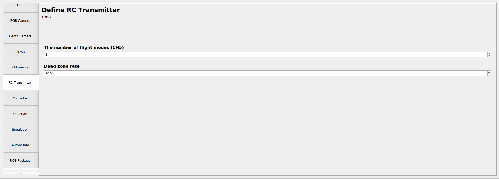

## Controller

---

制御器に関する設定を行います．
コンボボックスを開くと使用可能な制御器が表示されます．
今回は`Multirotor PID`を選択します．
`Flight Modes`は`RC Transmitter`タブで設定した個数のフライトモードが表示されています．
`Flight Mode 1`を`RollPitchYawThrust`に，`Flight Mode 2`を`PosVelAccYaw`に設定します．

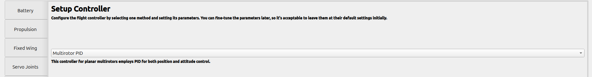

## Observer

---

状態推定器に関する設定を行います．
基本的にはデフォルトのままで構いません．

## Simulation

---

Gazebo のシミュレーション環境の設定を行います．
`Gravity`は標準重力加速度で固定されています．
経緯度と海抜高度は，デフォルトでは日本経緯度原点と日本水準原点に設定されています．
今回はさほど重要ではないためデフォルトのままとします．

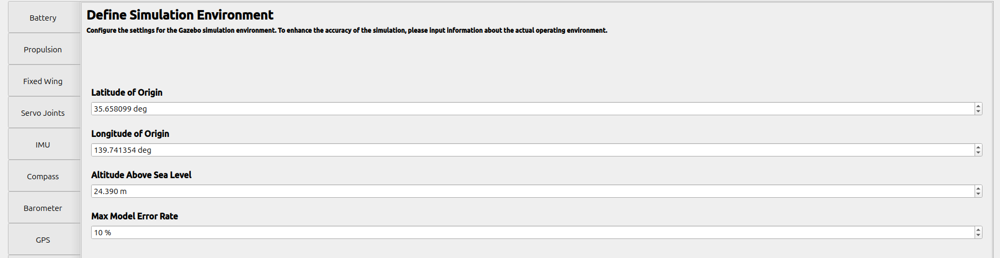

## Author Info

---

Setup Assistant によって生成される Tobas パッケージの管理者の名前とメールアドレスを入力します．

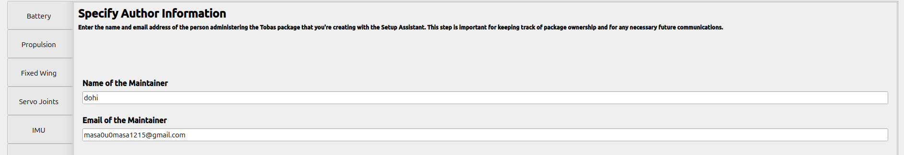

## ROS Package

---

Tobas パッケージを生成するディレクトリとパッケージ名を設定します．
`Parent Directory`を catkin ワークスペースの`src/`以下に設定し，`Package Name`に適当な名前を入力してください．
`Generate`ボタンを押すと，指定したディレクトリに Tobas パッケージが生成され，Setup Assistant は自動的にシャットダウンします．

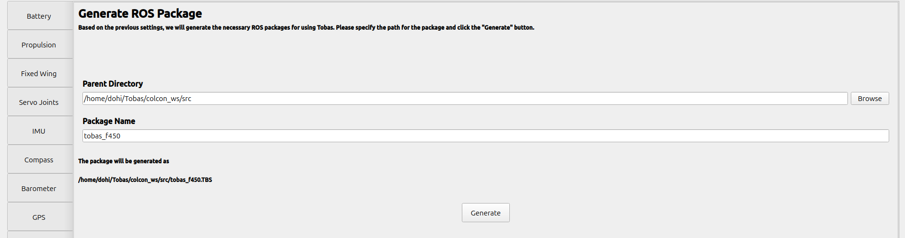

## Build

---

catkin ワークスペース以下に移動し，生成した Tobas パッケージをビルドします:

```bash
$ cd ~/catkin_ws
$ catkin build tobas_f450_config
```
