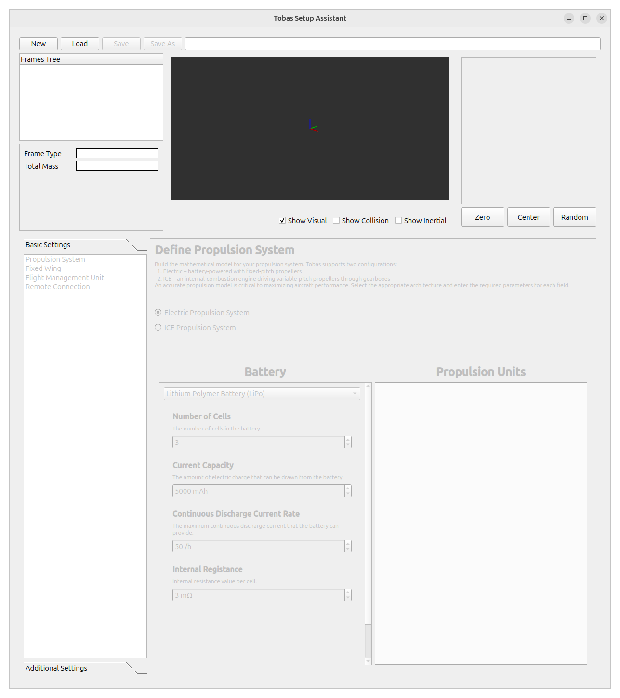
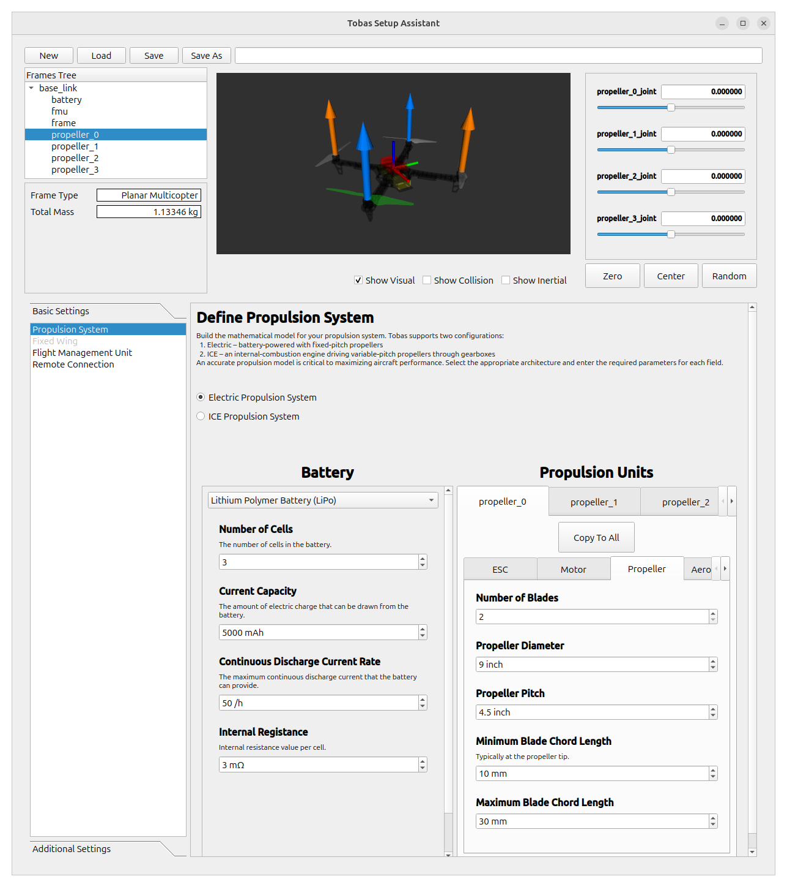

# Tobas Setup Assistant

Tobas Setup Assistant は，Tobas を用いてドローンを飛ばすのに必要な設定ファイルを生成するための GUI です．
前ページで作成した URDF を読み込み，プロペラの空気力学や制御器などの URDF には表現されていない項目の設定を行います．

## Setup Assistant の起動と URDF のロード

---

Tobas を起動し，左上の選択リストから`Setup Assistant`を選択します．



`Create new Tobas configuration package`にチェックが入っていることを確認します．
`Load`ボタンを押して先程作成した URDF を選択すると，URDF がロードされます．
画面左上の`Frames Tree`にはリンク名がツリー状に表示されており，リンク名をクリックすると中央のモデルビューで対応するリンクがハイライトされます．
画面右上には全ての可動関節名が表示されており，バーを動かすと中央のモデルビューで対応する関節角が変化します．


ロードが完了すると画面左のタブがアクティブになります．
これらのタブを上から順に設定していきます．

## Battery

---

バッテリーの設定を行います．
バッテリーの仕様を見ながら以下のように設定します:


## Propulsion

---

推進系 (プロペラ) の設定を行います．
`Available Links`にプロペラとして利用可能なリンクが表示されています．
表示されない場合は，URDF Builder でプロペラリンクのジョイントタイプが`Continuous`になっていることを確認してください．


リンク名の右端の`Add`ボタンを押すと，モデルビューに推力方向が矢印で表示されると同時にそのプロペラの設定タブが追加されます．
推力の向きが間違っている場合は，URDF Builder でジョイントの`Axis`を修正してください．


`propeller_0`リンクの設定を行います．
各パーツのデータシートを見ながら，`ESC`，`Motor`，`Propeller`の各項目に適切な値を入力します．




`Electrodynamics`ではモータのダイナミクスに関する設定を行います．
複数の設定方法から選ぶことができ`Estimate from Experimental Data`が望ましいのですが，
プロペラ込みのモータの実験データは持っていないため，今回は`Estimate from Motor Spec`を選択します．


`Aerodynamics`ではプロペラの空力特性の設定を行います．
こちらも複数の設定方法から選ぶことができ，
精度の観点から`Estimate from Thrust Stand Data`または`Estimate from UIUC Propeller Data Site`が望ましいです．
今回は`Estimate from UIUC Propeller Data Site`を選択します．
<a href=https://m-selig.ae.illinois.edu/props/propDB.html target="_blank">UIUC Propeller Data Site</a>
とは様々なプロペラの空力特性の実験データをまとめたサイトであり，
例えば<a href=https://www.apcprop.com/ target="_blank">APC</a>のプロペラならば大抵のものはデータを得ることができます．
とはいえ今回使用している Phantom3 0945 のデータはないため，UIUC の Volume 1 の
<a href=https://m-selig.ae.illinois.edu/props/volume-1/data/apcsf_9x4.7_static_kt1032.txt target="_blank">9 X 4.7 のデータ</a>
で代用します．
Static データをテーブルに転記してください．


以下のような CSV ファイルを作成して Load CSV からロードすることもできます:

```csv
RPM,CT,CP
2763,0.1137,0.0481
3062,0.1152,0.0482
3310,0.1152,0.0481
3622,0.1158,0.0480
3874,0.1159,0.0480
4153,0.1163,0.0480
4422,0.1170,0.0481
4687,0.1176,0.0482
4942,0.1175,0.0481
5226,0.1184,0.0484
5473,0.1189,0.0484
5736,0.1190,0.0484
6026,0.1192,0.0484
6285,0.1192,0.0483
6554,0.1195,0.0483
6768,0.1199,0.0483
```

他の 3 枚のプロペラについても設定を行う必要がありますが，回転方向以外は同じなのでコピーします．
左のタブから順にタブ上部の `Copy From Left` を押して左のタブの設定をコピーします．
`propeller_0`リンクの設定が他のプロペラリンクにも反映されていることを確認し，各プロペラの`Rotating Direction`を適切に設定します．
リンク名と位置の対応がわからない場合は`Frames Tree`のハイライト機能を用いて確認してください．

## Fixed Wing

---

固定翼の設定を行います．
今回は回転翼機なのでパスします．

## Custom Joints

---

推進系，固定翼駄面以外の関節の設定を行います．
今回はプロペラ以外の可動関節は無いためパスします．

## オンボードセンサ (IMU, Barometer, GNSS)

---

9 軸 IMU，気圧センサ，GPS はフライトコントローラに組み込まれています．
基本的に設定はデフォルトで構いませんが，GNSS レシーバの位置がルートフレームから離れているため，今回は GNSS レシーバのオフセットのみ修正します．


## オプションデバイス (Camera, LiDAR, Odometry, Tether Station)

---

オプションで搭載する機器の設定を行います．以下のような機器がサポートされています:

- RGB カメラ (RGB Camera)
- 深度カメラ (Depth Camera)
- LiDAR (LiDAR)
- カスタム位置発行機器 (Odometry)
- ドローンスパイダー (Tether Station)

今回はいずれも搭載しないためパスします．

## Controller

---

制御器に関する設定を行います．
選択リストを開くと制御器のリストが表示されます．
URDF やこれまでの設定を元に使用可能な制御器が自動で判定されており，
制御器名に`(Not Applicable)`と表示されていないもののみ使用することができます．
今回は`Multirotor PID`を選択します．


## Observer

---

状態推定器に関する設定を行います．
基本的にはデフォルトのままで構いません．

## Simulation

---

Gazebo のシミュレーション環境の設定を行います．
`Gravity`は標準重力加速度で固定されています．
経緯度と海抜高度は，デフォルトでは日本経緯度原点と日本水準原点に設定されています．
今回はさほど重要ではないためデフォルトのままとします．
また，空力系のモデル化誤差の程度を設定でき，今回はこれもデフォルトのままとします．


## Author Info

---

Setup Assistant によって生成される Tobas パッケージの管理者の名前とメールアドレスを入力します．


## ROS Package

---

Tobas パッケージを生成するディレクトリとパッケージ名を設定します．
`Parent Directory`を catkin ワークスペースの`src/`以下に設定し，`Package Name`に適当な名前を入力してください．
`Generate`ボタンを押すと，指定したディレクトリに Tobas パッケージ (\*.TBS) が生成されます．


