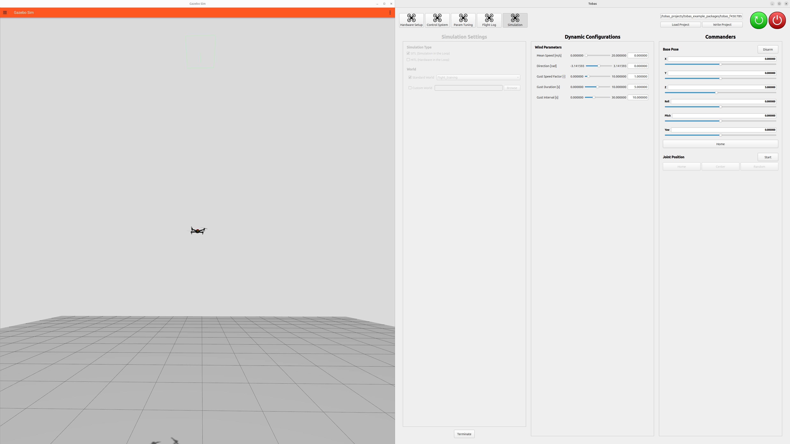

# シミュレーション

## 開始・終了の手順

---

`TobasGCS`を起動して`tobas_f450.TBS`を読み込み，ツールボタンから`Simulation`を選択します．

`Static Configurations`の`Simulation Type`を`SITL`に，`World`を`Standard World`の`flight_training`に設定します．
その他の項目はデフォルトのままとします．

`Start`をクリックすると，プロジェクトをビルドした後にシミュレーションが起動します．
初回は環境データのダウンロードのために時間がかかることがあります．

`Dynamic Configurations`から風速などの環境設定，`Commanders`から機体への指令を行うことができます．
[Flight Test](./flight_test.md)で紹介したミッション計画やパラメータチューニングなども実機と同様に行うことができます．

`Terminate`をクリックするとシミュレーションが終了します．

## プロポでの操作

---

RC キャリブレーションを行っていれば，シミュレーション中の機体をプロポから操作することができます．

1. <a href=https://akizukidenshi.com/catalog/g/g108461/ target="_blank">FTDI FT234X</a>
   のような USB シリアル変換モジュールを用意します．
1. USB シリアル変換モジュールを，High-Low を反転する設定にします．
1. USB シリアル変換モジュールを PC と RC 受信機に接続します．
1. PC から，USB シリアル変換モジュールに読み取り許可を与えます: `$ sudo chmod 666 /dev/ttyUSBx`
1. プロポの信号が`Control System`に表示されれば成功です．実機と同様に操作できます．

## ROS を介した操作

---

フライトコントローラを構成する各コンポーネント間の通信は全て ROS (ROS 2 Jazzy) で行われているため，
ユーザは自分のプログラムから機体を操作することができます．
詳しくは[User Code](./user_code.md)をご覧ください．
