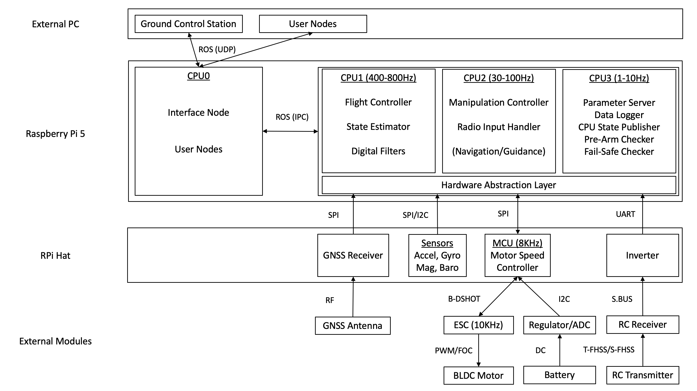
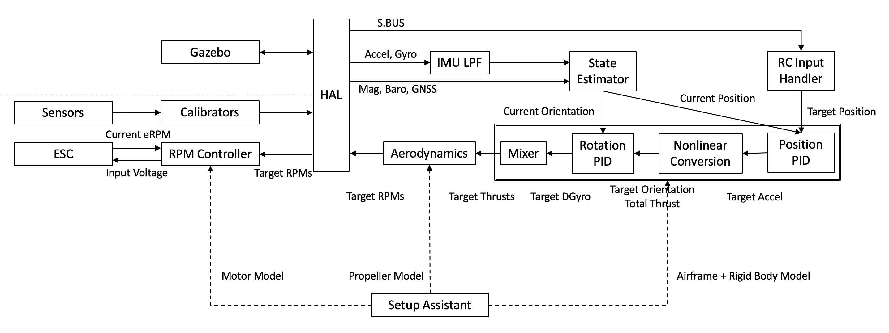

# システム構成

Tobas の大まかなシステム構成について，ハードウェアとソフトウェアに分けて説明します．

## ハードウェア構成

---

下図はハードウェアの構成図です．
HAT からシリアル通信で送られたセンサデータは，RPi 上のハードウェア仮想化層 (Hardware Abstraction Layer, 以下 HAL)
で共通の ROS メッセージに変換された後 CPU1-3 で動作するフライトコードで処理されます．
フライトコードから出力された目標モータ回転数は再び HAL を通過した後 HAT 上のモータ速度制御用 MCU に送られ，
計算されたスロットルはデジタル通信で ESC に指示されます．
CPU0 では遠隔通信のためのインターフェースノードがフライトコードとは別のプロセスで動作しており，
地上局などリモートからフライトコントローラにアクセスする際は必ずこのノードを通過します．
このように通信に関する処理のプロセスとコアを分離しているのは，フライトコードのリアルタイム性を確保し，予期せぬ動作を防ぐためです．

## ソフトウェア構成

---

下図はソフトウェアの構成図です．
実機もしくは Gazebo 上の機体からのセンサデータは HAL で共通の ROS メッセージに変換されます．
センサデータは状態推定器に送られ，機体の位置，姿勢，速度，角速度が推定されます．
推定された状態は図の二重枠で囲まれた制御器に送られ，各プロペラの目標推力が計算されます．
目標推力からプロペラのモデルに従ってモータの目標回転数が計算されます．
目標回転数は再び HAL を通過した後，実機もしくは Gazebo 上の機体に指令されます．
実機の場合，目標回転数から MCU 上のモータ制御器でモータへの印加電圧が計算され，ESC に送信されます．
飛行制御器やモータ制御器に必要な機体の物理モデルは，[Setup Assistant](./setup_assistant.md)で作成した Tobas プロジェクトから取得します．

