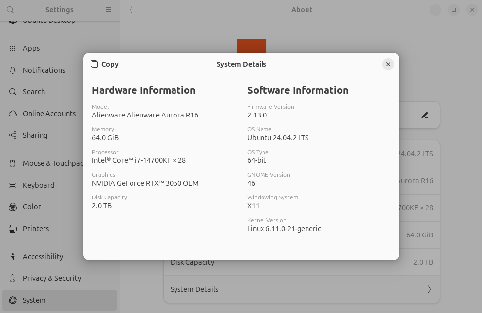

# トラブルシューティング

## ラズパイが起動しない

---

### 1. 不要なメタデータが残っている可能性

SD カードを一度ゼロクリアしてからイメージを書き込んでください．

```bash
$ sudo dd if=/dev/zero of=/dev/sdx bs=1G status=progress
$ sudo dd if=tobas_x.x.x_arm64.img of=/dev/sdx bs=1G status=progress
```

## Gazebo の動作が重い

---

### 1. ディスプレイサーバが X11 になっていない可能性

`Settings / System / About / System Details`
から，ディスプレイサーバが X11 になっていることを確認してください．



もしも X11 でない場合，例えば Wayland と表示されている場合は，
Ubuntu の起動画面でユーザ名を選択した際に画面右下に現れる歯車から，ディスプレイサーバを以下のように選択してください．

- `Ubuntu` もしくは `Ubuntu on Wayland` が選択可能な場合 → `Ubuntu`
- `Ubuntu on Xorg` もしくは `Ubuntu` が選択可能な場合 → `Ubuntu on Xorg`
