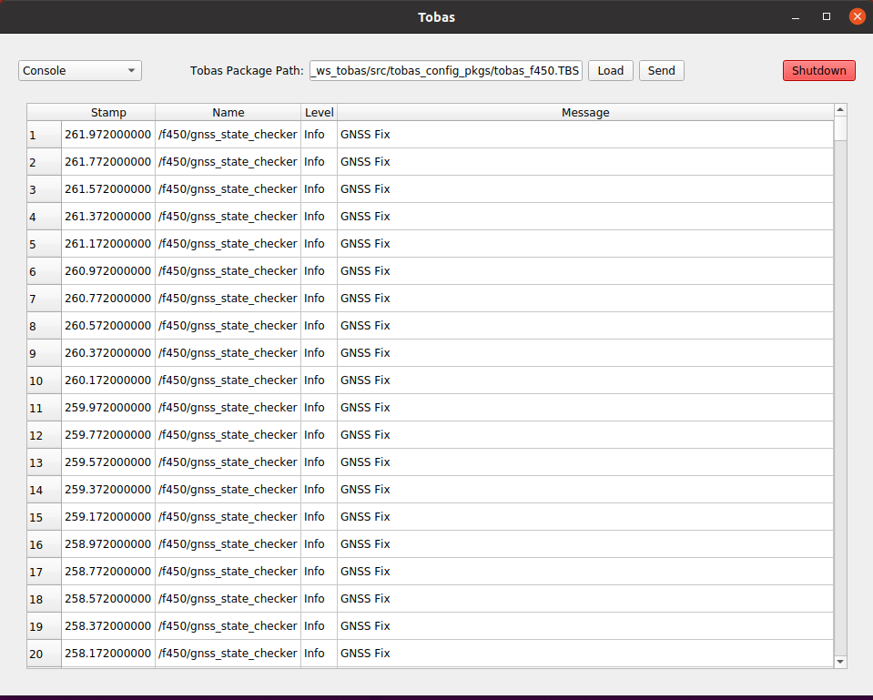

# ユーザプログラム

Setup Assistant で作成した Tobas パッケージ (例: tobas_f450.TBS) に含まれる ROS パッケージのうち，
ユーザパッケージ (例: tobas_f450_user) はユーザが自由に編集できるパッケージです．
ユーザパッケージには 3 つの launch ファイルが含まれます．

- `common.launch.py`: 実機とシミュレーションの両方で起動されます．
- `gazebo.launch.py`: シミュレーション時のみ起動されます．
- `real.launch.py`: 実機でのみ起動されます．

以下は GNSS の状態を確認し，測位できているか否かを Tobas メッセージで発行する Python スクリプトです．
これを`scripts/gnss_state_checker_node.py`として保存し，`chmod`で実行権限を与えてください．

```python
import rclpy
from rclpy.node import Node
from tobas_std_msgs.msg import Message
from tobas_msgs.msg import Gps


class GnssStateCheckerNode(Node):
    def __init__(self) -> None:
        super().__init__("gnss_state_checker")

        self._message_pub = self.create_publisher(Message, "message", 1)
        self._gps_sub = self.create_subscription(Gps, "gps", self._gps_callback, 1)

    def _gps_callback(self, gps: Gps) -> None:
        message = Message()
        message.stamp = gps.header.stamp
        message.name = self.get_name()

        if gps.fix_type == Gps.FIX_3D:
            message.level = Message.LEVEL_INFO
            message.message = "GNSS Fix"
        else:
            message.level = Message.LEVEL_WARN
            message.message = "GNSS No Fix"

        self._message_pub.publish(message)


def main(args=None) -> None:
    rclpy.init(args=args)
    node = GnssStateCheckerNode()
    rclpy.spin(node)


if __name__ == "__main__":
    main()
```

作成したスクリプトが自動で起動されるようにします．
`common.launch.py`を以下のように編集してください．

```xml
<!-- Do not delete or rename this file because it is executed in tobas_f450_config/bringup.launch. -->

<launch>

  <!-- Please launch the nodes that run on both the actual machine and the Gazebo simulation. -->
  <node pkg="tobas_f450_user" type="gnss_state_checker_node.py" name="gnss_state_checker"/>

</launch>
```

GUI からシミュレーションを起動すると，`Console`にメッセージが表示されます．


