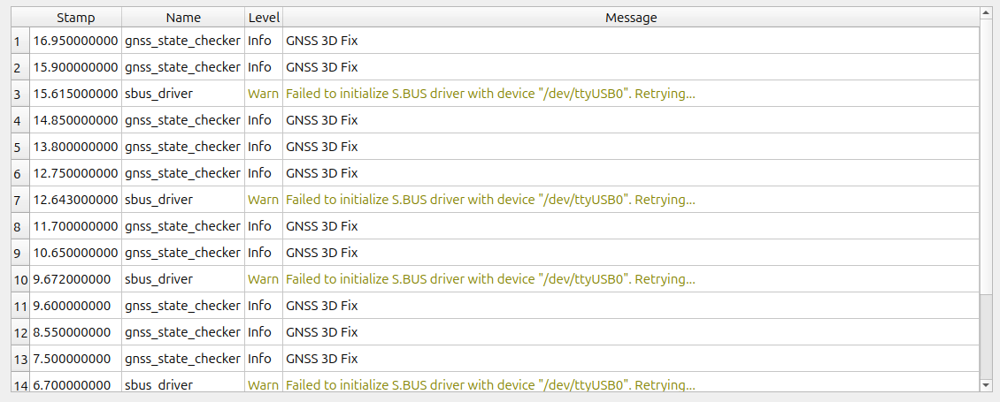

# ユーザコード (C++)

ここでは，ユーザが C++ と ROS 2 の基礎を習得していることを前提にしています．
ROS 2 の学習には
<a href=https://docs.ros.org/en/jazzy/Tutorials.html target="_blank">Tutorials | ROS 2 Documentation</a>
をご参照ください．

Setup Assistant で作成した Tobas プロジェクト (例: tobas_f450.TBS) に含まれる ROS パッケージのうち，
ユーザ C++ パッケージ (例: tobas_f450_user_cpp) はユーザが自由に編集できる C++ パッケージです．
以下の 5 つの launch ファイルが含まれます．

- `common_(interface/realtime).launch.py`: 実機とシミュレーションの両方で起動されます．
- `real_(interface/realtime).launch.py`: 実機でのみ起動されます．
- `gazebo.launch.py`: シミュレーション時のみ起動されます．

`common`と`real`にはそれぞれ`interface`と`realtime`の 2 種類の launch ファイルがありますが，
前者で立ち上げたノードはネットワーク間の ROS 通信ができるのに対し，後者で立ち上げたノードはできません．
そのため`*_realtime.launch`で立ち上げたノードがネットワーク間通信を行うためには，
`*_interface.launch`で立ち上げたインターフェースノードを介する必要があります．
このような仕組みになっているのは，ROS 2 のバックエンドである DDS のノード探索アルゴリズムがリアルタイム性に悪影響を及ぼすのを避けるためです．

試しに GNSS の状態を確認し，3 次元測位できている場合に 1 秒おきにメッセージを発する C++ ノードを作成してみます．
`tobas_f450_user_cpp/tobas_f450_user_cpp/user_node.cpp`を以下のように編集してください．

```cpp
#include <tobas_constants/constants.hpp>
#include <tobas_node/node.hpp>

#include <tobas_msgs_adapter/gnss.hpp>

class UserNode : public tobas::BaseNode
{
  using self = UserNode;
  using super = tobas::BaseNode;

public:
  explicit UserNode(const rclcpp::NodeOptions& options = rclcpp::NodeOptions());

private:
  ros2::SubscriberPtr<tobas_msgs::Gnss> gnss_sub_;

  void gnssCb(const tobas_msgs::Gnss::ConstSharedPtr& gnss);
};

UserNode::UserNode(const rclcpp::NodeOptions& options) : super("gnss_state_checker", options)
{
  gnss_sub_ = createSubscriber<tobas_msgs::Gnss>(tobas::kGnssTopic, &self::gnssCb, this);
}

void UserNode::gnssCb(const tobas_msgs::Gnss::ConstSharedPtr& gnss)
{
  if (gnss->fix_type == tobas_msgs::msg::Gnss::FIX_3D) {
    TOBAS_INFO_THROTTLE(1., "GNSS 3D Fix");
  }
}

RCLCPP_COMPONENTS_REGISTER_NODE(UserNode)
```

このノードをビルド対象に追加します．
`tobas_f450_user_cpp/CMakeLists.txt`に依存パッケージを追加し，ビルド処理のコメントアウトを外してください．

```cmake
cmake_minimum_required(VERSION 3.25)
project(tobas_f450_user_cpp)

if(NOT CMAKE_BUILD_TYPE AND NOT CMAKE_CONFIGURATION_TYPES)
  set(CMAKE_BUILD_TYPE "Release" CACHE STRING "Build type (default Release)" FORCE)
endif()

set(CMAKE_CXX_STANDARD 23)
set(CMAKE_CXX_STANDARD_REQUIRED ON)
set(CMAKE_CXX_EXTENSIONS OFF)
set(CMAKE_CXX_FLAGS "${CMAKE_CXX_FLAGS} -Wall -Wextra -Wpedantic -Wshadow -Werror")
set(CMAKE_POSITION_INDEPENDENT_CODE ON)

set(AMENT_DEPENDENCIES
  rclcpp
  rclcpp_components
  tobas_constants
  tobas_node
  tobas_msgs_adapter
)

find_package(ament_cmake REQUIRED)

foreach(dependency IN ITEMS ${AMENT_DEPENDENCIES})
  find_package(${dependency} REQUIRED)
endforeach()

include_directories(include)

add_library(${PROJECT_NAME} SHARED nodes/user_node.cpp)
ament_target_dependencies(${PROJECT_NAME} ${AMENT_DEPENDENCIES})
target_link_options(${PROJECT_NAME} PRIVATE -Wl,--no-undefined)
rclcpp_components_register_node(${PROJECT_NAME} PLUGIN "UserNode" EXECUTABLE user_node)

install(
  TARGETS ${PROJECT_NAME}
  EXPORT ${PROJECT_NAME}
  LIBRARY DESTINATION lib
  ARCHIVE DESTINATION lib
  RUNTIME DESTINATION bin
  INCLUDES
  DESTINATION include
)

install(DIRECTORY launch DESTINATION share/${PROJECT_NAME})

ament_package()
```

このノードが自動で起動するよう設定します．
通常の ROS ノードを立ち上げてもよいのですが，今回はトピック通信のコピーをなくすためにコンポーネントとして立ち上げます．

Tobas では 3 つのコンポーネントマネージャー (`component_manager_x (x = 1, 2, 3)`) がそれぞれ別々の CPU で動作し，
それぞれのコンポーネント間のトピック通信もゼロコピーで行われるようになっています．
番号が若いほど遅延が許されない高速な処理を担当しており，それぞれの大まかな役割は以下のとおりです．

- `component_manager_1`: IMU フィルタ，状態推定，姿勢/位置制御など (400-800Hz)
- `component_manager_2`: パス計画，ミッション実行など (30-100Hz)
- `component_manager_3`: パラメータサーバ，ログ記録，フェイルセーフなど (1-10Hz)

今回立ち上げるノードで行う処理はリアルタイム性が重要なものではないため，最も低速な処理を担当する`component_manager_3`にプラグインします．
`tobas_f450_user_cpp/launch/common_realtime.launch.py`の`add_action`の部分のコメントアウトを外してください．

```python
# Do not delete or rename this file because it is executed in tobas_f450_config/common_realtime.launch.py.

from launch import LaunchDescription
from launch_ros.actions import LoadComposableNodes
from launch_ros.descriptions import ComposableNode


def generate_launch_description():
    ld = LaunchDescription()

    # Please add the nodes that run both on real hardware and in simulation, with real-time requirements.

    ld.add_action(
        LoadComposableNodes(
            target_container=f"f450/component_manager_3",
            composable_node_descriptions=[
                ComposableNode(
                    package="tobas_f450_user_cpp",
                    plugin="UserNode",
                    namespace="f450",
                    extra_arguments=[{"use_intra_process_comms": True}],
                ),
            ],
        )
    )

    return ld
```

GCS からシミュレーションを起動すると，`Control System`のコンソールにメッセージが表示されます．



API の詳細については[ROS API](./ros_api.md)をご覧ください．
