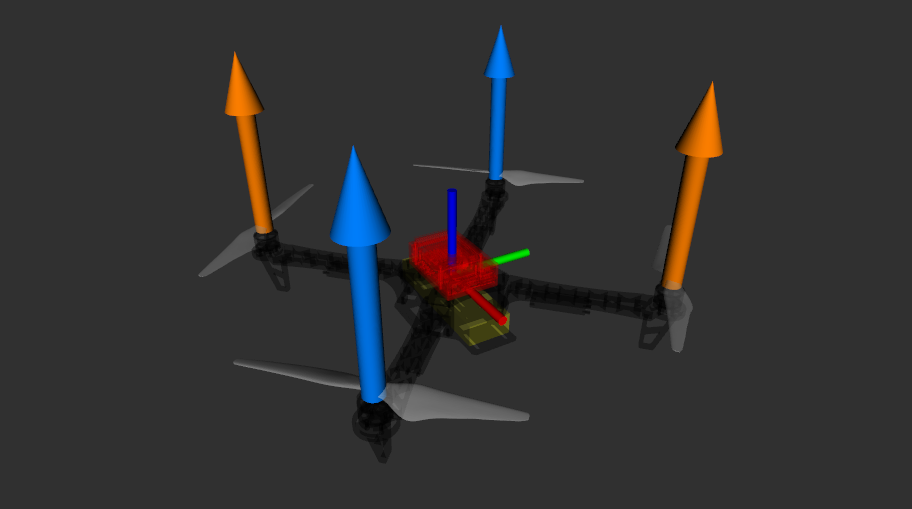
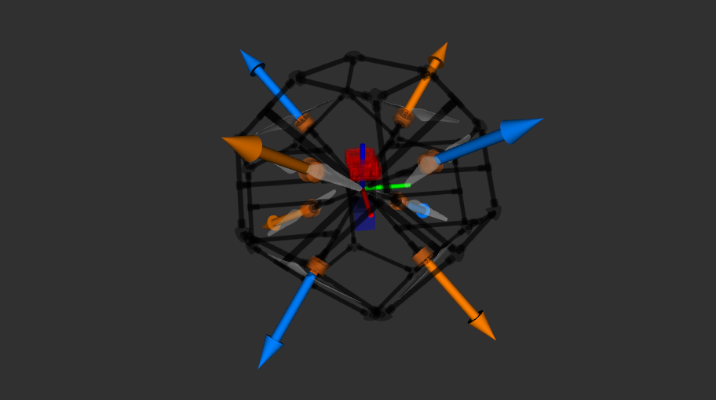
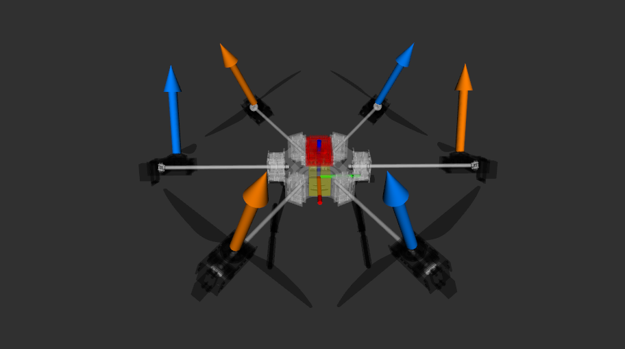
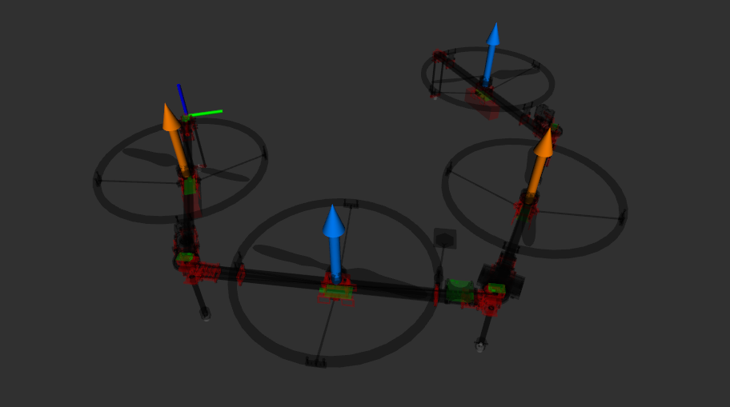

# What is UADF

Tobas が定義している Universal Aircraft Description Format (UADF) とは，
ロボットを表現する一般的なフォーマットである Universal Robot Description Format (URDF) に，
飛翔体特有の要素を追加したフォーマットです．

## URDF とは

---

剛体リンク系で表現されるあらゆるロボットを記述するためのフォーマットです．
ロボットに含まれる各リンクの質量情報，接触情報，視覚情報に加え，それらをつなぐジョイントが定義されます．
詳しくは<a href=https://wiki.ros.org/urdf target="_blank">urdf | ROS.org</a>をご参照ください．

## UADF と URDF の違い

---

UADF では，URDF のジョイント型に加えて，飛翔体特有の以下のジョイント型が追加されています．

### thrust

モータ，プロペラを合わせた推進ユニットを表すジョイントです．
URDF の`continuous`がベースですが，以下の点が異なります．

- `axis`: 回転軸．軸方向に推力が出る想定．
- `direction`: 回転方向．`value`に`cw`または`ccw`を指定する．

<!-- prettier-ignore-start -->
!!! note
    `thrust`ジョイントはエンドジョイントでなければなりません．
<!-- prettier-ignore-end -->

### cs

固定翼機の操舵面 (Control Surface) を表すジョイントです．
URDF の`revolute`がベースになっています．

<!-- prettier-ignore-start -->
!!! note
    `cs`ジョイントはエンドジョイントでなければなりません．
<!-- prettier-ignore-end -->

### tilt

アクティブチルトロータのチルトジョイントを表します．
URDF の`revolute`がベースになっています．

<!-- prettier-ignore-start -->
!!! note
    `tilt`ジョイントの先には 1 つの`thrust`ジョイントが接続していなければなりません．
<!-- prettier-ignore-end -->

## UADF の作成方法

---

ここでは，チュートリアルで用いた典型的なクアッドコプターである DJI F450 の UADF を作成します．



URDF には視覚化のためにメッシュファイルやテクスチャファイルを取り込む機能があり，
URDF そのものに加えてそれらのファイルも一緒に配布されることが多いため，
ロボットごとに専用の ROS パッケージを作ると便利です．
今回は `~/colcon_ws/src/` 直下に` tobas_f450_description` というパッケージを作成し，その中に必要な全てのファイルを含めることにします．
<a href=https://github.com/TobasFlightControl/tobas_f450_description target="_blank">TobasFlightControl/tobas_f450_description</a>
に完成したパッケージを公開しています．

### ROS パッケージの構成と必須ファイル

`tobas_f450_description`は以下のような構成になっています．

```text
tobas_f450_description/
├── meshes
│   ├── frame.stl
│   ├── phantom3_0945_ccw.stl
│   ├── phantom3_0945_cw.stl
│   └── tobas_t100.stl
├── urdf
│   └── f450.uadf
├── CMakeLists.txt
└── package.xml
```

`package.xml`はパッケージの概要と依存関係を記述したファイルです．
各 ROS パッケージのルートに必ず 1 つ置く必要があります．
今回作るパッケージは外部のパッケージには依存していないため，パッケージ名やライセンスなど最小限の要素のみ記述しています．

```xml
<package format="3">
	<name>tobas_f450_description</name>
	<version>0.0.0</version>
	<description>A UADF example for the DJI F450.</description>
	<maintainer email="m.dohi@tobas.jp">Masayoshi Dohi</maintainer>
	<license>MIT</license>
	<buildtool_depend>ament_cmake</buildtool_depend>
	<export>
		<build_type>ament_cmake</build_type>
	</export>
</package>
```

`CMakeLists.txt`はパッケージのビルドやインストールの手順を記述したファイルです．
メッシュファイルを格納するディレクトリである`meshes`と，UADF を格納するディレクトリである`urdf`をインストールするようにします．

```cmake
cmake_minimum_required(VERSION 3.25)
project(tobas_f450_description)
find_package(ament_cmake REQUIRED)
install(DIRECTORY meshes urdf DESTINATION share/${PROJECT_NAME})
ament_package()
```

### UADF の書き方

今回作成する F450 の UADF は以下のような構成要素から成ります．

- 空のルートリンク (必須)
- モータを含むメインフレーム
- メインフレームに固定されたバッテリー
- メインフレームに固定された FMU
- 4 つのプロペラ

これらの要素はそれぞれ 1 つの剛体リンクとして記述され，
それらが適切なジョイントで接続されることで全体として 1 つのツリー構造を形成します．

今回はメインフレーム以下の全てのリンクをルートリンクにぶら下げる形をとることにします．
全体のツリー構造は以下のようになります．

```text
base_link
├──frame
├──battery
├──fmu
├──propeller_0
├──propeller_1
├──propeller_2
└──propeller_3
```

まず，URDF のルート要素を記述します．
URDF のルート要素は`robot`でなければならず，`name`属性を指定する必要があります．
以下の全ての要素はこのルート要素の中に記述します．

```xml
<robot name="f450">
</robot>
```

`robot`の中に空のルートリンクを記述します．
ルートリンクは大きさや質量を持たない概念上のリンクで，全ての UADF は必ず 1 つのルートリンクを持つ必要があります．

```xml
  <!-- Base Link (Empty) -->
  <link name="base_link"/>
```

メインフレームをルートリンクに固定します．
`visual`のメッシュファイルはパッケージからの相対パスで指定しています．
このように`package://<package name>`で ROS パッケージへの相対パスを記述できます．
`collision`の接触領域はメッシュファイルを使うとシミュレーションが重くなるため直方体で近似しています．
`inertial`の質量特性は 3D CAD から取得した値をそのまま転記しています．

```xml
  <!-- Main Frame -->
  <joint name="frame_joint" type="fixed">
    <origin xyz="0 0 0" rpy="0 0 0"/>
    <parent link="base_link"/>
    <child link="frame"/>
  </joint>
  <link name="frame">
    <inertial>
      <mass value="0.55346"/>
      <origin xyz="0 0 -0.004136" rpy="0 0 0"/>
      <inertia ixx="0.008128" ixy="0" ixz="0" iyy="0.008193" iyz="0" izz="0.01597"/>
    </inertial>
    <visual>
      <origin xyz="0 0 0" rpy="0 0 0"/>
      <geometry>
        <mesh filename="package://tobas_f450_description/meshes/frame.stl" scale="1 1 1"/>
      </geometry>
      <material name="black">
        <color rgba="0 0 0 1"/>
      </material>
    </visual>
    <collision>
      <origin xyz="0 0 -0.03" rpy="0 0 0"/>
      <geometry>
        <box size="0.35 0.35 0.06"/>
      </geometry>
    </collision>
  </link>
```

バッテリーと FMU をメインフレームと同じ要領で追加します．
それぞれの慣性モーメントは，質量が`collision`と同じ大きさの直方体に均一に分布している場合の値を計算して記入しています．
具体的な計算方法については[Inertia Moment](./inertia_moment.md)をご確認ください．

```xml
  <!-- Battery -->
  <joint name="battery_joint" type="fixed">
    <origin xyz="0 0 -0.025" rpy="0 0 0"/>
    <parent link="base_link"/>
    <child link="battery"/>
  </joint>
  <link name="battery">
    <inertial>
      <mass value="0.376"/>
      <origin xyz="0 0 0" rpy="0 0 0"/>
      <inertia ixx="9.024e-05" ixy="0" ixz="0" iyy="0.000770831" iyz="0" izz="0.000824975"/>
    </inertial>
    <visual>
      <origin xyz="0 0 0" rpy="0 0 0"/>
      <geometry>
        <box size="0.155 0.048 0.024"/>
      </geometry>
      <material name="yellow">
        <color rgba="1 1 0 1"/>
      </material>
    </visual>
    <collision>
      <origin xyz="0 0 0" rpy="0 0 0"/>
      <geometry>
        <box size="0.155 0.048 0.024"/>
      </geometry>
    </collision>
  </link>

  <!-- Flight Management Unit -->
  <joint name="fmu_joint" type="fixed">
    <origin xyz="0 0 0" rpy="0 0 0"/>
    <parent link="base_link"/>
    <child link="fmu"/>
  </joint>
  <link name="fmu">
    <inertial>
      <mass value="0.16"/>
      <origin xyz="0 0 0.014" rpy="0 0 0"/>
      <inertia ixx="6.17067e-05" ixy="0" ixz="0" iyy="0.000118453" iyz="0" izz="0.000159253"/>
    </inertial>
    <visual>
      <origin xyz="0 0 0" rpy="0 0 0"/>
      <geometry>
        <mesh filename="package://tobas_f450_description/meshes/tobas_t100.stl" scale="1 1 1"/>
      </geometry>
      <material name="red">
        <color rgba="1 0 0 1"/>
      </material>
    </visual>
    <collision>
      <origin xyz="0 0 0.014" rpy="0 0 0"/>
      <geometry>
        <box size="0.09 0.062 0.028"/>
      </geometry>
    </collision>
  </link>
```

プロペラを追加します．
ジョイントタイプに UADF 特有の`thrust`を指定し，`axis`を推力方向の+Z 軸方向 (`0 0 1`)，`direction`を反時計回り (`ccw`) とします．
`visual`のメッシュファイルはパッケージからの相対パスで指定しています．
`collision`の接触領域は円柱で近似しています．
`inertial`の慣性モーメントは，質量が`collision`と同じ大きさの円柱に均一に分布している場合の値を計算して記入しています．
具体的な計算方法については[Inertia Moment](./inertia_moment.md)をご確認ください．

```xml
  <!-- Propeller (0) -->
  <joint name="propeller_0_joint" type="thrust">
    <origin xyz="0.159099 -0.159099 0.0247" rpy="0 0 -0.785398"/>
    <axis xyz="0 0 1"/>
    <parent link="base_link"/>
    <child link="propeller_0"/>
    <direction value="ccw"/>
  </joint>
  <link name="propeller_0">
    <inertial>
      <mass value="0.011"/>
      <origin xyz="0 0 0.006" rpy="0 0 0"/>
      <inertia ixx="3.9732e-05" ixy="0" ixz="0" iyy="3.9732e-05" iyz="0" izz="7.92e-05"/>
    </inertial>
    <visual>
      <origin xyz="0 0 0" rpy="0 0 0"/>
      <geometry>
        <mesh filename="package://tobas_f450_description/meshes/phantom3_0945_ccw.stl" scale="1 1 1"/>
      </geometry>
      <material name="white">
        <color rgba="1 1 1 1"/>
      </material>
    </visual>
    <collision>
      <origin xyz="0 0 0.006" rpy="0 0 0"/>
      <geometry>
        <cylinder radius="0.12" length="0.012"/>
      </geometry>
    </collision>
  </link>
```

同様に他の 3 つのプロペラを追加します．
それぞれジョイント原点，回転方向，メッシュパスが異なることに注意してください．

最終的な UADF は以下のようになります．

```xml
<robot name="f450">

  <!-- Base Link (Empty) -->
  <link name="base_link"/>

  <!-- Main Frame -->
  <joint name="frame_joint" type="fixed">
    <origin xyz="0 0 0" rpy="0 0 0"/>
    <parent link="base_link"/>
    <child link="frame"/>
  </joint>
  <link name="frame">
    <inertial>
      <mass value="0.55346"/>
      <origin xyz="0 0 -0.004136" rpy="0 0 0"/>
      <inertia ixx="0.008128" ixy="0" ixz="0" iyy="0.008193" iyz="0" izz="0.01597"/>
    </inertial>
    <visual>
      <origin xyz="0 0 0" rpy="0 0 0"/>
      <geometry>
        <mesh filename="package://tobas_f450_description/meshes/frame.stl" scale="1 1 1"/>
      </geometry>
      <material name="black">
        <color rgba="0 0 0 1"/>
      </material>
    </visual>
    <collision>
      <origin xyz="0 0 -0.03" rpy="0 0 0"/>
      <geometry>
        <box size="0.35 0.35 0.06"/>
      </geometry>
    </collision>
  </link>

  <!-- Battery -->
  <joint name="battery_joint" type="fixed">
    <origin xyz="0 0 -0.025" rpy="0 0 0"/>
    <parent link="base_link"/>
    <child link="battery"/>
  </joint>
  <link name="battery">
    <inertial>
      <mass value="0.376"/>
      <origin xyz="0 0 0" rpy="0 0 0"/>
      <inertia ixx="9.024e-05" ixy="0" ixz="0" iyy="0.000770831" iyz="0" izz="0.000824975"/>
    </inertial>
    <visual>
      <origin xyz="0 0 0" rpy="0 0 0"/>
      <geometry>
        <box size="0.155 0.048 0.024"/>
      </geometry>
      <material name="yellow">
        <color rgba="1 1 0 1"/>
      </material>
    </visual>
    <collision>
      <origin xyz="0 0 0" rpy="0 0 0"/>
      <geometry>
        <box size="0.155 0.048 0.024"/>
      </geometry>
    </collision>
  </link>

  <!-- Flight Management Unit -->
  <joint name="fmu_joint" type="fixed">
    <origin xyz="0 0 0" rpy="0 0 0"/>
    <parent link="base_link"/>
    <child link="fmu"/>
  </joint>
  <link name="fmu">
    <inertial>
      <mass value="0.16"/>
      <origin xyz="0 0 0.014" rpy="0 0 0"/>
      <inertia ixx="6.17067e-05" ixy="0" ixz="0" iyy="0.000118453" iyz="0" izz="0.000159253"/>
    </inertial>
    <visual>
      <origin xyz="0 0 0" rpy="0 0 0"/>
      <geometry>
        <mesh filename="package://tobas_f450_description/meshes/tobas_t100.stl" scale="1 1 1"/>
      </geometry>
      <material name="red">
        <color rgba="1 0 0 1"/>
      </material>
    </visual>
    <collision>
      <origin xyz="0 0 0.014" rpy="0 0 0"/>
      <geometry>
        <box size="0.09 0.062 0.028"/>
      </geometry>
    </collision>
  </link>

  <!-- Propeller (0) -->
  <joint name="propeller_0_joint" type="thrust">
    <origin xyz="0.159099 -0.159099 0.0247" rpy="0 0 -0.785398"/>
    <axis xyz="0 0 1"/>
    <parent link="base_link"/>
    <child link="propeller_0"/>
    <direction value="ccw"/>
  </joint>
  <link name="propeller_0">
    <inertial>
      <mass value="0.011"/>
      <origin xyz="0 0 0.006" rpy="0 0 0"/>
      <inertia ixx="3.9732e-05" ixy="0" ixz="0" iyy="3.9732e-05" iyz="0" izz="7.92e-05"/>
    </inertial>
    <visual>
      <origin xyz="0 0 0" rpy="0 0 0"/>
      <geometry>
        <mesh filename="package://tobas_f450_description/meshes/phantom3_0945_ccw.stl" scale="1 1 1"/>
      </geometry>
      <material name="white">
        <color rgba="1 1 1 1"/>
      </material>
    </visual>
    <collision>
      <origin xyz="0 0 0.006" rpy="0 0 0"/>
      <geometry>
        <cylinder radius="0.12" length="0.012"/>
      </geometry>
    </collision>
  </link>

  <!-- Propeller (1) -->
  <joint name="propeller_1_joint" type="thrust">
    <origin xyz="-0.159099 0.159099 0.0247" rpy="0 0 2.35619"/>
    <axis xyz="0 0 1"/>
    <parent link="base_link"/>
    <child link="propeller_1"/>
    <direction value="ccw"/>
  </joint>
  <link name="propeller_1">
    <inertial>
      <mass value="0.011"/>
      <origin xyz="0 0 0.006" rpy="0 0 0"/>
      <inertia ixx="3.9732e-05" ixy="0" ixz="0" iyy="3.9732e-05" iyz="0" izz="7.92e-05"/>
    </inertial>
    <visual>
      <origin xyz="0 0 0" rpy="0 0 0"/>
      <geometry>
        <mesh filename="package://tobas_f450_description/meshes/phantom3_0945_ccw.stl" scale="1 1 1"/>
      </geometry>
      <material name="white">
        <color rgba="1 1 1 1"/>
      </material>
    </visual>
    <collision>
      <origin xyz="0 0 0.006" rpy="0 0 0"/>
      <geometry>
        <cylinder radius="0.12" length="0.012"/>
      </geometry>
    </collision>
  </link>

  <!-- Propeller (2) -->
  <joint name="propeller_2_joint" type="thrust">
    <origin xyz="0.159099 0.159099 0.0247" rpy="0 0 0.785398"/>
    <axis xyz="0 0 1"/>
    <parent link="base_link"/>
    <child link="propeller_2"/>
    <direction value="cw"/>
  </joint>
  <link name="propeller_2">
    <inertial>
      <mass value="0.011"/>
      <origin xyz="0 0 0.006" rpy="0 0 0"/>
      <inertia ixx="3.9732e-05" ixy="0" ixz="0" iyy="3.9732e-05" iyz="0" izz="7.92e-05"/>
    </inertial>
    <visual>
      <origin xyz="0 0 0" rpy="0 0 0"/>
      <geometry>
        <mesh filename="package://tobas_f450_description/meshes/phantom3_0945_cw.stl" scale="1 1 1"/>
      </geometry>
      <material name="white">
        <color rgba="1 1 1 1"/>
      </material>
    </visual>
    <collision>
      <origin xyz="0 0 0.006" rpy="0 0 0"/>
      <geometry>
        <cylinder radius="0.12" length="0.012"/>
      </geometry>
    </collision>
  </link>

  <!-- Propeller (3) -->
  <joint name="propeller_3_joint" type="thrust">
    <origin xyz="-0.159099 -0.159099 0.0247" rpy="0 0 -2.35619"/>
    <axis xyz="0 0 1"/>
    <parent link="base_link"/>
    <child link="propeller_3"/>
    <direction value="cw"/>
  </joint>
  <link name="propeller_3">
    <inertial>
      <mass value="0.011"/>
      <origin xyz="0 0 0.006" rpy="0 0 0"/>
      <inertia ixx="3.9732e-05" ixy="0" ixz="0" iyy="3.9732e-05" iyz="0" izz="7.92e-05"/>
    </inertial>
    <visual>
      <origin xyz="0 0 0" rpy="0 0 0"/>
      <geometry>
        <mesh filename="package://tobas_f450_description/meshes/phantom3_0945_cw.stl" scale="1 1 1"/>
      </geometry>
      <material name="white">
        <color rgba="1 1 1 1"/>
      </material>
    </visual>
    <collision>
      <origin xyz="0 0 0.006" rpy="0 0 0"/>
      <geometry>
        <cylinder radius="0.12" length="0.012"/>
      </geometry>
    </collision>
  </link>

</robot>
```

## UADF の作成例

---

上では単純なクアッドコプターの UADF を作成しましたが，UADF では他にも様々な機体を表現することができます．
ここでは他の UADF の作成例をいくつか紹介します．

先ほどと異なり XACRO と呼ばれる XML のマクロを用いており，内部で以下のようなプログラミング的な処理を行っています：

- 他のファイルをインクルード
- 定数を定義
- 簡単な数値計算
- 繰り返し処理を関数化

XACRO を用いることで XML をより短く，わかりやすく書くことができます．

### Non-Planar Octacopter (TOC8)

8 つの`thrust`ジョイントをもつオクタコプターです．
ただし，それぞれのプロペラは立方体の頂点から外側を向くように配置されています．



<details><summary>XACRO 展開前</summary>

```xml
<robot xmlns:xacro="http://ros.org/wiki/xacro" name="toc8_pt001">

  <!-- Included URDF Files -->
  <xacro:include filename="$(find tobas_description)/urdf/components/common.xacro"/>
  <xacro:include filename="$(find tobas_description)/urdf/components/fmu/tobas_t1.xacro"/>
  <xacro:include filename="$(find tobas_description)/urdf/components/battery/sigp_6s_1100mah_120c.xacro"/>
  <xacro:include filename="$(find tobas_description)/urdf/components/combo/mt3508_0945.uadf"/>

  <!-- Properties -->
  <xacro:property name="frame_width" value="0.5"/>
  <xacro:property name="motor_offset" value="0.1705"/>
  <xacro:property name="x" value="${motor_offset/sqrt3}"/>
  <xacro:property name="prop_pitch" value="0.95"/>

  <!-- Base Link -->
  <link name="base_link"/>

  <!-- Frame -->
  <joint name="frame_joint" type="fixed">
    <origin xyz="0 0 0" rpy="0 0 0"/>
    <parent link="base_link"/>
    <child link="frame"/>
  </joint>
  <link name="frame">
    <visual>
      <origin xyz="0 0 0" rpy="0 0 0"/>
      <geometry>
        <mesh filename="package://toc8_pt001_description/meshes/frame.stl" scale="1 1 1"/>
      </geometry>
      <xacro:insert_block name="black"/>
    </visual>
    <inertial>
      <mass value="0.875668"/>
      <origin xyz="0 0 0" rpy="0 0 0"/>
      <inertia ixx="2.731e-2" ixy="-1.176e-5" ixz="2.301e-5" iyy="2.415e-2" iyz="-3.35e-7" izz="2.615e-2"/>
    </inertial>
    <collision>
      <origin xyz="0 0 0" rpy="0 0 0"/>
      <geometry>
        <box size="${frame_width} ${frame_width} ${frame_width}"/>
      </geometry>
    </collision>
  </link>

  <!-- Flight Controller -->
  <xacro:tobas_t1 parent="base_link">
    <origin xyz="0 0 0.0425" rpy="0 0 0"/>
  </xacro:tobas_t1>

  <!-- Battery -->
  <xacro:sigp_6s_1100mah_120c link_name="battery" parent="base_link">
    <origin xyz="0 0 -0.060" rpy="${pi/2} 0 0"/>
  </xacro:sigp_6s_1100mah_120c>

  <!-- Propulsion System -->
  <xacro:mt3508_0945 parent="base_link" index="0" direction="ccw">
    <origin xyz="${x} ${x} ${x}" rpy="0 ${prop_pitch} ${pi/4*1}"/>
  </xacro:mt3508_0945>
  <xacro:mt3508_0945 parent="base_link" index="1" direction="cw">
    <origin xyz="${-x} ${x} ${x}" rpy="0 ${prop_pitch} ${pi/4*3}"/>
  </xacro:mt3508_0945>
  <xacro:mt3508_0945 parent="base_link" index="2" direction="ccw">
    <origin xyz="${-x} ${-x} ${x}" rpy="0 ${prop_pitch} ${pi/4*5}"/>
  </xacro:mt3508_0945>
  <xacro:mt3508_0945 parent="base_link" index="3" direction="cw">
    <origin xyz="${x} ${-x} ${x}" rpy="0 ${prop_pitch} ${pi/4*7}"/>
  </xacro:mt3508_0945>
  <xacro:mt3508_0945 parent="base_link" index="4" direction="cw">
    <origin xyz="${x} ${x} ${-x}" rpy="0 ${pi-prop_pitch} ${pi/4*1}"/>
  </xacro:mt3508_0945>
  <xacro:mt3508_0945 parent="base_link" index="5" direction="ccw">
    <origin xyz="${-x} ${x} ${-x}" rpy="0 ${pi-prop_pitch} ${pi/4*3}"/>
  </xacro:mt3508_0945>
  <xacro:mt3508_0945 parent="base_link" index="6" direction="cw">
    <origin xyz="${-x} ${-x} ${-x}" rpy="0 ${pi-prop_pitch} ${pi/4*5}"/>
  </xacro:mt3508_0945>
  <xacro:mt3508_0945 parent="base_link" index="7" direction="ccw">
    <origin xyz="${x} ${-x} ${-x}" rpy="0 ${pi-prop_pitch} ${pi/4*7}"/>
  </xacro:mt3508_0945>

</robot>
```

</details>

<details><summary>XACRO 展開後</summary>

```xml
<robot name="toc8_pt001">
  <material name="black">
    <texture/>
    <color rgba="0 0 0 1"/>
  </material>
  <material name="blue">
    <texture/>
    <color rgba="0 0 1 1"/>
  </material>
  <material name="orange">
    <texture/>
    <color rgba="1 0.423529 0.0392157 1"/>
  </material>
  <material name="red">
    <texture/>
    <color rgba="1 0 0 1"/>
  </material>
  <material name="white">
    <texture/>
    <color rgba="1 1 1 1"/>
  </material>
  <link name="base_link"/>
  <link name="battery">
    <inertial>
      <mass value="0.205"/>
      <origin xyz="0 0 0" rpy="0 -0 0"/>
      <inertia ixx="5.10621e-05" ixy="0" ixz="0" iyy="0.000131422" iyz="0" izz="0.000122214"/>
    </inertial>
    <visual>
      <origin xyz="0 0 0" rpy="0 -0 0"/>
      <geometry>
        <box size="0.077 0.035 0.042"/>
      </geometry>
      <material name="blue">
        <texture/>
        <color rgba="0 0 1 1"/>
      </material>
    </visual>
    <collision>
      <origin xyz="0 0 0" rpy="0 -0 0"/>
      <geometry>
        <box size="0.077 0.035 0.042"/>
      </geometry>
    </collision>
  </link>
  <link name="fmu">
    <inertial>
      <mass value="0.2"/>
      <origin xyz="0 0 0.014" rpy="0 -0 0"/>
      <inertia ixx="7.71333e-05" ixy="0" ixz="0" iyy="0.000148067" iyz="0" izz="0.000199067"/>
    </inertial>
    <visual>
      <origin xyz="0 0 0" rpy="0 -0 0"/>
      <geometry>
        <mesh filename="package://tobas_toc8_pt001_config/meshes/tobas_t1.stl" scale="1 1 1"/>
      </geometry>
      <material name="red">
        <texture/>
        <color rgba="1 0 0 1"/>
      </material>
    </visual>
    <collision>
      <origin xyz="0 0 0.014" rpy="0 -0 0"/>
      <geometry>
        <box size="0.09 0.062 0.028"/>
      </geometry>
    </collision>
  </link>
  <link name="frame">
    <inertial>
      <mass value="0.875668"/>
      <origin xyz="0 0 0" rpy="0 -0 0"/>
      <inertia ixx="0.02731" ixy="-1.176e-05" ixz="2.301e-05" iyy="0.02415" iyz="-3.35e-07" izz="0.02615"/>
    </inertial>
    <visual>
      <origin xyz="0 0 0" rpy="0 -0 0"/>
      <geometry>
        <mesh filename="package://tobas_toc8_pt001_config/meshes/frame.stl" scale="1 1 1"/>
      </geometry>
      <material name="black">
        <texture/>
        <color rgba="0 0 0 1"/>
      </material>
    </visual>
    <collision>
      <origin xyz="0 0 0" rpy="0 -0 0"/>
      <geometry>
        <box size="0.5 0.5 0.5"/>
      </geometry>
    </collision>
  </link>
  <link name="motor_0">
    <inertial>
      <mass value="0.086"/>
      <origin xyz="0 0 0.012" rpy="0 -0 0"/>
      <inertia ixx="1.36095e-05" ixy="0" ixz="0" iyy="1.36095e-05" iyz="0" izz="1.8963e-05"/>
    </inertial>
    <visual>
      <origin xyz="0 0 0" rpy="0 -0 0"/>
      <geometry>
        <mesh filename="package://tobas_toc8_pt001_config/meshes/mt3508_580kv.stl" scale="1 1 1"/>
      </geometry>
      <material name="orange">
        <texture/>
        <color rgba="1 0.423529 0.0392157 1"/>
      </material>
    </visual>
    <collision>
      <origin xyz="0 0 0.012" rpy="0 -0 0"/>
      <geometry>
        <cylinder radius="0.021" length="0.024"/>
      </geometry>
    </collision>
  </link>
  <link name="motor_1">
    <inertial>
      <mass value="0.086"/>
      <origin xyz="0 0 0.012" rpy="0 -0 0"/>
      <inertia ixx="1.36095e-05" ixy="0" ixz="0" iyy="1.36095e-05" iyz="0" izz="1.8963e-05"/>
    </inertial>
    <visual>
      <origin xyz="0 0 0" rpy="0 -0 0"/>
      <geometry>
        <mesh filename="package://tobas_toc8_pt001_config/meshes/mt3508_580kv.stl" scale="1 1 1"/>
      </geometry>
      <material name="orange">
        <texture/>
        <color rgba="1 0.423529 0.0392157 1"/>
      </material>
    </visual>
    <collision>
      <origin xyz="0 0 0.012" rpy="0 -0 0"/>
      <geometry>
        <cylinder radius="0.021" length="0.024"/>
      </geometry>
    </collision>
  </link>
  <link name="motor_2">
    <inertial>
      <mass value="0.086"/>
      <origin xyz="0 0 0.012" rpy="0 -0 0"/>
      <inertia ixx="1.36095e-05" ixy="0" ixz="0" iyy="1.36095e-05" iyz="0" izz="1.8963e-05"/>
    </inertial>
    <visual>
      <origin xyz="0 0 0" rpy="0 -0 0"/>
      <geometry>
        <mesh filename="package://tobas_toc8_pt001_config/meshes/mt3508_580kv.stl" scale="1 1 1"/>
      </geometry>
      <material name="orange">
        <texture/>
        <color rgba="1 0.423529 0.0392157 1"/>
      </material>
    </visual>
    <collision>
      <origin xyz="0 0 0.012" rpy="0 -0 0"/>
      <geometry>
        <cylinder radius="0.021" length="0.024"/>
      </geometry>
    </collision>
  </link>
  <link name="motor_3">
    <inertial>
      <mass value="0.086"/>
      <origin xyz="0 0 0.012" rpy="0 -0 0"/>
      <inertia ixx="1.36095e-05" ixy="0" ixz="0" iyy="1.36095e-05" iyz="0" izz="1.8963e-05"/>
    </inertial>
    <visual>
      <origin xyz="0 0 0" rpy="0 -0 0"/>
      <geometry>
        <mesh filename="package://tobas_toc8_pt001_config/meshes/mt3508_580kv.stl" scale="1 1 1"/>
      </geometry>
      <material name="orange">
        <texture/>
        <color rgba="1 0.423529 0.0392157 1"/>
      </material>
    </visual>
    <collision>
      <origin xyz="0 0 0.012" rpy="0 -0 0"/>
      <geometry>
        <cylinder radius="0.021" length="0.024"/>
      </geometry>
    </collision>
  </link>
  <link name="motor_4">
    <inertial>
      <mass value="0.086"/>
      <origin xyz="0 0 0.012" rpy="0 -0 0"/>
      <inertia ixx="1.36095e-05" ixy="0" ixz="0" iyy="1.36095e-05" iyz="0" izz="1.8963e-05"/>
    </inertial>
    <visual>
      <origin xyz="0 0 0" rpy="0 -0 0"/>
      <geometry>
        <mesh filename="package://tobas_toc8_pt001_config/meshes/mt3508_580kv.stl" scale="1 1 1"/>
      </geometry>
      <material name="orange">
        <texture/>
        <color rgba="1 0.423529 0.0392157 1"/>
      </material>
    </visual>
    <collision>
      <origin xyz="0 0 0.012" rpy="0 -0 0"/>
      <geometry>
        <cylinder radius="0.021" length="0.024"/>
      </geometry>
    </collision>
  </link>
  <link name="motor_5">
    <inertial>
      <mass value="0.086"/>
      <origin xyz="0 0 0.012" rpy="0 -0 0"/>
      <inertia ixx="1.36095e-05" ixy="0" ixz="0" iyy="1.36095e-05" iyz="0" izz="1.8963e-05"/>
    </inertial>
    <visual>
      <origin xyz="0 0 0" rpy="0 -0 0"/>
      <geometry>
        <mesh filename="package://tobas_toc8_pt001_config/meshes/mt3508_580kv.stl" scale="1 1 1"/>
      </geometry>
      <material name="orange">
        <texture/>
        <color rgba="1 0.423529 0.0392157 1"/>
      </material>
    </visual>
    <collision>
      <origin xyz="0 0 0.012" rpy="0 -0 0"/>
      <geometry>
        <cylinder radius="0.021" length="0.024"/>
      </geometry>
    </collision>
  </link>
  <link name="motor_6">
    <inertial>
      <mass value="0.086"/>
      <origin xyz="0 0 0.012" rpy="0 -0 0"/>
      <inertia ixx="1.36095e-05" ixy="0" ixz="0" iyy="1.36095e-05" iyz="0" izz="1.8963e-05"/>
    </inertial>
    <visual>
      <origin xyz="0 0 0" rpy="0 -0 0"/>
      <geometry>
        <mesh filename="package://tobas_toc8_pt001_config/meshes/mt3508_580kv.stl" scale="1 1 1"/>
      </geometry>
      <material name="orange">
        <texture/>
        <color rgba="1 0.423529 0.0392157 1"/>
      </material>
    </visual>
    <collision>
      <origin xyz="0 0 0.012" rpy="0 -0 0"/>
      <geometry>
        <cylinder radius="0.021" length="0.024"/>
      </geometry>
    </collision>
  </link>
  <link name="motor_7">
    <inertial>
      <mass value="0.086"/>
      <origin xyz="0 0 0.012" rpy="0 -0 0"/>
      <inertia ixx="1.36095e-05" ixy="0" ixz="0" iyy="1.36095e-05" iyz="0" izz="1.8963e-05"/>
    </inertial>
    <visual>
      <origin xyz="0 0 0" rpy="0 -0 0"/>
      <geometry>
        <mesh filename="package://tobas_toc8_pt001_config/meshes/mt3508_580kv.stl" scale="1 1 1"/>
      </geometry>
      <material name="orange">
        <texture/>
        <color rgba="1 0.423529 0.0392157 1"/>
      </material>
    </visual>
    <collision>
      <origin xyz="0 0 0.012" rpy="0 -0 0"/>
      <geometry>
        <cylinder radius="0.021" length="0.024"/>
      </geometry>
    </collision>
  </link>
  <link name="propeller_0">
    <inertial>
      <mass value="0.011"/>
      <origin xyz="0 0 0.006" rpy="0 -0 0"/>
      <inertia ixx="3.9732e-05" ixy="0" ixz="0" iyy="3.9732e-05" iyz="0" izz="7.92e-05"/>
    </inertial>
    <visual>
      <origin xyz="0 0 0" rpy="0 -0 0"/>
      <geometry>
        <mesh filename="package://tobas_toc8_pt001_config/meshes/phantom3_0945_ccw.stl" scale="1 1 1"/>
      </geometry>
      <material name="white">
        <texture/>
        <color rgba="1 1 1 1"/>
      </material>
    </visual>
    <collision>
      <origin xyz="0 0 0.006" rpy="0 -0 0"/>
      <geometry>
        <cylinder radius="0.12" length="0.012"/>
      </geometry>
    </collision>
  </link>
  <link name="propeller_1">
    <inertial>
      <mass value="0.011"/>
      <origin xyz="0 0 0.006" rpy="0 -0 0"/>
      <inertia ixx="3.9732e-05" ixy="0" ixz="0" iyy="3.9732e-05" iyz="0" izz="7.92e-05"/>
    </inertial>
    <visual>
      <origin xyz="0 0 0" rpy="0 -0 0"/>
      <geometry>
        <mesh filename="package://tobas_toc8_pt001_config/meshes/phantom3_0945_cw.stl" scale="1 1 1"/>
      </geometry>
      <material name="white">
        <texture/>
        <color rgba="1 1 1 1"/>
      </material>
    </visual>
    <collision>
      <origin xyz="0 0 0.006" rpy="0 -0 0"/>
      <geometry>
        <cylinder radius="0.12" length="0.012"/>
      </geometry>
    </collision>
  </link>
  <link name="propeller_2">
    <inertial>
      <mass value="0.011"/>
      <origin xyz="0 0 0.006" rpy="0 -0 0"/>
      <inertia ixx="3.9732e-05" ixy="0" ixz="0" iyy="3.9732e-05" iyz="0" izz="7.92e-05"/>
    </inertial>
    <visual>
      <origin xyz="0 0 0" rpy="0 -0 0"/>
      <geometry>
        <mesh filename="package://tobas_toc8_pt001_config/meshes/phantom3_0945_ccw.stl" scale="1 1 1"/>
      </geometry>
      <material name="white">
        <texture/>
        <color rgba="1 1 1 1"/>
      </material>
    </visual>
    <collision>
      <origin xyz="0 0 0.006" rpy="0 -0 0"/>
      <geometry>
        <cylinder radius="0.12" length="0.012"/>
      </geometry>
    </collision>
  </link>
  <link name="propeller_3">
    <inertial>
      <mass value="0.011"/>
      <origin xyz="0 0 0.006" rpy="0 -0 0"/>
      <inertia ixx="3.9732e-05" ixy="0" ixz="0" iyy="3.9732e-05" iyz="0" izz="7.92e-05"/>
    </inertial>
    <visual>
      <origin xyz="0 0 0" rpy="0 -0 0"/>
      <geometry>
        <mesh filename="package://tobas_toc8_pt001_config/meshes/phantom3_0945_cw.stl" scale="1 1 1"/>
      </geometry>
      <material name="white">
        <texture/>
        <color rgba="1 1 1 1"/>
      </material>
    </visual>
    <collision>
      <origin xyz="0 0 0.006" rpy="0 -0 0"/>
      <geometry>
        <cylinder radius="0.12" length="0.012"/>
      </geometry>
    </collision>
  </link>
  <link name="propeller_4">
    <inertial>
      <mass value="0.011"/>
      <origin xyz="0 0 0.006" rpy="0 -0 0"/>
      <inertia ixx="3.9732e-05" ixy="0" ixz="0" iyy="3.9732e-05" iyz="0" izz="7.92e-05"/>
    </inertial>
    <visual>
      <origin xyz="0 0 0" rpy="0 -0 0"/>
      <geometry>
        <mesh filename="package://tobas_toc8_pt001_config/meshes/phantom3_0945_cw.stl" scale="1 1 1"/>
      </geometry>
      <material name="white">
        <texture/>
        <color rgba="1 1 1 1"/>
      </material>
    </visual>
    <collision>
      <origin xyz="0 0 0.006" rpy="0 -0 0"/>
      <geometry>
        <cylinder radius="0.12" length="0.012"/>
      </geometry>
    </collision>
  </link>
  <link name="propeller_5">
    <inertial>
      <mass value="0.011"/>
      <origin xyz="0 0 0.006" rpy="0 -0 0"/>
      <inertia ixx="3.9732e-05" ixy="0" ixz="0" iyy="3.9732e-05" iyz="0" izz="7.92e-05"/>
    </inertial>
    <visual>
      <origin xyz="0 0 0" rpy="0 -0 0"/>
      <geometry>
        <mesh filename="package://tobas_toc8_pt001_config/meshes/phantom3_0945_ccw.stl" scale="1 1 1"/>
      </geometry>
      <material name="white">
        <texture/>
        <color rgba="1 1 1 1"/>
      </material>
    </visual>
    <collision>
      <origin xyz="0 0 0.006" rpy="0 -0 0"/>
      <geometry>
        <cylinder radius="0.12" length="0.012"/>
      </geometry>
    </collision>
  </link>
  <link name="propeller_6">
    <inertial>
      <mass value="0.011"/>
      <origin xyz="0 0 0.006" rpy="0 -0 0"/>
      <inertia ixx="3.9732e-05" ixy="0" ixz="0" iyy="3.9732e-05" iyz="0" izz="7.92e-05"/>
    </inertial>
    <visual>
      <origin xyz="0 0 0" rpy="0 -0 0"/>
      <geometry>
        <mesh filename="package://tobas_toc8_pt001_config/meshes/phantom3_0945_cw.stl" scale="1 1 1"/>
      </geometry>
      <material name="white">
        <texture/>
        <color rgba="1 1 1 1"/>
      </material>
    </visual>
    <collision>
      <origin xyz="0 0 0.006" rpy="0 -0 0"/>
      <geometry>
        <cylinder radius="0.12" length="0.012"/>
      </geometry>
    </collision>
  </link>
  <link name="propeller_7">
    <inertial>
      <mass value="0.011"/>
      <origin xyz="0 0 0.006" rpy="0 -0 0"/>
      <inertia ixx="3.9732e-05" ixy="0" ixz="0" iyy="3.9732e-05" iyz="0" izz="7.92e-05"/>
    </inertial>
    <visual>
      <origin xyz="0 0 0" rpy="0 -0 0"/>
      <geometry>
        <mesh filename="package://tobas_toc8_pt001_config/meshes/phantom3_0945_ccw.stl" scale="1 1 1"/>
      </geometry>
      <material name="white">
        <texture/>
        <color rgba="1 1 1 1"/>
      </material>
    </visual>
    <collision>
      <origin xyz="0 0 0.006" rpy="0 -0 0"/>
      <geometry>
        <cylinder radius="0.12" length="0.012"/>
      </geometry>
    </collision>
  </link>
  <joint name="battery_joint" type="fixed">
    <origin xyz="0 0 -0.06" rpy="1.5708 -0 0"/>
    <axis xyz="0 0 0"/>
    <parent link="base_link"/>
    <child link="battery"/>
  </joint>
  <joint name="fmu_joint" type="fixed">
    <origin xyz="0 0 0.0425" rpy="0 -0 0"/>
    <axis xyz="0 0 0"/>
    <parent link="base_link"/>
    <child link="fmu"/>
  </joint>
  <joint name="frame_joint" type="fixed">
    <origin xyz="0 0 0" rpy="0 -0 0"/>
    <axis xyz="0 0 0"/>
    <parent link="base_link"/>
    <child link="frame"/>
  </joint>
  <joint name="motor_0_joint" type="fixed">
    <origin xyz="0.0984382 0.0984382 0.0984382" rpy="9.54319e-17 0.95 0.785398"/>
    <axis xyz="0 0 0"/>
    <parent link="base_link"/>
    <child link="motor_0"/>
  </joint>
  <joint name="motor_1_joint" type="fixed">
    <origin xyz="-0.0984382 0.0984382 0.0984382" rpy="0 0.95 2.35619"/>
    <axis xyz="0 0 0"/>
    <parent link="base_link"/>
    <child link="motor_1"/>
  </joint>
  <joint name="motor_2_joint" type="fixed">
    <origin xyz="-0.0984382 -0.0984382 0.0984382" rpy="9.54319e-17 0.95 -2.35619"/>
    <axis xyz="0 0 0"/>
    <parent link="base_link"/>
    <child link="motor_2"/>
  </joint>
  <joint name="motor_3_joint" type="fixed">
    <origin xyz="0.0984382 -0.0984382 0.0984382" rpy="9.54319e-17 0.95 -0.785398"/>
    <axis xyz="0 0 0"/>
    <parent link="base_link"/>
    <child link="motor_3"/>
  </joint>
  <joint name="motor_4_joint" type="fixed">
    <origin xyz="0.0984382 0.0984382 -0.0984382" rpy="3.14159 0.95 -2.35619"/>
    <axis xyz="0 0 0"/>
    <parent link="base_link"/>
    <child link="motor_4"/>
  </joint>
  <joint name="motor_5_joint" type="fixed">
    <origin xyz="-0.0984382 0.0984382 -0.0984382" rpy="3.14159 0.95 -0.785398"/>
    <axis xyz="0 0 0"/>
    <parent link="base_link"/>
    <child link="motor_5"/>
  </joint>
  <joint name="motor_6_joint" type="fixed">
    <origin xyz="-0.0984382 -0.0984382 -0.0984382" rpy="3.14159 0.95 0.785398"/>
    <axis xyz="0 0 0"/>
    <parent link="base_link"/>
    <child link="motor_6"/>
  </joint>
  <joint name="motor_7_joint" type="fixed">
    <origin xyz="0.0984382 -0.0984382 -0.0984382" rpy="3.14159 0.95 2.35619"/>
    <axis xyz="0 0 0"/>
    <parent link="base_link"/>
    <child link="motor_7"/>
  </joint>
  <joint name="propeller_0_joint" type="thrust">
    <origin xyz="0 0 0.029" rpy="0 -0 0"/>
    <axis xyz="0 0 1"/>
    <parent link="motor_0"/>
    <child link="propeller_0"/>
    <direction value="ccw"/>
  </joint>
  <joint name="propeller_1_joint" type="thrust">
    <origin xyz="0 0 0.029" rpy="0 -0 0"/>
    <axis xyz="0 0 1"/>
    <parent link="motor_1"/>
    <child link="propeller_1"/>
    <direction value="cw"/>
  </joint>
  <joint name="propeller_2_joint" type="thrust">
    <origin xyz="0 0 0.029" rpy="0 -0 0"/>
    <axis xyz="0 0 1"/>
    <parent link="motor_2"/>
    <child link="propeller_2"/>
    <direction value="ccw"/>
  </joint>
  <joint name="propeller_3_joint" type="thrust">
    <origin xyz="0 0 0.029" rpy="0 -0 0"/>
    <axis xyz="0 0 1"/>
    <parent link="motor_3"/>
    <child link="propeller_3"/>
    <direction value="cw"/>
  </joint>
  <joint name="propeller_4_joint" type="thrust">
    <origin xyz="0 0 0.029" rpy="0 -0 0"/>
    <axis xyz="0 0 1"/>
    <parent link="motor_4"/>
    <child link="propeller_4"/>
    <direction value="cw"/>
  </joint>
  <joint name="propeller_5_joint" type="thrust">
    <origin xyz="0 0 0.029" rpy="0 -0 0"/>
    <axis xyz="0 0 1"/>
    <parent link="motor_5"/>
    <child link="propeller_5"/>
    <direction value="ccw"/>
  </joint>
  <joint name="propeller_6_joint" type="thrust">
    <origin xyz="0 0 0.029" rpy="0 -0 0"/>
    <axis xyz="0 0 1"/>
    <parent link="motor_6"/>
    <child link="propeller_6"/>
    <direction value="cw"/>
  </joint>
  <joint name="propeller_7_joint" type="thrust">
    <origin xyz="0 0 0.029" rpy="0 -0 0"/>
    <axis xyz="0 0 1"/>
    <parent link="motor_7"/>
    <child link="propeller_7"/>
    <direction value="ccw"/>
  </joint>
</robot>
```

</details>
<br>

### Active Tilt Hexacopter (Voliro Like)

`thrust`ジョイントと`tilt`ジョイントのペアを 6 つもつヘキサコプターです．



<details><summary>XACRO 展開前</summary>

```xml
<robot xmlns:xacro="http://ros.org/wiki/xacro" name="voliro_like_pt003">

  <!-- Included URDF Files -->
  <xacro:include filename="$(find tobas_description)/urdf/components/common.xacro"/>
  <xacro:include filename="$(find tobas_description)/urdf/components/fmu/tobas_t1.xacro"/>
  <xacro:include filename="$(find tobas_description)/urdf/components/battery/hrb_6s_5000mah_50c.xacro"/>
  <xacro:include filename="$(find tobas_description)/urdf/components/landing_gear/zhizicathy_electric_150.xacro"/>
  <xacro:include filename="$(find voliro_like_pt003_description)/urdf/tmotor_1344.uadf"/>

  <!-- Properties -->
  <xacro:property name="arm_offset" value="0.330"/>

  <!-- Base Link -->
  <link name="base_link"/>

  <!-- Body -->
  <joint name="frame_joint" type="fixed">
    <origin xyz="0 0 0" rpy="0 0 0"/>
    <parent link="base_link"/>
    <child link="body"/>
  </joint>
  <link name="body">
    <visual>
      <origin xyz="0 0 0" rpy="0 0 0"/>
      <geometry>
        <mesh filename="package://voliro_like_pt003_description/meshes/body.stl" scale="1 1 1"/>
      </geometry>
      <xacro:insert_block name="white"/>
    </visual>
    <collision>
      <origin xyz="0 0 0" rpy="0 0 0"/>
      <geometry>
        <mesh filename="package://voliro_like_pt003_description/meshes/body.stl" scale="1 1 1"/>
      </geometry>
    </collision>
    <inertial>
      <mass value="0.575"/>
      <origin xyz="-0.011 0 0.021" rpy="0 0 0"/>
      <inertia ixx="6.800e-3" ixy="-1.818e-5" ixz="-1.767e-4" iyy="7.155e-3" iyz="-9.915e-7" izz="1.333e-2"/>
    </inertial>
  </link>

  <!-- Flight Controller -->
  <xacro:tobas_t1 parent="base_link">
    <origin xyz="0 0 0.058" rpy="0 0 0"/>
  </xacro:tobas_t1>

  <!-- Battery -->
  <xacro:hrb_6s_5000mah_50c link_name="battery" parent="base_link">
    <origin xyz="0 0 0.026" rpy="${pi/2} 0 0"/>
  </xacro:hrb_6s_5000mah_50c>

  <!-- Tilt Rotor -->
  <xacro:macro name="tilt_rotor" params="index direction yaw_deg">
    <joint name="arm_${index}_joint" type="tilt">
      <origin xyz="${arm_offset*cos(yaw_deg*deg2rad)} ${arm_offset*sin(yaw_deg*deg2rad)} 0.029" rpy="0 0 ${yaw_deg*deg2rad}"/>
      <axis xyz="1 0 0"/>
      <parent link="base_link"/>
      <child link="arm_${index}"/>

      <!-- 9imod BLS-HV25MG-270 @8.4V: https://ja.aliexpress.com/item/1005007702114246.html -->
      <limit lower="${-135*deg2rad}" upper="${135*deg2rad}" velocity="${60*deg2rad/0.04}" effort="${25*gravity/100}"/>
    </joint>

    <link name="arm_${index}">
      <visual>
        <origin xyz="0 0 0" rpy="0 0 ${pi}"/>
        <geometry>
          <mesh filename="package://voliro_like_pt003_description/meshes/arm.stl" scale="1 1 1"/>
        </geometry>
        <xacro:insert_block name="black"/>
      </visual>
      <collision>
        <origin xyz="0 0 0" rpy="0 0 ${pi}"/>
        <geometry>
          <mesh filename="package://voliro_like_pt003_description/meshes/arm.stl" scale="1 1 1"/>
        </geometry>
      </collision>
      <inertial>
        <mass value="0.224"/>
        <origin xyz="0.025 0 5.736e-3" rpy="0 0 ${pi}"/>
        <inertia ixx="8.806e-5" ixy="0" ixz="-8.840e-5" iyy="3.292e-4" iyz="0" izz="2.949e-4"/>
      </inertial>
    </link>

    <xacro:tmotor_1344 parent="arm_${index}" index="${index}" direction="${direction}">
      <origin xyz="0 0 0.034" rpy="0 0 0"/>
    </xacro:tmotor_1344>
  </xacro:macro>

  <xacro:tilt_rotor index="0" direction="ccw" yaw_deg="30"/>
  <xacro:tilt_rotor index="1" direction="cw" yaw_deg="90"/>
  <xacro:tilt_rotor index="2" direction="ccw" yaw_deg="150"/>
  <xacro:tilt_rotor index="3" direction="cw" yaw_deg="210"/>
  <xacro:tilt_rotor index="4" direction="ccw" yaw_deg="270"/>
  <xacro:tilt_rotor index="5" direction="cw" yaw_deg="330"/>

  <!-- Landing Gear -->
  <xacro:zhizicathy_electric_150 parent="base_link" distance="0.165" max_angle="${55*deg2rad}">
    <origin xyz="0 0 0" rpy="0 0 0"/>
  </xacro:zhizicathy_electric_150>

</robot>
```

</details>

<details><summary>XACRO 展開後</summary>

```xml
<robot name="voliro_like_pt003">
  <material name="black">
    <texture/>
    <color rgba="0 0 0 1"/>
  </material>
  <material name="red">
    <texture/>
    <color rgba="1 0 0 1"/>
  </material>
  <material name="white">
    <texture/>
    <color rgba="1 1 1 1"/>
  </material>
  <material name="yellow">
    <texture/>
    <color rgba="1 1 0 1"/>
  </material>
  <link name="arm_0">
    <inertial>
      <mass value="0.224"/>
      <origin xyz="0.025 0 0.005736" rpy="0 -0 3.14159"/>
      <inertia ixx="8.806e-05" ixy="0" ixz="-8.84e-05" iyy="0.0003292" iyz="0" izz="0.0002949"/>
    </inertial>
    <visual>
      <origin xyz="0 0 0" rpy="0 -0 3.14159"/>
      <geometry>
        <mesh filename="package://tobas_voliro_like_pt003_config/meshes/arm.stl" scale="1 1 1"/>
      </geometry>
      <material name="black">
        <texture/>
        <color rgba="0 0 0 1"/>
      </material>
    </visual>
    <collision>
      <origin xyz="0 0 0" rpy="0 -0 3.14159"/>
      <geometry>
        <mesh filename="package://tobas_voliro_like_pt003_config/meshes/arm.stl" scale="1 1 1"/>
      </geometry>
    </collision>
  </link>
  <link name="arm_1">
    <inertial>
      <mass value="0.224"/>
      <origin xyz="0.025 0 0.005736" rpy="0 -0 3.14159"/>
      <inertia ixx="8.806e-05" ixy="0" ixz="-8.84e-05" iyy="0.0003292" iyz="0" izz="0.0002949"/>
    </inertial>
    <visual>
      <origin xyz="0 0 0" rpy="0 -0 3.14159"/>
      <geometry>
        <mesh filename="package://tobas_voliro_like_pt003_config/meshes/arm.stl" scale="1 1 1"/>
      </geometry>
      <material name="black">
        <texture/>
        <color rgba="0 0 0 1"/>
      </material>
    </visual>
    <collision>
      <origin xyz="0 0 0" rpy="0 -0 3.14159"/>
      <geometry>
        <mesh filename="package://tobas_voliro_like_pt003_config/meshes/arm.stl" scale="1 1 1"/>
      </geometry>
    </collision>
  </link>
  <link name="arm_2">
    <inertial>
      <mass value="0.224"/>
      <origin xyz="0.025 0 0.005736" rpy="0 -0 3.14159"/>
      <inertia ixx="8.806e-05" ixy="0" ixz="-8.84e-05" iyy="0.0003292" iyz="0" izz="0.0002949"/>
    </inertial>
    <visual>
      <origin xyz="0 0 0" rpy="0 -0 3.14159"/>
      <geometry>
        <mesh filename="package://tobas_voliro_like_pt003_config/meshes/arm.stl" scale="1 1 1"/>
      </geometry>
      <material name="black">
        <texture/>
        <color rgba="0 0 0 1"/>
      </material>
    </visual>
    <collision>
      <origin xyz="0 0 0" rpy="0 -0 3.14159"/>
      <geometry>
        <mesh filename="package://tobas_voliro_like_pt003_config/meshes/arm.stl" scale="1 1 1"/>
      </geometry>
    </collision>
  </link>
  <link name="arm_3">
    <inertial>
      <mass value="0.224"/>
      <origin xyz="0.025 0 0.005736" rpy="0 -0 3.14159"/>
      <inertia ixx="8.806e-05" ixy="0" ixz="-8.84e-05" iyy="0.0003292" iyz="0" izz="0.0002949"/>
    </inertial>
    <visual>
      <origin xyz="0 0 0" rpy="0 -0 3.14159"/>
      <geometry>
        <mesh filename="package://tobas_voliro_like_pt003_config/meshes/arm.stl" scale="1 1 1"/>
      </geometry>
      <material name="black">
        <texture/>
        <color rgba="0 0 0 1"/>
      </material>
    </visual>
    <collision>
      <origin xyz="0 0 0" rpy="0 -0 3.14159"/>
      <geometry>
        <mesh filename="package://tobas_voliro_like_pt003_config/meshes/arm.stl" scale="1 1 1"/>
      </geometry>
    </collision>
  </link>
  <link name="arm_4">
    <inertial>
      <mass value="0.224"/>
      <origin xyz="0.025 0 0.005736" rpy="0 -0 3.14159"/>
      <inertia ixx="8.806e-05" ixy="0" ixz="-8.84e-05" iyy="0.0003292" iyz="0" izz="0.0002949"/>
    </inertial>
    <visual>
      <origin xyz="0 0 0" rpy="0 -0 3.14159"/>
      <geometry>
        <mesh filename="package://tobas_voliro_like_pt003_config/meshes/arm.stl" scale="1 1 1"/>
      </geometry>
      <material name="black">
        <texture/>
        <color rgba="0 0 0 1"/>
      </material>
    </visual>
    <collision>
      <origin xyz="0 0 0" rpy="0 -0 3.14159"/>
      <geometry>
        <mesh filename="package://tobas_voliro_like_pt003_config/meshes/arm.stl" scale="1 1 1"/>
      </geometry>
    </collision>
  </link>
  <link name="arm_5">
    <inertial>
      <mass value="0.224"/>
      <origin xyz="0.025 0 0.005736" rpy="0 -0 3.14159"/>
      <inertia ixx="8.806e-05" ixy="0" ixz="-8.84e-05" iyy="0.0003292" iyz="0" izz="0.0002949"/>
    </inertial>
    <visual>
      <origin xyz="0 0 0" rpy="0 -0 3.14159"/>
      <geometry>
        <mesh filename="package://tobas_voliro_like_pt003_config/meshes/arm.stl" scale="1 1 1"/>
      </geometry>
      <material name="black">
        <texture/>
        <color rgba="0 0 0 1"/>
      </material>
    </visual>
    <collision>
      <origin xyz="0 0 0" rpy="0 -0 3.14159"/>
      <geometry>
        <mesh filename="package://tobas_voliro_like_pt003_config/meshes/arm.stl" scale="1 1 1"/>
      </geometry>
    </collision>
  </link>
  <link name="base_link"/>
  <link name="battery">
    <inertial>
      <mass value="0.725"/>
      <origin xyz="0 0 0" rpy="0 -0 0"/>
      <inertia ixx="0.0002784" ixy="0" ixz="0" iyy="0.00159071" iyz="0" izz="0.00159071"/>
    </inertial>
    <visual>
      <origin xyz="0 0 0" rpy="0 -0 0"/>
      <geometry>
        <box size="0.155 0.048 0.048"/>
      </geometry>
      <material name="yellow">
        <texture/>
        <color rgba="1 1 0 1"/>
      </material>
    </visual>
    <collision>
      <origin xyz="0 0 0" rpy="0 -0 0"/>
      <geometry>
        <box size="0.155 0.048 0.048"/>
      </geometry>
    </collision>
  </link>
  <link name="body">
    <inertial>
      <mass value="0.575"/>
      <origin xyz="-0.011 0 0.021" rpy="0 -0 0"/>
      <inertia ixx="0.0068" ixy="-1.818e-05" ixz="-0.0001767" iyy="0.007155" iyz="-9.915e-07" izz="0.01333"/>
    </inertial>
    <visual>
      <origin xyz="0 0 0" rpy="0 -0 0"/>
      <geometry>
        <mesh filename="package://tobas_voliro_like_pt003_config/meshes/body.stl" scale="1 1 1"/>
      </geometry>
      <material name="white">
        <texture/>
        <color rgba="1 1 1 1"/>
      </material>
    </visual>
    <collision>
      <origin xyz="0 0 0" rpy="0 -0 0"/>
      <geometry>
        <mesh filename="package://tobas_voliro_like_pt003_config/meshes/body.stl" scale="1 1 1"/>
      </geometry>
    </collision>
  </link>
  <link name="fmu">
    <inertial>
      <mass value="0.16"/>
      <origin xyz="0 0 0.014" rpy="0 -0 0"/>
      <inertia ixx="6.17067e-05" ixy="0" ixz="0" iyy="0.000118453" iyz="0" izz="0.000159253"/>
    </inertial>
    <visual>
      <origin xyz="0 0 0" rpy="0 -0 0"/>
      <geometry>
        <mesh filename="package://tobas_voliro_like_pt003_config/meshes/tobas_t1.stl" scale="1 1 1"/>
      </geometry>
      <material name="red">
        <texture/>
        <color rgba="1 0 0 1"/>
      </material>
    </visual>
    <collision>
      <origin xyz="0 0 0.014" rpy="0 -0 0"/>
      <geometry>
        <box size="0.09 0.062 0.028"/>
      </geometry>
    </collision>
  </link>
  <link name="lg_base_link">
    <inertial>
      <mass value="1e-06"/>
      <origin xyz="0 0 0" rpy="0 -0 0"/>
      <inertia ixx="1e-12" ixy="0" ixz="0" iyy="1e-12" iyz="0" izz="1e-12"/>
    </inertial>
  </link>
  <link name="lg_left_bottom">
    <inertial>
      <mass value="0.0706"/>
      <origin xyz="0 0.029 -0.142" rpy="0 -0 0"/>
      <inertia ixx="0.0002169" ixy="0" ixz="0" iyy="0.000432" iyz="4.968e-05" izz="0.0002437"/>
    </inertial>
    <visual>
      <origin xyz="0 0 0" rpy="0 -0 0"/>
      <geometry>
        <mesh filename="package://tobas_voliro_like_pt003_config/meshes/bottom.stl" scale="1 1 1"/>
      </geometry>
      <material name="black">
        <texture/>
        <color rgba="0 0 0 1"/>
      </material>
    </visual>
    <collision>
      <origin xyz="0 0.013 -0.085" rpy="0.261799 -0 0"/>
      <geometry>
        <cylinder radius="0.008" length="0.18"/>
      </geometry>
    </collision>
    <collision>
      <origin xyz="0 0.036 -0.17" rpy="0 -0 0"/>
      <geometry>
        <box size="0.24 0.02 0.02"/>
      </geometry>
    </collision>
  </link>
  <link name="lg_left_top">
    <inertial>
      <mass value="0.0988"/>
      <origin xyz="0 0.0175 -0.007" rpy="0 -0 0"/>
      <inertia ixx="3.841e-05" ixy="0" ixz="0" iyy="5.358e-06" iyz="8.642e-07" izz="4.031e-05"/>
    </inertial>
    <visual>
      <origin xyz="0 0 0" rpy="0 -0 0"/>
      <geometry>
        <mesh filename="package://tobas_voliro_like_pt003_config/meshes/top.stl" scale="1 1 1"/>
      </geometry>
      <material name="black">
        <texture/>
        <color rgba="0 0 0 1"/>
      </material>
    </visual>
    <collision>
      <origin xyz="0 0 0" rpy="0 -0 0"/>
      <geometry>
        <mesh filename="package://tobas_voliro_like_pt003_config/meshes/top.stl" scale="1 1 1"/>
      </geometry>
    </collision>
  </link>
  <link name="lg_right_bottom">
    <inertial>
      <mass value="0.0706"/>
      <origin xyz="0 0.029 -0.142" rpy="0 -0 0"/>
      <inertia ixx="0.0002169" ixy="0" ixz="0" iyy="0.000432" iyz="4.968e-05" izz="0.0002437"/>
    </inertial>
    <visual>
      <origin xyz="0 0 0" rpy="0 -0 0"/>
      <geometry>
        <mesh filename="package://tobas_voliro_like_pt003_config/meshes/bottom.stl" scale="1 1 1"/>
      </geometry>
      <material name="black">
        <texture/>
        <color rgba="0 0 0 1"/>
      </material>
    </visual>
    <collision>
      <origin xyz="0 0.013 -0.085" rpy="0.261799 -0 0"/>
      <geometry>
        <cylinder radius="0.008" length="0.18"/>
      </geometry>
    </collision>
    <collision>
      <origin xyz="0 0.036 -0.17" rpy="0 -0 0"/>
      <geometry>
        <box size="0.24 0.02 0.02"/>
      </geometry>
    </collision>
  </link>
  <link name="lg_right_top">
    <inertial>
      <mass value="0.0988"/>
      <origin xyz="0 0.0175 -0.007" rpy="0 -0 0"/>
      <inertia ixx="3.841e-05" ixy="0" ixz="0" iyy="5.358e-06" iyz="8.642e-07" izz="4.031e-05"/>
    </inertial>
    <visual>
      <origin xyz="0 0 0" rpy="0 -0 0"/>
      <geometry>
        <mesh filename="package://tobas_voliro_like_pt003_config/meshes/top.stl" scale="1 1 1"/>
      </geometry>
      <material name="black">
        <texture/>
        <color rgba="0 0 0 1"/>
      </material>
    </visual>
    <collision>
      <origin xyz="0 0 0" rpy="0 -0 0"/>
      <geometry>
        <mesh filename="package://tobas_voliro_like_pt003_config/meshes/top.stl" scale="1 1 1"/>
      </geometry>
    </collision>
  </link>
  <link name="propeller_0">
    <inertial>
      <mass value="0.0142"/>
      <origin xyz="0 0 0.006" rpy="0 -0 0"/>
      <inertia ixx="9.69363e-05" ixy="0" ixz="0" iyy="9.69363e-05" iyz="0" izz="0.000193532"/>
    </inertial>
    <visual>
      <origin xyz="0 0 0" rpy="0 -0 0"/>
      <geometry>
        <mesh filename="package://tobas_voliro_like_pt003_config/meshes/tmotor_1344_ccw.stl" scale="1 1 1"/>
      </geometry>
      <material name="black">
        <texture/>
        <color rgba="0 0 0 1"/>
      </material>
    </visual>
    <collision>
      <origin xyz="0 0 0.006" rpy="0 -0 0"/>
      <geometry>
        <cylinder radius="0.1651" length="0.012"/>
      </geometry>
    </collision>
  </link>
  <link name="propeller_1">
    <inertial>
      <mass value="0.0142"/>
      <origin xyz="0 0 0.006" rpy="0 -0 0"/>
      <inertia ixx="9.69363e-05" ixy="0" ixz="0" iyy="9.69363e-05" iyz="0" izz="0.000193532"/>
    </inertial>
    <visual>
      <origin xyz="0 0 0" rpy="0 -0 0"/>
      <geometry>
        <mesh filename="package://tobas_voliro_like_pt003_config/meshes/tmotor_1344_cw.stl" scale="1 1 1"/>
      </geometry>
      <material name="black">
        <texture/>
        <color rgba="0 0 0 1"/>
      </material>
    </visual>
    <collision>
      <origin xyz="0 0 0.006" rpy="0 -0 0"/>
      <geometry>
        <cylinder radius="0.1651" length="0.012"/>
      </geometry>
    </collision>
  </link>
  <link name="propeller_2">
    <inertial>
      <mass value="0.0142"/>
      <origin xyz="0 0 0.006" rpy="0 -0 0"/>
      <inertia ixx="9.69363e-05" ixy="0" ixz="0" iyy="9.69363e-05" iyz="0" izz="0.000193532"/>
    </inertial>
    <visual>
      <origin xyz="0 0 0" rpy="0 -0 0"/>
      <geometry>
        <mesh filename="package://tobas_voliro_like_pt003_config/meshes/tmotor_1344_ccw.stl" scale="1 1 1"/>
      </geometry>
      <material name="black">
        <texture/>
        <color rgba="0 0 0 1"/>
      </material>
    </visual>
    <collision>
      <origin xyz="0 0 0.006" rpy="0 -0 0"/>
      <geometry>
        <cylinder radius="0.1651" length="0.012"/>
      </geometry>
    </collision>
  </link>
  <link name="propeller_3">
    <inertial>
      <mass value="0.0142"/>
      <origin xyz="0 0 0.006" rpy="0 -0 0"/>
      <inertia ixx="9.69363e-05" ixy="0" ixz="0" iyy="9.69363e-05" iyz="0" izz="0.000193532"/>
    </inertial>
    <visual>
      <origin xyz="0 0 0" rpy="0 -0 0"/>
      <geometry>
        <mesh filename="package://tobas_voliro_like_pt003_config/meshes/tmotor_1344_cw.stl" scale="1 1 1"/>
      </geometry>
      <material name="black">
        <texture/>
        <color rgba="0 0 0 1"/>
      </material>
    </visual>
    <collision>
      <origin xyz="0 0 0.006" rpy="0 -0 0"/>
      <geometry>
        <cylinder radius="0.1651" length="0.012"/>
      </geometry>
    </collision>
  </link>
  <link name="propeller_4">
    <inertial>
      <mass value="0.0142"/>
      <origin xyz="0 0 0.006" rpy="0 -0 0"/>
      <inertia ixx="9.69363e-05" ixy="0" ixz="0" iyy="9.69363e-05" iyz="0" izz="0.000193532"/>
    </inertial>
    <visual>
      <origin xyz="0 0 0" rpy="0 -0 0"/>
      <geometry>
        <mesh filename="package://tobas_voliro_like_pt003_config/meshes/tmotor_1344_ccw.stl" scale="1 1 1"/>
      </geometry>
      <material name="black">
        <texture/>
        <color rgba="0 0 0 1"/>
      </material>
    </visual>
    <collision>
      <origin xyz="0 0 0.006" rpy="0 -0 0"/>
      <geometry>
        <cylinder radius="0.1651" length="0.012"/>
      </geometry>
    </collision>
  </link>
  <link name="propeller_5">
    <inertial>
      <mass value="0.0142"/>
      <origin xyz="0 0 0.006" rpy="0 -0 0"/>
      <inertia ixx="9.69363e-05" ixy="0" ixz="0" iyy="9.69363e-05" iyz="0" izz="0.000193532"/>
    </inertial>
    <visual>
      <origin xyz="0 0 0" rpy="0 -0 0"/>
      <geometry>
        <mesh filename="package://tobas_voliro_like_pt003_config/meshes/tmotor_1344_cw.stl" scale="1 1 1"/>
      </geometry>
      <material name="black">
        <texture/>
        <color rgba="0 0 0 1"/>
      </material>
    </visual>
    <collision>
      <origin xyz="0 0 0.006" rpy="0 -0 0"/>
      <geometry>
        <cylinder radius="0.1651" length="0.012"/>
      </geometry>
    </collision>
  </link>
  <joint name="arm_0_joint" type="tilt">
    <origin xyz="0.285788 0.165 0.029" rpy="0 -0 0.523599"/>
    <axis xyz="1 0 0"/>
    <parent link="base_link"/>
    <child link="arm_0"/>
    <limit effort="2.45166" velocity="26.1799" lower="-2.35619" upper="2.35619"/>
  </joint>
  <joint name="arm_1_joint" type="tilt">
    <origin xyz="2.02067e-17 0.33 0.029" rpy="0 -0 1.5708"/>
    <axis xyz="1 0 0"/>
    <parent link="base_link"/>
    <child link="arm_1"/>
    <limit effort="2.45166" velocity="26.1799" lower="-2.35619" upper="2.35619"/>
  </joint>
  <joint name="arm_2_joint" type="tilt">
    <origin xyz="-0.285788 0.165 0.029" rpy="0 -0 2.61799"/>
    <axis xyz="1 0 0"/>
    <parent link="base_link"/>
    <child link="arm_2"/>
    <limit effort="2.45166" velocity="26.1799" lower="-2.35619" upper="2.35619"/>
  </joint>
  <joint name="arm_3_joint" type="tilt">
    <origin xyz="-0.285788 -0.165 0.029" rpy="0 -0 -2.61799"/>
    <axis xyz="1 0 0"/>
    <parent link="base_link"/>
    <child link="arm_3"/>
    <limit effort="2.45166" velocity="26.1799" lower="-2.35619" upper="2.35619"/>
  </joint>
  <joint name="arm_4_joint" type="tilt">
    <origin xyz="-6.062e-17 -0.33 0.029" rpy="0 -0 -1.5708"/>
    <axis xyz="1 0 0"/>
    <parent link="base_link"/>
    <child link="arm_4"/>
    <limit effort="2.45166" velocity="26.1799" lower="-2.35619" upper="2.35619"/>
  </joint>
  <joint name="arm_5_joint" type="tilt">
    <origin xyz="0.285788 -0.165 0.029" rpy="0 -0 -0.523599"/>
    <axis xyz="1 0 0"/>
    <parent link="base_link"/>
    <child link="arm_5"/>
    <limit effort="2.45166" velocity="26.1799" lower="-2.35619" upper="2.35619"/>
  </joint>
  <joint name="battery_joint" type="fixed">
    <origin xyz="0 0 0.026" rpy="1.5708 -0 0"/>
    <axis xyz="0 0 0"/>
    <parent link="base_link"/>
    <child link="battery"/>
  </joint>
  <joint name="fmu_joint" type="fixed">
    <origin xyz="0 0 0.058" rpy="0 -0 0"/>
    <axis xyz="0 0 0"/>
    <parent link="base_link"/>
    <child link="fmu"/>
  </joint>
  <joint name="frame_joint" type="fixed">
    <origin xyz="0 0 0" rpy="0 -0 0"/>
    <axis xyz="0 0 0"/>
    <parent link="base_link"/>
    <child link="body"/>
  </joint>
  <joint name="lg_base_joint" type="fixed">
    <origin xyz="0 0 0" rpy="0 -0 0"/>
    <axis xyz="0 0 0"/>
    <parent link="base_link"/>
    <child link="lg_base_link"/>
  </joint>
  <joint name="lg_left_bottom_joint" type="revolute">
    <origin xyz="0 0 -0.0125" rpy="0 -0 0"/>
    <axis xyz="1 0 0"/>
    <parent link="lg_left_top"/>
    <child link="lg_left_bottom"/>
    <dynamics damping="0" friction="0.1"/>
    <limit effort="10" velocity="0.218166" lower="-0.01" upper="0.959931"/>
  </joint>
  <joint name="lg_left_top_joint" type="fixed">
    <origin xyz="0 0.0825 0" rpy="0 -0 0"/>
    <axis xyz="0 0 0"/>
    <parent link="lg_base_link"/>
    <child link="lg_left_top"/>
  </joint>
  <joint name="lg_right_bottom_joint" type="revolute">
    <origin xyz="0 0 -0.0125" rpy="0 -0 0"/>
    <axis xyz="1 0 0"/>
    <parent link="lg_right_top"/>
    <child link="lg_right_bottom"/>
    <dynamics damping="0" friction="0.1"/>
    <limit effort="10" velocity="0.218166" lower="-0.01" upper="0.959931"/>
  </joint>
  <joint name="lg_right_top_joint" type="fixed">
    <origin xyz="0 -0.0825 0" rpy="0 -0 3.14159"/>
    <axis xyz="0 0 0"/>
    <parent link="lg_base_link"/>
    <child link="lg_right_top"/>
  </joint>
  <joint name="propeller_0_joint" type="thrust">
    <origin xyz="0 0 0.034" rpy="0 -0 0"/>
    <axis xyz="0 0 1"/>
    <parent link="arm_0"/>
    <child link="propeller_0"/>
    <direction value="ccw"/>
  </joint>
  <joint name="propeller_1_joint" type="thrust">
    <origin xyz="0 0 0.034" rpy="0 -0 0"/>
    <axis xyz="0 0 1"/>
    <parent link="arm_1"/>
    <child link="propeller_1"/>
    <direction value="cw"/>
  </joint>
  <joint name="propeller_2_joint" type="thrust">
    <origin xyz="0 0 0.034" rpy="0 -0 0"/>
    <axis xyz="0 0 1"/>
    <parent link="arm_2"/>
    <child link="propeller_2"/>
    <direction value="ccw"/>
  </joint>
  <joint name="propeller_3_joint" type="thrust">
    <origin xyz="0 0 0.034" rpy="0 -0 0"/>
    <axis xyz="0 0 1"/>
    <parent link="arm_3"/>
    <child link="propeller_3"/>
    <direction value="cw"/>
  </joint>
  <joint name="propeller_4_joint" type="thrust">
    <origin xyz="0 0 0.034" rpy="0 -0 0"/>
    <axis xyz="0 0 1"/>
    <parent link="arm_4"/>
    <child link="propeller_4"/>
    <direction value="ccw"/>
  </joint>
  <joint name="propeller_5_joint" type="thrust">
    <origin xyz="0 0 0.034" rpy="0 -0 0"/>
    <axis xyz="0 0 1"/>
    <parent link="arm_5"/>
    <child link="propeller_5"/>
    <direction value="cw"/>
  </joint>
</robot>
```

</details>
<br>

### Transformable Multicopter (JSK Hydrus)

4 つの`thrust`ジョイントに加え，3 つの`revolute`ジョイントをもつクアッドコプターです．
`revolute`ジョイントへの指令値はユーザが自由に与えることができます．



<details><summary>XACRO 展開前</summary>

```xml
<robot xmlns:xacro="http://www.ros.org/wiki/xacro" name="hydrus">

  <!-- basic kinematics model -->
  <xacro:include filename="$(find tobas_description)/urdf/components/hydrus/common.xacro"/>
  <xacro:include filename="$(find tobas_description)/urdf/components/hydrus/link.uadf"/>

  <xacro:hydrus_link links="4" self="1" rotor_direction="-1" with_battery="0"/>
  <xacro:hydrus_link links="4" self="2" rotor_direction="1" with_battery="0"/>
  <xacro:hydrus_link links="4" self="3" rotor_direction="-1" with_battery="0"/>
  <xacro:hydrus_link links="4" self="4" rotor_direction="1" with_battery="0"/>

  <!-- special battery arrangement -->
  <xacro:extra_module name="bat1" parent="link1" visible="1" model_url="package://tobas_description/meshes/hydrus/battery/Kypom-3000-6s.dae">
    <origin xyz="${link_length/2} 0.0 -0.048" rpy="0 0 0"/>
    <inertial>
      <origin xyz="0 0 0" rpy="0 0 0"/>
      <mass value="0.4108"/>
      <inertia ixx="0.0001" iyy="0.0006" izz="0.0006" ixy="0.0" ixz="0.0" iyz="0.0"/>
    </inertial>
  </xacro:extra_module>

  <xacro:extra_module name="bat2" parent="link4" visible="1" model_url="package://tobas_description/meshes/hydrus/battery/Kypom-3000-6s.dae">
    <origin xyz="${link_length/2} 0.0 -0.048" rpy="0 0 0"/>
    <inertial>
      <origin xyz="0 0 0" rpy="0 0 0"/>
      <mass value="0.4108"/>
      <inertia ixx="0.0001" iyy="0.0006" izz="0.0006" ixy="0.0" ixz="0.0" iyz="0.0"/>
    </inertial>
  </xacro:extra_module>

  <!-- onboard -->
  <!-- 1.  processor -->
  <!-- 1.1 flight controller -->
  <xacro:extra_module name="fc" parent="link2" visible="1" model_url="package://tobas_description/meshes/hydrus/ver2/flight_controller/spinal.dae">    <!-- same with intel euclid -->
    <origin xyz="${link_length / 2 + 0.2221} ${-4.4*0.001} 0.02135" rpy="0 0 0"/>
    <inertial>
      <mass value="0.05"/>
      <origin xyz="${13*0.001} ${4.4*0.001} ${-9*0.001}" rpy="0 0 0"/>
      <inertia ixx="0.00001" ixy="0.0" ixz="0.0" iyy="0.00001" iyz="0.0" izz="0.00002"/>
    </inertial>
  </xacro:extra_module>
  <!-- end: flight controller -->

  <!-- 1.2 processor: jetson tx2 -->
  <!-- confirm the inertial parameter with real machine -->
  <xacro:extra_module name="pc" parent="link3" visible="1" model_url="package://tobas_description/meshes/hydrus/ver2/processor/jetson_tx2_unit.dae">
    <origin xyz="${link_length / 2 - 0.23775} 0.0 ${-0.01}" rpy="0 0 0"/>
    <inertial>
      <mass value="0.181"/>
      <origin xyz="${18 * 0.001} ${4 * 0.001} ${-18 * 0.001}" rpy="0 0 0"/>
      <inertia ixx="0.00007" ixy="0.0" ixz="0.0" iyy="0.00003" iyz="0.0" izz="0.00009"/>
    </inertial>
  </xacro:extra_module>
  <!-- end: processor: jetson tx2 -->

  <!-- 2.  sensor -->
  <!-- 2.1 leddar one -->
  <xacro:extra_module name="leddarone" parent="link3" visible="1" model_url="package://tobas_description/meshes/hydrus/sensor/leddar_one_tx2_attached_mode.dae">
    <origin xyz="${link_length/2 - 0.1855} 0.0 -0.0626" rpy="${pi} 0 0"/>
    <inertial>
      <origin xyz="-0.008 0.0 0.0" rpy="0 0 0"/>
      <mass value="0.025"/>
      <inertia ixx="0.00001" iyy="0.000006" izz="0.00001" ixy="0.000000" ixz="0.000000" iyz="0.000000"/>
    </inertial>
  </xacro:extra_module>
  <!-- end: leddar one -->

  <!-- 2.2 gps -->
  <xacro:extra_module name="gps" parent="link2" visible="1" model_url="package://tobas_description/meshes/hydrus/sensor/gps_ublox_m8n.dae">
    <origin xyz="${link_length/2 + 0.1925} 0.0 0.152" rpy="0 0 0"/>
    <inertial>
      <origin xyz="0.000000 0.000000 -0.013" rpy="0 0 0"/>
      <mass value="0.042"/>
      <inertia ixx="0.00006" iyy="0.00006" izz="0.000007" ixy="0.000000" ixz="0.000000" iyz="0.000000"/>
    </inertial>
  </xacro:extra_module>
  <xacro:extra_module name="magnet" parent="gps">
    <origin xyz="0 0 0" rpy="0 0 0"/>
    <inertial>
      <mass value="0.00001"/>
      <origin xyz="0 0 0" rpy="0 0 0"/>
      <inertia ixx="0.000001" ixy="0.0" ixz="0.0" iyy="0.000001" iyz="0.0" izz="0.000002"/>
    </inertial>
  </xacro:extra_module>
  <!-- end: gps -->

</robot>
```

</details>

<details><summary>XACRO 展開後</summary>

```xml
<robot name="hydrus">
  <link name="bat1">
    <inertial>
      <mass value="0.4108"/>
      <origin xyz="0 0 0" rpy="0 -0 0"/>
      <inertia ixx="0.0001" ixy="0" ixz="0" iyy="0.0006" iyz="0" izz="0.0006"/>
    </inertial>
    <visual>
      <origin xyz="0 0 0" rpy="0 -0 0"/>
      <geometry>
        <mesh filename="package://tobas_hydrus_config/meshes/Kypom-3000-6s.dae" scale="1 1 1"/>
      </geometry>
    </visual>
  </link>
  <link name="bat2">
    <inertial>
      <mass value="0.4108"/>
      <origin xyz="0 0 0" rpy="0 -0 0"/>
      <inertia ixx="0.0001" ixy="0" ixz="0" iyy="0.0006" iyz="0" izz="0.0006"/>
    </inertial>
    <visual>
      <origin xyz="0 0 0" rpy="0 -0 0"/>
      <geometry>
        <mesh filename="package://tobas_hydrus_config/meshes/Kypom-3000-6s.dae" scale="1 1 1"/>
      </geometry>
    </visual>
  </link>
  <link name="fc">
    <inertial>
      <mass value="0.05"/>
      <origin xyz="0.013 0.0044 -0.009" rpy="0 -0 0"/>
      <inertia ixx="1e-05" ixy="0" ixz="0" iyy="1e-05" iyz="0" izz="2e-05"/>
    </inertial>
    <visual>
      <origin xyz="0 0 0" rpy="0 -0 0"/>
      <geometry>
        <mesh filename="package://tobas_hydrus_config/meshes/spinal.dae" scale="1 1 1"/>
      </geometry>
    </visual>
  </link>
  <link name="gps">
    <inertial>
      <mass value="0.042"/>
      <origin xyz="0 0 -0.013" rpy="0 -0 0"/>
      <inertia ixx="6e-05" ixy="0" ixz="0" iyy="6e-05" iyz="0" izz="7e-06"/>
    </inertial>
    <visual>
      <origin xyz="0 0 0" rpy="0 -0 0"/>
      <geometry>
        <mesh filename="package://tobas_hydrus_config/meshes/gps_ublox_m8n.dae" scale="1 1 1"/>
      </geometry>
    </visual>
  </link>
  <link name="leddarone">
    <inertial>
      <mass value="0.025"/>
      <origin xyz="-0.008 0 0" rpy="0 -0 0"/>
      <inertia ixx="1e-05" ixy="0" ixz="0" iyy="6e-06" iyz="0" izz="1e-05"/>
    </inertial>
    <visual>
      <origin xyz="0 0 0" rpy="0 -0 0"/>
      <geometry>
        <mesh filename="package://tobas_hydrus_config/meshes/leddar_one_tx2_attached_mode.dae" scale="1 1 1"/>
      </geometry>
    </visual>
  </link>
  <link name="leg1">
    <inertial>
      <mass value="0.0471"/>
      <origin xyz="0 0.0005 -0.09411" rpy="0 -0 0"/>
      <inertia ixx="0.000251" ixy="0" ixz="0" iyy="0.000242" iyz="0" izz="1.1e-05"/>
    </inertial>
    <visual>
      <origin xyz="0 0 0" rpy="0 -0 0"/>
      <geometry>
        <mesh filename="package://tobas_hydrus_config/meshes/end_leg.dae" scale="1 1 1"/>
      </geometry>
    </visual>
  </link>
  <link name="leg2">
    <inertial>
      <mass value="0.0471"/>
      <origin xyz="0 0.0005 -0.09521" rpy="0 -0 0"/>
      <inertia ixx="0.000251" ixy="0" ixz="0" iyy="0.000242" iyz="0" izz="1.1e-05"/>
    </inertial>
    <visual>
      <origin xyz="0 0 0" rpy="0 -0 0"/>
      <geometry>
        <mesh filename="package://tobas_hydrus_config/meshes/joint_leg.dae" scale="1 1 1"/>
      </geometry>
    </visual>
  </link>
  <link name="leg3">
    <inertial>
      <mass value="0.0471"/>
      <origin xyz="0 0.0005 -0.09521" rpy="0 -0 0"/>
      <inertia ixx="0.000251" ixy="0" ixz="0" iyy="0.000242" iyz="0" izz="1.1e-05"/>
    </inertial>
    <visual>
      <origin xyz="0 0 0" rpy="0 -0 0"/>
      <geometry>
        <mesh filename="package://tobas_hydrus_config/meshes/joint_leg.dae" scale="1 1 1"/>
      </geometry>
    </visual>
  </link>
  <link name="leg4">
    <inertial>
      <mass value="0.0471"/>
      <origin xyz="0 0.0005 -0.09521" rpy="0 -0 0"/>
      <inertia ixx="0.000251" ixy="0" ixz="0" iyy="0.000242" iyz="0" izz="1.1e-05"/>
    </inertial>
    <visual>
      <origin xyz="0 0 0" rpy="0 -0 0"/>
      <geometry>
        <mesh filename="package://tobas_hydrus_config/meshes/joint_leg.dae" scale="1 1 1"/>
      </geometry>
    </visual>
  </link>
  <link name="leg5">
    <inertial>
      <mass value="0.0471"/>
      <origin xyz="0 0.0005 -0.09411" rpy="0 -0 0"/>
      <inertia ixx="0.000251" ixy="0" ixz="0" iyy="0.000242" iyz="0" izz="1.1e-05"/>
    </inertial>
    <visual>
      <origin xyz="0 0 0" rpy="0 -0 0"/>
      <geometry>
        <mesh filename="package://tobas_hydrus_config/meshes/end_leg.dae" scale="1 1 1"/>
      </geometry>
    </visual>
  </link>
  <link name="link1">
    <inertial>
      <mass value="0.58712"/>
      <origin xyz="0.357 0 0.018" rpy="0 -0 0"/>
      <inertia ixx="0.00179" ixy="0" ixz="0.00067" iyy="0.01605" iyz="0" izz="0.01714"/>
    </inertial>
    <visual>
      <origin xyz="0.3 0 0" rpy="0 -0 0"/>
      <geometry>
        <mesh filename="package://tobas_hydrus_config/meshes/link1.dae" scale="1 1 1"/>
      </geometry>
    </visual>
    <collision>
      <origin xyz="0.3 0 -0.08575" rpy="0 -0 0"/>
      <geometry>
        <box size="0.6 0.05 0.1715"/>
      </geometry>
    </collision>
  </link>
  <link name="link2">
    <inertial>
      <mass value="0.55744"/>
      <origin xyz="0.3 0 0.01287" rpy="0 -0 0"/>
      <inertia ixx="0.00171" ixy="0" ixz="1e-05" iyy="0.01727" iyz="0" izz="0.01844"/>
    </inertial>
    <visual>
      <origin xyz="0.3 0 0" rpy="0 -0 0"/>
      <geometry>
        <mesh filename="package://tobas_hydrus_config/meshes/link2.dae" scale="1 1 1"/>
      </geometry>
    </visual>
    <collision>
      <origin xyz="0.3 0 -0.08575" rpy="0 -0 0"/>
      <geometry>
        <box size="0.6 0.05 0.1715"/>
      </geometry>
    </collision>
  </link>
  <link name="link3">
    <inertial>
      <mass value="0.63453"/>
      <origin xyz="0.2683 0 0.01836" rpy="0 -0 0"/>
      <inertia ixx="0.00182" ixy="0" ixz="-0.00077" iyy="0.02232" iyz="0" izz="0.02254"/>
    </inertial>
    <visual>
      <origin xyz="0.3 0 0" rpy="0 -0 0"/>
      <geometry>
        <mesh filename="package://tobas_hydrus_config/meshes/link3.dae" scale="1 1 1"/>
      </geometry>
    </visual>
    <collision>
      <origin xyz="0.3 0 -0.08575" rpy="0 -0 0"/>
      <geometry>
        <box size="0.6 0.05 0.1715"/>
      </geometry>
    </collision>
  </link>
  <link name="link4">
    <inertial>
      <mass value="0.59"/>
      <origin xyz="0.242 0 0.0188" rpy="0 -0 0"/>
      <inertia ixx="0.00179" ixy="0" ixz="-0.00067" iyy="0.01581" iyz="0" izz="0.01692"/>
    </inertial>
    <visual>
      <origin xyz="0.3 0 0" rpy="0 -0 0"/>
      <geometry>
        <mesh filename="package://tobas_hydrus_config/meshes/link4.dae" scale="1 1 1"/>
      </geometry>
    </visual>
    <collision>
      <origin xyz="0.3 0 -0.08575" rpy="0 -0 0"/>
      <geometry>
        <box size="0.6 0.05 0.1715"/>
      </geometry>
    </collision>
  </link>
  <link name="magnet">
    <inertial>
      <mass value="1e-05"/>
      <origin xyz="0 0 0" rpy="0 -0 0"/>
      <inertia ixx="1e-06" ixy="0" ixz="0" iyy="1e-06" iyz="0" izz="2e-06"/>
    </inertial>
  </link>
  <link name="pc">
    <inertial>
      <mass value="0.181"/>
      <origin xyz="0.018 0.004 -0.018" rpy="0 -0 0"/>
      <inertia ixx="7e-05" ixy="0" ixz="0" iyy="3e-05" iyz="0" izz="9e-05"/>
    </inertial>
    <visual>
      <origin xyz="0 0 0" rpy="0 -0 0"/>
      <geometry>
        <mesh filename="package://tobas_hydrus_config/meshes/jetson_tx2_unit.dae" scale="1 1 1"/>
      </geometry>
    </visual>
  </link>
  <link name="root"/>
  <link name="thrust1">
    <inertial>
      <mass value="0.0001"/>
      <origin xyz="0 0 0" rpy="0 -0 0"/>
      <inertia ixx="1e-05" ixy="0" ixz="0" iyy="1e-05" iyz="0" izz="2e-05"/>
    </inertial>
    <visual>
      <origin xyz="0 0 0.032" rpy="0 -0 0"/>
      <geometry>
        <mesh filename="package://tobas_hydrus_config/meshes/T-motor-CF-14inch-CW.dae" scale="1 1 1"/>
      </geometry>
    </visual>
    <collision>
      <origin xyz="0 0 0" rpy="0 -0 0"/>
      <geometry>
        <cylinder radius="0.2025" length="0.1"/>
      </geometry>
    </collision>
  </link>
  <link name="thrust2">
    <inertial>
      <mass value="0.0001"/>
      <origin xyz="0 0 0" rpy="0 -0 0"/>
      <inertia ixx="1e-05" ixy="0" ixz="0" iyy="1e-05" iyz="0" izz="2e-05"/>
    </inertial>
    <visual>
      <origin xyz="0 0 0.032" rpy="0 -0 0"/>
      <geometry>
        <mesh filename="package://tobas_hydrus_config/meshes/T-motor-CF-14inch-CCW.dae" scale="1 1 1"/>
      </geometry>
    </visual>
    <collision>
      <origin xyz="0 0 0" rpy="0 -0 0"/>
      <geometry>
        <cylinder radius="0.2025" length="0.1"/>
      </geometry>
    </collision>
  </link>
  <link name="thrust3">
    <inertial>
      <mass value="0.0001"/>
      <origin xyz="0 0 0" rpy="0 -0 0"/>
      <inertia ixx="1e-05" ixy="0" ixz="0" iyy="1e-05" iyz="0" izz="2e-05"/>
    </inertial>
    <visual>
      <origin xyz="0 0 0.032" rpy="0 -0 0"/>
      <geometry>
        <mesh filename="package://tobas_hydrus_config/meshes/T-motor-CF-14inch-CW.dae" scale="1 1 1"/>
      </geometry>
    </visual>
    <collision>
      <origin xyz="0 0 0" rpy="0 -0 0"/>
      <geometry>
        <cylinder radius="0.2025" length="0.1"/>
      </geometry>
    </collision>
  </link>
  <link name="thrust4">
    <inertial>
      <mass value="0.0001"/>
      <origin xyz="0 0 0" rpy="0 -0 0"/>
      <inertia ixx="1e-05" ixy="0" ixz="0" iyy="1e-05" iyz="0" izz="2e-05"/>
    </inertial>
    <visual>
      <origin xyz="0 0 0.032" rpy="0 -0 0"/>
      <geometry>
        <mesh filename="package://tobas_hydrus_config/meshes/T-motor-CF-14inch-CCW.dae" scale="1 1 1"/>
      </geometry>
    </visual>
    <collision>
      <origin xyz="0 0 0" rpy="0 -0 0"/>
      <geometry>
        <cylinder radius="0.2025" length="0.1"/>
      </geometry>
    </collision>
  </link>
  <joint name="gps2magnet" type="fixed">
    <origin xyz="0 0 0" rpy="0 -0 0"/>
    <axis xyz="0 0 0"/>
    <parent link="gps"/>
    <child link="magnet"/>
  </joint>
  <joint name="joint1" type="revolute">
    <origin xyz="0.6 0 0" rpy="0 -0 0"/>
    <axis xyz="0 0 1"/>
    <parent link="link1"/>
    <child link="link2"/>
    <dynamics damping="0.9" friction="0.05"/>
    <limit effort="10" velocity="0.5" lower="-1.5708" upper="1.5708"/>
  </joint>
  <joint name="joint2" type="revolute">
    <origin xyz="0.6 0 0" rpy="0 -0 0"/>
    <axis xyz="0 0 1"/>
    <parent link="link2"/>
    <child link="link3"/>
    <dynamics damping="0.9" friction="0.05"/>
    <limit effort="10" velocity="0.5" lower="-1.5708" upper="1.5708"/>
  </joint>
  <joint name="joint3" type="revolute">
    <origin xyz="0.6 0 0" rpy="0 -0 0"/>
    <axis xyz="0 0 1"/>
    <parent link="link3"/>
    <child link="link4"/>
    <dynamics damping="0.9" friction="0.05"/>
    <limit effort="10" velocity="0.5" lower="-1.5708" upper="1.5708"/>
  </joint>
  <joint name="link12bat1" type="fixed">
    <origin xyz="0.3 0 -0.048" rpy="0 -0 0"/>
    <axis xyz="0 0 0"/>
    <parent link="link1"/>
    <child link="bat1"/>
  </joint>
  <joint name="link12leg1" type="fixed">
    <origin xyz="0.04116 0 0" rpy="0 -0 0"/>
    <axis xyz="0 0 0"/>
    <parent link="link1"/>
    <child link="leg1"/>
  </joint>
  <joint name="link22fc" type="fixed">
    <origin xyz="0.5221 -0.0044 0.02135" rpy="0 -0 0"/>
    <axis xyz="0 0 0"/>
    <parent link="link2"/>
    <child link="fc"/>
  </joint>
  <joint name="link22gps" type="fixed">
    <origin xyz="0.4925 0 0.152" rpy="0 -0 0"/>
    <axis xyz="0 0 0"/>
    <parent link="link2"/>
    <child link="gps"/>
  </joint>
  <joint name="link22leg2" type="fixed">
    <origin xyz="0 0 0" rpy="0 -0 0"/>
    <axis xyz="0 0 0"/>
    <parent link="link2"/>
    <child link="leg2"/>
  </joint>
  <joint name="link32leddarone" type="fixed">
    <origin xyz="0.1145 0 -0.0626" rpy="3.14159 -0 0"/>
    <axis xyz="0 0 0"/>
    <parent link="link3"/>
    <child link="leddarone"/>
  </joint>
  <joint name="link32leg3" type="fixed">
    <origin xyz="0 0 0" rpy="0 -0 0"/>
    <axis xyz="0 0 0"/>
    <parent link="link3"/>
    <child link="leg3"/>
  </joint>
  <joint name="link32pc" type="fixed">
    <origin xyz="0.06225 0 -0.01" rpy="0 -0 0"/>
    <axis xyz="0 0 0"/>
    <parent link="link3"/>
    <child link="pc"/>
  </joint>
  <joint name="link42bat2" type="fixed">
    <origin xyz="0.3 0 -0.048" rpy="0 -0 0"/>
    <axis xyz="0 0 0"/>
    <parent link="link4"/>
    <child link="bat2"/>
  </joint>
  <joint name="link42leg4" type="fixed">
    <origin xyz="0 0 0" rpy="0 -0 0"/>
    <axis xyz="0 0 0"/>
    <parent link="link4"/>
    <child link="leg4"/>
  </joint>
  <joint name="link42leg5" type="fixed">
    <origin xyz="0.55884 0 0" rpy="0 -0 0"/>
    <axis xyz="0 0 0"/>
    <parent link="link4"/>
    <child link="leg5"/>
  </joint>
  <joint name="root_joint" type="fixed">
    <origin xyz="0 0 0" rpy="0 -0 0"/>
    <axis xyz="0 0 0"/>
    <parent link="root"/>
    <child link="link1"/>
  </joint>
  <joint name="rotor1" type="thrust">
    <origin xyz="0.3 0 0.013" rpy="0 -0 0"/>
    <axis xyz="0 0 1"/>
    <parent link="link1"/>
    <child link="thrust1"/>
    <direction value="cw"/>
  </joint>
  <joint name="rotor2" type="thrust">
    <origin xyz="0.3 0 0.013" rpy="0 -0 0"/>
    <axis xyz="0 0 1"/>
    <parent link="link2"/>
    <child link="thrust2"/>
    <direction value="ccw"/>
  </joint>
  <joint name="rotor3" type="thrust">
    <origin xyz="0.3 0 0.013" rpy="0 -0 0"/>
    <axis xyz="0 0 1"/>
    <parent link="link3"/>
    <child link="thrust3"/>
    <direction value="cw"/>
  </joint>
  <joint name="rotor4" type="thrust">
    <origin xyz="0.3 0 0.013" rpy="0 -0 0"/>
    <axis xyz="0 0 1"/>
    <parent link="link4"/>
    <child link="thrust4"/>
    <direction value="ccw"/>
  </joint>
</robot>
```

</details>
<br>
